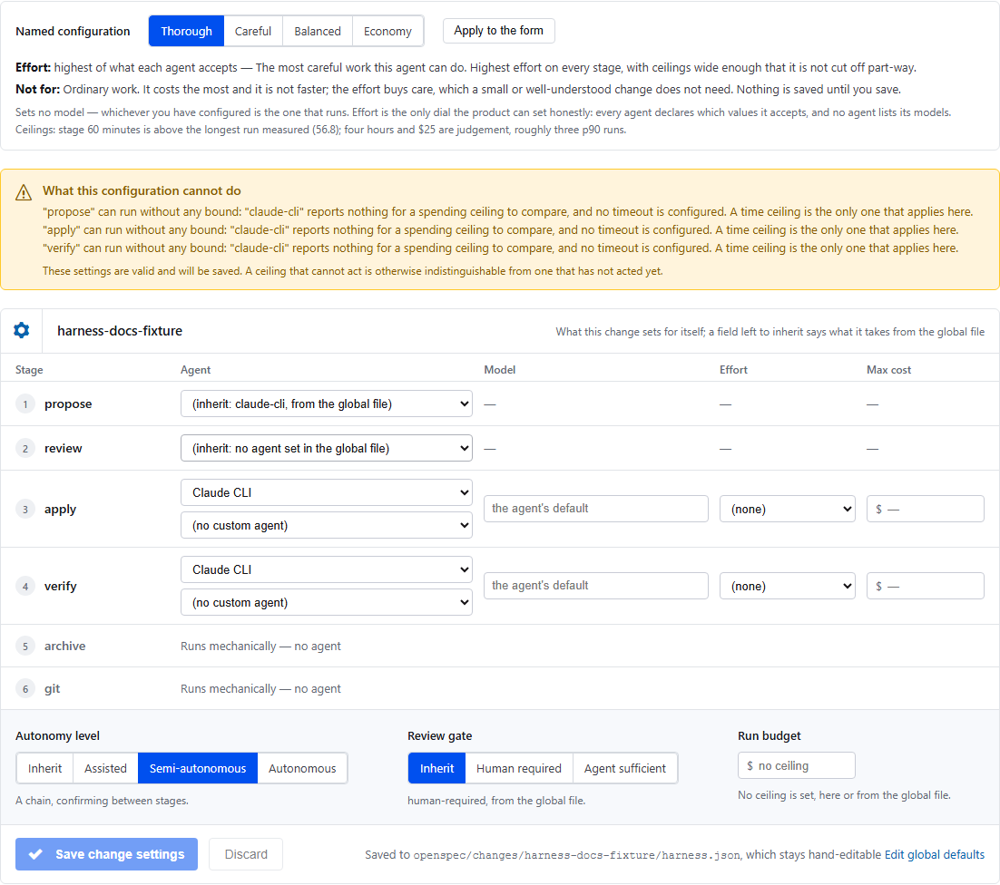
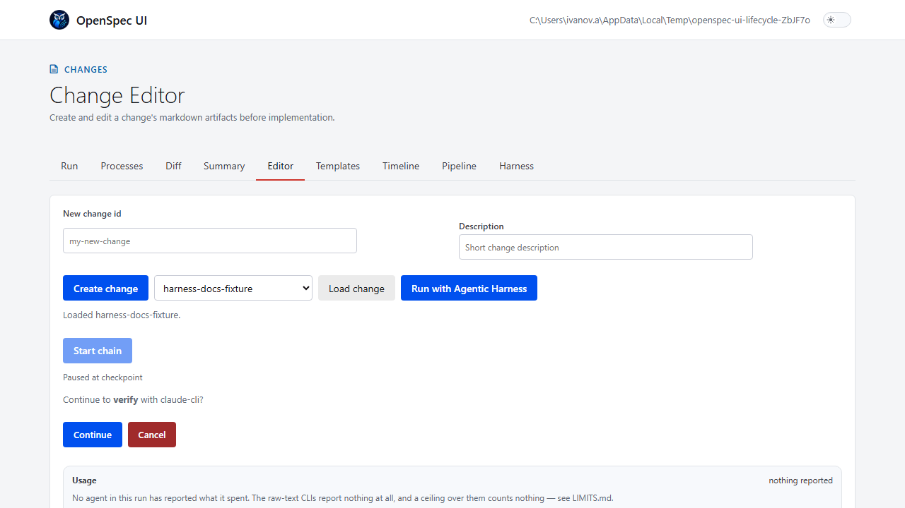

# The Agentic Harness

A reference for configuring and running the Agentic Harness — what each
setting means, what accepts it, and where it is edited. This document
describes what exists; it changes no setting, default, or validation rule.
For spending ceilings specifically (what caps a run, in what unit, and
what does **not** cap it), see [`LIMITS.md`](LIMITS.md).

## Find what you need

| I want to... | Go to |
| --- | --- |
| Understand the run from proposal to merge | [The stage sequence](#the-stage-sequence) |
| Configure global defaults or one change | [Two configuration files](#two-configuration-files) and [Every key](#every-key-and-its-accepted-values) |
| Find a setting in the standalone app or VS Code | [Where each setting is edited](#where-each-setting-is-edited) |
| See how checkpoints and resumed chains behave | [Where a chain starts](#where-a-chain-starts-and-what-a-user-can-steer) |
| Allow push, pull-request creation, and merge | [The `git` stage](#the-git-stage) |
| Compare agents, models, effort, and caps | [Agent reference](#agents-models-effort-and-spending-caps) |
| Set a spending ceiling | [Harness Spending Limits](LIMITS.md) |

The harness sequences CLI-agent runs (or a mechanical action) across the
stages of one OpenSpec change: `propose → review → apply → verify →
archive → git`. Configuration lives in two JSON files —
`openspec/agent-harness.json` (workspace-wide default) and a per-change
`openspec/changes/<id>/harness.json` (override) — read by
`packages/core/src/harness-config.ts`. Both hosts (the standalone app and
the VS Code extension) read the same configuration through the same code;
neither has a setting the other lacks.

## The stage sequence

| Stage | What runs it | What it produces |
| --- | --- | --- |
| `propose` | The `stepAgents.propose` CLI agent, dispatched as a `plan` command. | Drafts or updates the change's `proposal.md`/`design.md`/`tasks.md`. |
| `review` | The `stepAgents.review` CLI agent, dispatched as a `review` command. | A review verdict on the change's artifacts — does not itself modify them. |
| `apply` | The `stepAgents.apply` CLI agent, dispatched as an `implement` command. | Implements `tasks.md`'s checkboxes; a before/after checkpoint of the workspace is captured around this stage so `verify` can be handed the actual delta. |
| `verify` | Mechanical checks first (see "Mechanical checks" below), then the `stepAgents.verify` CLI agent, dispatched as a `verify` command — only if every declared check passed. | A verification report; a failing mechanical check skips the agent entirely. |
| `archive` | **Mechanical.** `HarnessChainRunner` calls `openspec archive` directly — no CLI agent runs, and `stepAgents` has no `archive` key to set (see "Two configuration files" below). | The change moves to `openspec/changes/archive/`. Refuses outright unless every task in `tasks.md` is checked. |
| `git` | **Mechanical, and gated.** Push, open a pull request, wait for its checks, merge — see "The `git` stage" below. Runs only when the resolved `reviewGate.mode` is `"agent-sufficient"`. | A merged pull request, or nothing at all under the default `reviewGate.mode`. |

`archive` is mechanical and `git` is gated: neither is a CLI-agent stage
like the first four, and a reader should not have to infer either from
the table above — both are called out here explicitly.

## Two configuration files

- **Global**: `openspec/agent-harness.json` — the workspace-wide default.
  Applies to every change unless a per-change file overrides it.
- **Per-change**: `openspec/changes/<id>/harness.json` — overrides the
  global file for one change only.

`resolveHarnessConfig(workspaceRoot, changeName)` reads both and merges
the per-change file over the global one (`mergeHarnessConfig`):

- `stepAgents` merges **key by key**, and each stage's entry merges
  **field by field** — a per-change file overriding only
  `stepAgents.apply` still inherits every other stage from the global
  file, and one that sets only an effort for `apply` still inherits the
  model and budget the global file set for it.

  With one exception: naming a **different agent** for a stage inherits
  nothing. A stage's model, effort and budget belong to its agent —
  effort vocabularies differ between agents (`copilot` accepts seven
  values, `claude` five, `codex` four, and four agents accept none), and a
  budget is denominated in whichever unit its agent reports — so carrying
  them across a change of agent would build a configuration nobody wrote.

  Until `stage-override-keeps-the-rest` a stage's entry was replaced
  outright, so setting an effort silently discarded the model.
- `autonomyLevel`, `reviewGate`, `checkpoints`, `budget`, and
  `gitStageAllowlist` are each a **whole-value override** — if the
  per-change file sets one at all, its value is used exactly as written,
  never merged field-by-field with the global file's own value.

Four settings a **global** `openspec/agent-harness.json` may not set —
each one raises a dedicated `InvalidHarnessConfigError` subclass naming
the reason if a global file tries:

| Setting | Global file may set it? | Why |
| --- | --- | --- |
| `autonomyLevel: "autonomous"` | No — `GlobalAutonomousAutonomyLevelError` | An unattended chain (no checkpoint, ever) is a decision one change opts into deliberately, not something a workspace default should hand every change silently. |
| `reviewGate.mode: "agent-sufficient"` | No — `GlobalAgentSufficientReviewGateError` | This is what allows the `git` stage to push/PR/merge without a human present. A workspace default must never grant that; only a specific change's own file can. |
| `checkpoints.requireConfirmationBetweenSteps: false` | No — `GlobalCheckpointsDisabledError` | Same reasoning as `autonomyLevel: "autonomous"`, one field over: skipping the pause between stages is a per-change opt-in. |
| `gitStageAllowlist` (the key itself, any value) | No — `GlobalGitAllowlistError` | The allowlist is what a real `git push`/`gh pr create`/`gh pr merge` is checked against. A workspace-wide allowlist would apply to every change's git actions by default, which is exactly the blast radius this setting exists to avoid. |

A per-change file may set any of the four above without restriction —
including a `budget` (see below) **higher** than the global file's. There
is no equivalent restriction on the chain-level `budget` field itself: any
file, global or per-change, may set any positive value for it.

## Every key and its accepted values

Read from `packages/core/src/harness-config.ts` and
`packages/core/src/harness-step-agent.ts` — the two modules that validate
a harness configuration file. A top-level key outside this list is
rejected outright (`unrecognized top-level key`), naming the key and, if
it matches a known stage name, suggesting `stepAgents.<key>` instead.

**Top-level keys**: `stepAgents`, `autonomyLevel`, `reviewGate`,
`checkpoints`, `budget`, `timeout`, `maxStageAttempts`,
`gitStageAllowlist`. Nothing else is accepted, at either file.

### `stepAgents`

An object whose keys are stage names — `propose`, `review`, `apply`,
`verify` — and whose values name what runs that stage. **Not**
`archive` or `git`: each is a mechanical or dedicated-sequence stage with
nothing to configure, and a `stepAgents.archive`/`stepAgents.git` entry
from before this restriction existed is read and dropped with a warning,
not rejected outright.

Each entry is either a bare agent-id string (`"claude-cli"`) or an object:

```json
{ "agent": "claude-cli", "model": "claude-opus-4-6", "effort": "high", "budget": { "maxCostUsd": 5 }, "customAgent": "reviewer" }
```

| Field | Accepted values |
| --- | --- |
| `agent` | Any id in the agent table below, plus `"vscode-chat"` (only valid when the resolved `autonomyLevel` is `"assisted"` — a chain can never select it). |
| `model` | A string matching `/^[A-Za-z0-9][A-Za-z0-9._:-]*$/`, and only for an agent whose registry entry declares a `modelFlag` (`claude-cli`, `copilot-cli`, `claude-cli-acp`, `copilot-cli-acp`). |
| `effort` | One of `none`, `minimal`, `low`, `medium`, `high`, `xhigh`, `max` — restricted per agent; see the reference table below. |
| `budget` | `{ "maxCostUsd": <positive number> }` or `{ "maxAiCredits": <positive integer, minimum 30> }` — whichever field the chosen agent's own capabilities accept; the other field is rejected. |
| `customAgent` | The name of a custom agent you defined yourself, passed to the CLI as `--agent <name>`. A string matching `/^[A-Za-z0-9][A-Za-z0-9._:-]*$/` — the same rule `model` obeys, and for the same reason: both reach the CLI as the value of a flag, so a value beginning with `-` could be read as a second flag. Only for an agent whose registry entry declares a `customAgentFlag` — the `claude-cli` and `copilot-cli` families, raw and ACP alike. Setting one for any other agent is rejected rather than dropped. |

Custom agents are discovered from the directories the CLIs themselves
read: `.claude/agents/*.md` for Claude, in the project and for the user,
and `.github/agents/*.md` for Copilot. A name defined in both the project
and the user directory is offered once, with the project's winning — it
is the one its own CLI would use. Neither CLI has a command that lists
them, and neither needs one: the definitions are files. A definition
whose file name the rule above would refuse is reported as found and not
offered, rather than dropped without a word — discovery and validation
say the same thing about the same name.

They are chosen in the standalone UI's harness settings, beside the
stage's agent, effort and budget — one picker per stage, listing only the
definitions that stage's own CLI accepts. A stage whose agent takes none
says so instead of showing an empty control, as does a workspace that
defines none, which also names the directories that were read. A name in
the file that the discovery no longer finds stays selected and is marked
as not found rather than being replaced.

In VS Code they are chosen in the same view, in the panel — see "Where
each setting is edited" below.

Gemini and Codex accept no custom agent here. Their CLIs were not
installed on the machine this was verified on, so their convention could
not be checked, and offering one that cannot be passed is the same defect
as a ceiling that cannot act.

**`stepAgents.git` is not accepted by this schema.** `HarnessChainRunner`'s
`runStage` routes the `"git"` stage straight to its own push/PR/merge
sequence (`runGitStage`); no `CommandKind` exists for it, and no CLI agent
runs during this stage under any configuration. Neither settings surface
offers an agent, effort or budget control for it. A `stepAgents.git`
entry written before this restriction existed is read and dropped with a
warning, not rejected outright, the same way `stepAgents.archive` is. See
"The `git` stage" below for what actually runs it.

VS Code's wizard does not offer either `archive` or `git`:
`HARNESS_TEMPLATE_STAGES` in `commands.ts` lists `propose`, `review`,
`apply`, `verify` and `archive`, and its loop skips any stage that is not
a `stepAgents`-configurable one — so it never asks about `archive` or
`git` either. Both hosts agree.

### `autonomyLevel`

`"assisted"` | `"semi-autonomous"` | `"autonomous"`. `"assisted"` runs one
stage at a time from the picker; a chain command requires
`"semi-autonomous"` or `"autonomous"` and fails immediately, rather than
silently running one stage, against an `"assisted"` change. See "Where a
chain starts" below for how each behaves.

### `reviewGate`

`{ "mode": "human-required" | "agent-sufficient" }`. Default
`"human-required"`. Only `"agent-sufficient"` lets the `git` stage run at
all — see "The `git` stage" below.

### `checkpoints`

`{ "requireConfirmationBetweenSteps": <boolean> }`. Optional; absent
means "confirmation required" wherever a `semi-autonomous` chain would
otherwise pause. See "What a checkpoint offers" below.

### `budget` (chain-level)

`{ "maxCostUsd"?: <positive number>, "maxTokens"?: <positive integer> }`.
Both fields optional and independent. This is the **chain-level** ceiling
`HarnessChainRunner` checks between stages — distinct from a
`stepAgents.<stage>.budget`, which caps one CLI invocation. See
[`LIMITS.md`](LIMITS.md) for the full distinction, including why there is
no single `budget: number`.

`maxStageCostUsd` and `maxStageTokens` bound one stage, enforced here
rather than by the agent's CLI. Checked when a stage ends and stopping
the chain — not the stage, which a spending ceiling cannot do. Neither
may exceed its whole-chain counterpart.

### `timeout`

`{ "maxRunSeconds"?: <positive integer>, "maxStageSeconds"?: <positive
integer> }`. Both optional and independent; absent means unbounded.

Unlike `budget`, this ceiling **stops a stage that is already running** —
elapsed time is known during a run where a run's cost is not. It is also
the only ceiling with any force over an agent that reports no usage,
which is six of the ten supported. Reaching it ends the run as
*cancelled*, with a reason naming the ceiling and its value, rather than
as a failure.

Time counts while a stage runs and not while the chain waits at a
checkpoint. `maxStageSeconds` may not exceed `maxRunSeconds` — the run
ceiling would stop the chain first, so the stage ceiling could never
fire. See [`LIMITS.md`](LIMITS.md) for the full picture, including how a
run ceiling under five minutes interacts with the `git` stage's own
check-polling.

### `maxStageAttempts`

`<positive integer>`, counting the first attempt. Absent means one, which
is today's behaviour.

Deliberately one number covering every reason a stage is attempted again,
rather than one per reason: separate ceilings multiply, and three
attempts for a time cut plus three for another reason would produce nine
runs of a stage nobody configured. Each attempt records its own reason.

### `gitStageAllowlist`

`{ "remotes": string[], "branches": string[] }`. Both arrays non-empty;
entries are exact strings or simple `*` wildcards. Per-change only — see
"Two configuration files" above. Detailed in "The `git` stage" below.

## Where each setting is edited

Neither UI is a full editor for every field above — some settings have no
control in either host and must be hand-edited in the JSON file directly.
State this plainly rather than let a reader discover it by searching a
settings screen that doesn't have the control:

| Setting | Standalone (webui) | VS Code |
| --- | --- | --- |
| `stepAgents.<stage>.agent`, `.effort`, `.budget`, `.customAgent` | **Harness Settings** tab, both the "Global default" and "Per-change override" sections (`HarnessSettingsView.tsx`) — the effort, budget and custom-agent fields only appear once a stage's agent accepts them. | The same view, in the panel. **OpenSpec UI: Configure Harness Settings** opens it on the global file; **OpenSpec UI: Configure Harness for this Change** opens it on that change's override, already loaded. Both files stay hand-editable and the view names them. See harness-settings-in-the-panel. |
| `stepAgents.<stage>.model` | **Not editable in either UI.** Hand-edit the JSON file's object-form entry directly. | Same — not editable in either UI. |
| `autonomyLevel` | Both sections of the Harness Settings tab. | The same view, from either command above. The separate **OpenSpec UI: Set Up Agentic Harness** command has a guided Quick Pick flow for the global setup, but it is not the general config editor. |
| `reviewGate.mode` | Per-change override section only (the global value is fixed at `"human-required"` and shown, not editable). | The same, in the panel's per-change section. |
| `checkpoints.requireConfirmationBetweenSteps` | **Not editable in either UI.** Hand-edit the JSON file. | Same — not editable in either UI. |
| `budget` (chain-level `maxCostUsd`/`maxTokens`) | **Not editable in either UI.** Hand-edit the JSON file. | Same — not editable in either UI. |
| `gitStageAllowlist` | **Not editable in either UI.** Hand-edit the per-change JSON file. | Same — not editable in either UI. |

### Standalone settings, in pictures

The captures below come from the running application, not a mock. Select
either image to open the original PNG at full resolution.

#### Global defaults

[](./docs/images/standalone/harness-settings.png)

*The global view shows the stage runner, effort, and per-invocation budget
controls together with the workspace autonomy level. The footer records
the package versions rendered by the capture.*

#### Per-change override

[](./docs/images/standalone/harness-change-override.png)

*Only this section is captured: inherited stages remain visible, while
explicit values show exactly what the change overrides. The visible
`(not yet implemented)` suffix is stale UI copy; semi-autonomous chains
are implemented and described under [Where a chain starts](#where-a-chain-starts-and-what-a-user-can-steer).*

Both are produced by `packages/server/e2e/harness-screenshots.spec.ts`,
which also produces the checkpoint screenshot in "What a checkpoint
offers" below. Regenerate all three with, from `packages/server`:

```
npm run test:browser -- harness-screenshots.spec.ts
```

There is no VS Code harness screenshot in this guide yet. The extension
host cannot be captured by this Playwright workflow, so adding one remains
the human-only task 3.4 in `agentic-harness-documentation`. This guide does
not present a standalone screenshot as though it represented both hosts.

## Mechanical checks

Before the `verify` stage's agent runs, `HarnessChainRunner` runs every
mechanical check the change's own `tasks.md` declares
(`runMechanicalChecksForVerify`, `packages/core/src/mechanical-checks.ts`).
**A failing check skips the verifying agent entirely** — the stage fails
immediately with the failing checks' reasons, and no agent run is spent
reviewing work a mechanical check already found broken. A `tasks.md` that
declares no checks at all runs `verify` exactly as before this capability
existed.

The complete, closed set of six check names
(`MECHANICAL_CHECK_NAMES`):

| Name | What it runs |
| --- | --- |
| `validate-change` | `openspec change validate --strict <changeName>` |
| `typecheck` | `npm run typecheck` |
| `test` | `npm run test` |
| `lint` | `npm run lint` |
| `path-unchanged` | `git diff --quiet -- <path>` — requires a repository-relative path parameter |
| `changeset-present` | A pending `.changeset/*.md` file exists for the change |

A task line declares one with a trailing inline-code span:

```
- [ ] 6.1 `openspec change validate --strict my-change` `check(validate-change)`
- [ ] 6.5 No source changes outside this path. `check(path-unchanged, packages/core/src)`
```

`` `check(name)` `` or `` `check(name, param)` ``, matched by
`TASK_CHECK_DECLARATION_RE` at the very end of the task's text. A name
outside the six above fails to parse (`UnknownMechanicalCheckError`)
rather than silently becoming an ordinary, unchecked task.

## Where a chain starts, and what a user can steer

### One way in

There is one entry, in both hosts: **Run** — the
`openspec-ui.runWithHarness` command in VS Code (the id is unchanged, so
existing keybindings still work), one button in the standalone Change
Editor.

It is named `Run` and not after any one of the three paths it offers.
Naming it after one of them is how it came to sit beside a second entry
named after another.

A run can also be asked for at a time rather than now. The schedule is
kept in `.openspec-ui/scheduled-runs.json`, gitignored beside the audit
log: "start this one at six" is one person's intent on one machine, not
project configuration. It needs the application open at that time; if it
is closed, the run starts the next time it is opened and the dialog says
how late it is. See a-run-can-be-scheduled.

It is a panel in both hosts. In VS Code it used to be a quick-pick, which
gives one line per item and cuts the rest without saying so — measured
from a screenshot on 2026-09-08, every named configuration's intent ended
mid-word. The panel renders the same components the standalone shell
does, so neither host shows less than the other. See
run-dialog-in-the-panel.

It shows what the change's configuration resolves to before starting
anything: which path will run and why, which agent each stage will use,
whether every ceiling can act (said either way, so "examined and fine"
never looks like "not examined"), and which named configuration is
recommended, with the observations behind it.

The recommendation appears in both hosts. It reads the change's open task
count — over HTTP in the standalone shell, from the file in the editor —
and, in the editor, the audit log as well. Where a host cannot read the
run history, the recommendation says there is no previous run to go on
rather than implying it looked.

Four named configurations are offered in the same place — **Thorough**,
**Careful**, **Balanced**, **Economy** — each with what it is for, when
it is the wrong choice, and where each of its ceilings came from.

They are named by the effort they ask for, and each carries a *level*
rather than a value: the highest, high, medium or lowest of what the
agent accepts. The value is resolved when the configuration is applied,
against the agent that stage will use — `max` for `claude-cli` and `high`
for `codex-cli` are both "highest", and five of the ten registered agents
accept no effort at all, for which the surface says the configurations
differ in their ceilings alone rather than showing a dial that does
nothing.

None of them sets a model. The model is whichever the workspace already
configured, and each says so in its own text rather than leaving it to be
inferred from an absence.

Applying one **writes** the change's `harness.json` and starts nothing: a
path is chosen for one run, a configuration is chosen until someone
changes it, and the run that follows should be the one the file
describes. What is written is the change's existing file with the
configuration laid over it — including the stage's agent beside the
resolved effort, since an effort without its agent means nothing — so a
key the configuration does not mention, `gitStageAllowlist` above all, is
kept.

Three paths are offered, with the configured one pre-selected:

- **Run the chain** — `propose → review → apply → verify`, pausing where
  the configuration says to. This is what `semi-autonomous` and
  `autonomous` resolve to.
- **Run one stage** — the single-stage picker. This is what `assisted`
  resolves to.
- **Implement with the VS Code agent** — the `apply` stage run by
  `vscode-chat`. Offered in VS Code only; the standalone shell has no VS
  Code Chat to open.

Choosing a path other than the configured one applies to that run alone
and writes nothing to `harness.json`. A run is not a configuration
change.

The third path used to be its own command, `Implement with VS Code
Agent`. It no longer appears in any menu: two entries whose correct
choice depended on a file one of them never read is what made picking
between them guesswork.

`Explain Harness Settings` and `Recommend a Harness Configuration` also
leave the active-change menu, because the Run dialog now shows both. They
remain in the command palette, and on an archived change — which cannot
be started, so there they are the only way to ask.

### Resuming, not always starting at `propose`

A chain does not always start at `propose`. `determineStartStage`
(`harness-chain-runner.ts`) reads the change's own artifacts and task
counts and enters at the first stage that still has work:

- **`propose`**, while `openspec status`'s proposal, design, or tasks
  artifact is not yet `"done"`/`"complete"`.
- **`apply`**, once those three are done but at least one `tasks.md`
  checkbox is still unchecked. (`review` is never a resume point on its
  own — it has no durable artifact of its own; a chain that resumes after
  `propose` finished goes straight to `apply`.)
- **`verify`**, once every task is checked but the change is not yet
  archived.

This is resuming, not restarting: running the same chain command twice
against a partially-worked change picks up where the previous run left
off, rather than repeating finished work.

### The unknown-progress case enters at `apply`, deliberately

When the change's `tasks.md` cannot be read at all, `determineStartStage`
returns `"apply"` rather than failing or guessing `"verify"`/`"archive"`.
This is a safety choice, not an arbitrary default: a redundant `apply`
costs one wasted run; a wrong `archive` costs an unimplemented change
being marked done. The cheaper mistake is the one the harness risks.

### A chain runs forward, with one exception it can justify

**There is no control that steps a running chain back to an earlier
stage,** and there is exactly one edge the chain takes on its own. Three
things answer "can I move around inside a change":

- A **chain** (`propose -> review -> apply -> verify -> archive -> git`)
  advances. Cancelling ends it; there is no "go back one stage."
- **`verify` may send work back to `apply`**, and only that. `verify`
  writes each declared mechanical check's result onto its own task's
  checkbox, so a failing check unchecks the task — which `archive` would
  then refuse. Where `maxStageAttempts` allows another attempt, the chain
  returns to `apply` instead of failing at the next stage; where it does
  not, `archive` refuses exactly as before. This is not a general
  step-back: it is one condition the machine can evaluate, from the one
  stage that produces a machine-checked statement that earlier work is
  unfinished.
- The panel's **per-stage commands** (`plan`, `review`, `implement`,
  `verify`) go through `RunController` directly, independent of any
  chain. Running `review` again by itself, after a chain has already
  moved past it, is how you "go back" anywhere else — as a fresh,
  standalone run, not as a rewound chain.

### What a checkpoint offers

Under `semi-autonomous` (with the default
`checkpoints.requireConfirmationBetweenSteps`, i.e. not explicitly set to
`false`), a chain pauses between stages and waits for a `confirmCheckpoint`
or `cancel` command. Confirming continues to the next stage; cancelling
ends the chain cleanly without starting it. **There is no third option** —
a checkpoint never offers "redo the previous stage."

[](./docs/images/standalone/harness-checkpoint.png)

*A real chain paused before `verify`. Select the image to inspect the event
log and checkpoint controls at full resolution.*

### Only one mutating run at a time, for the whole workspace

`WorkbenchProcessScheduler` holds a single `mutationLocked` flag and a
queue per workspace — starting a second mutating run (an `implement`, a
chain, anything that writes) while one is already active **enqueues** it
rather than running both concurrently. ADR 0010's cross-host lease extends
the same rule across a second editor or a second host open on the same
workspace root. This is easy to assume away — "the UI is stuck" reads
differently from "the queue is doing its job" — so it is stated here
directly.

**What is concurrent**: a non-mutating run (`status`, `list`, `show`,
`validate`) is never blocked by a mutating one. That distinction is the
whole difference between the two symptoms above.

## The `git` stage

The last stage in the sequence, after `archive`. When it runs, it pushes
the change's current branch, opens a pull request, waits for that pull
request's checks, and — only if they pass — merges it.

**It runs only when the resolved `reviewGate.mode` is
`"agent-sufficient"`, which only a per-change `harness.json` may set.**
Under the default `"human-required"`, a chain ends cleanly after
`archive` and **nothing is pushed** — stated first, here, because a
reader must not have to work out for themselves that the default is safe.

### The allowlist

A per-change `gitStageAllowlist` gates every push/PR/merge action before
any `git` or `gh` process starts — an action matching nothing in it is
**blocked**, not attempted:

```json
{
  "gitStageAllowlist": {
    "remotes": ["origin"],
    "branches": ["feature/*"]
  }
}
```

`remotes`/`branches` are non-empty string arrays; each entry may use a
simple `*` wildcard. A global `openspec/agent-harness.json` may not set
this key at all (see "Two configuration files" above).

### The merge waits for checks, and refuses without them

**The merge waits for the pull request's own checks and refuses one whose
checks have not passed. This is not configurable** — no setting and no
allowlist entry permits merging past a red check (ADR 0014). An absent
check result, or a pull request where every check merely skipped, is
treated as a **refusal**, not as permission: `gh-pr-gateway.ts`'s
`parseCheckStatus` requires at least one check to have actually passed. On
any refusal, the pushed branch and the already-open pull request are left
exactly as they are — the work is not lost, it waits for a person to pick
up.

### Prerequisites

`gh` must already be on `PATH` and already authenticated
(`gh auth login`) on the machine running the stage. This project never
handles git-forge credentials itself; the `gh` session already
authenticated on that machine is what authorises every push, pull-request
creation, and merge this stage performs.

### Audit

Every push, pull-request creation, and merge this stage attempts —
including a blocked attempt — is written to the audit log at
`.openspec-ui/audit.jsonl` under the workspace root.

### Nobody has run this stage end to end yet

**State this plainly: no one has run the `git` stage against a real,
running pull request from this repository.**
`agentic-harness-git-stage` task 4.4 (a live end-to-end run) is still
open, and three of the four defects found during that change's own review
sat directly behind this untested path. Anyone deciding whether to let a
chain merge their code unattended is entitled to know that before
deciding, not after.

## Agents, models, effort, and spending caps

One row per registered agent id — ten in total: five raw CLI adapters,
four ACP-flavored adapters, and the VS Code chat dispatch target. Columns
below come from `HARNESS_AGENT_CAPABILITIES`
(`packages/core/src/harness-step-agent.ts` — the single source of truth
both the validator and each settings UI read) and `modelFlag`
(`packages/core/src/agents/registry.ts`); the "run against the real
binary here" column repeats `README.md`'s own agent table.

| id | What it runs | Accepts a `model` | Accepts an `effort`, and which values | Accepts a spending cap, and in which unit | Run against the real binary here? |
| --- | --- | --- | --- | --- | --- |
| `claude-cli` | `claude` | Yes (`--model`) | `low`, `medium`, `high`, `xhigh`, `max` | `maxCostUsd` (`--max-budget-usd`, Claude Code v2.1.217+) | Yes — used continuously in development |
| `copilot-cli` | `copilot` | Yes (`--model`) | `none`, `minimal`, `low`, `medium`, `high`, `xhigh`, `max` | `maxAiCredits` (`--max-ai-credits`, minimum 30) | Yes |
| `codex-cli` | `codex` | No | `minimal`, `low`, `medium`, `high` (from OpenAI's documented config, not live-verified here) | No | **No — never** |
| `gemini-cli` | `gemini` | No | No mechanism | No | **No — never** |
| `local-llm` | HTTP to `http://localhost:30000` by default | No | No mechanism | No | Not exercised live |
| `claude-cli-acp` | `claude --input-format stream-json --output-format stream-json` | Yes (`--model`) | Same as `claude-cli` | Same as `claude-cli` (`maxCostUsd`) | Progress only — no permission gate, see below |
| `copilot-cli-acp` | `copilot --acp` | Yes (`--model`) | Same as `copilot-cli` | Same as `copilot-cli` (`maxAiCredits`) | Yes |
| `codex-cli-acp` | externally installed `codex-acp` | No | No mechanism (deliberately empty — see below) | No mechanism (deliberately empty) | **No — never** |
| `gemini-cli-acp` | `gemini --experimental-acp` | No | No mechanism (deliberately empty — see below) | No mechanism (deliberately empty) | **No — never** |
| `vscode-chat` | Dispatches the stage to VS Code's own Chat panel — spawns no CLI process at all | No | No mechanism | No mechanism | Not applicable — only valid under `autonomyLevel: "assisted"` |

**On the "run against the real binary here" column, plainly: `codex` and
`gemini` have never been run by this project at all**, raw or
ACP-flavored — see `README.md`'s "Agent Selection" section for the full
statement. If you configure either and it misbehaves, that is the most
likely reason.

### ACP effort and budget capabilities

`copilot-cli-acp` and `claude-cli-acp` accept the same `effort` and
per-invocation `budget` fields as their plain counterparts. This is read
from `HARNESS_AGENT_CAPABILITIES`, so configuration validation and both
settings surfaces use the same capability set as the table above.

### What changes when an `-acp` id is chosen

Choosing `claude-cli-acp`/`copilot-cli-acp`/`codex-cli-acp`/`gemini-cli-acp`
instead of the plain counterpart changes three things:

1. **Structured progress instead of scraped text.** The adapter speaks
   the [Agent Client Protocol](https://agentclientprotocol.com)'s
   `session/update` notifications rather than parsing free-form stdout.
2. **A permission gate, where the agent offers one.** ACP defines
   `session/request_permission`; the UI can answer it when the agent
   actually sends it.
3. **A recorded agent version, compared against the version this project
   verified against**, rather than no version check at all.

**Documented exception: `claude-cli-acp` never emits a permission
request.** `claude` has no native ACP mode; its adapter translates
`claude`'s own structured output into ACP shape, and that translation
never produces `session/request_permission` — its own permission gate is
not something to rely on. Separately (not a documented exception, a
live-verified fact): `copilot --acp` completes file writes and shell
commands **without ever asking for permission** either, despite ACP
supporting the mechanism — see `README.md`'s "Agent Selection" section.

`codex-cli-acp` and `gemini-cli-acp` carry a deliberately empty
capabilities entry (`{}`) — their adapters render neither an effort flag
nor a budget flag at all, by design, not by omission (see
`agents/codex-acp.ts` and `agents/gemini-acp.ts`'s own header comments).
This is different from the `copilot-cli-acp`/`claude-cli-acp` defect
above: here, an empty row is the documented, intended state, not a gap
between two tables that drifted apart.

## Worked examples

Both examples below are asserted to load through `resolveHarnessConfig`
without error — an example that does not parse is worse than none (see
`packages/core/src/harness-config.test.ts`'s `describe("HARNESS.md")`
block).

### A worked `openspec/agent-harness.json` (global)

```json
{
  "stepAgents": {
    "propose": "claude-cli",
    "review": { "agent": "copilot-cli", "effort": "medium" },
    "apply": "claude-cli",
    "verify": "claude-cli"
  },
  "autonomyLevel": "assisted"
}
```

### A worked `openspec/changes/<id>/harness.json` (per-change)

```json
{
  "autonomyLevel": "semi-autonomous",
  "reviewGate": { "mode": "agent-sufficient" },
  "checkpoints": { "requireConfirmationBetweenSteps": true },
  "budget": { "maxCostUsd": 25, "maxTokens": 2000000 },
  "stepAgents": {
    "apply": { "agent": "claude-cli", "effort": "high", "budget": { "maxCostUsd": 10 } }
  },
  "gitStageAllowlist": {
    "remotes": ["origin"],
    "branches": ["feature/*"]
  }
}
```

This per-change example is the one configuration shape in this document
that actually reaches the `git` stage (`reviewGate.mode:
"agent-sufficient"` plus a `gitStageAllowlist`) — see "The `git` stage"
above for what that stage does and its current, unverified state.
