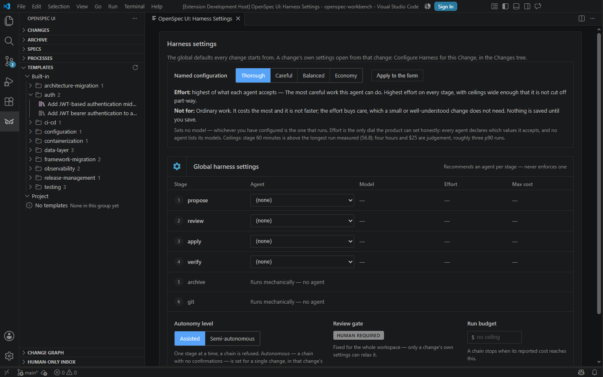
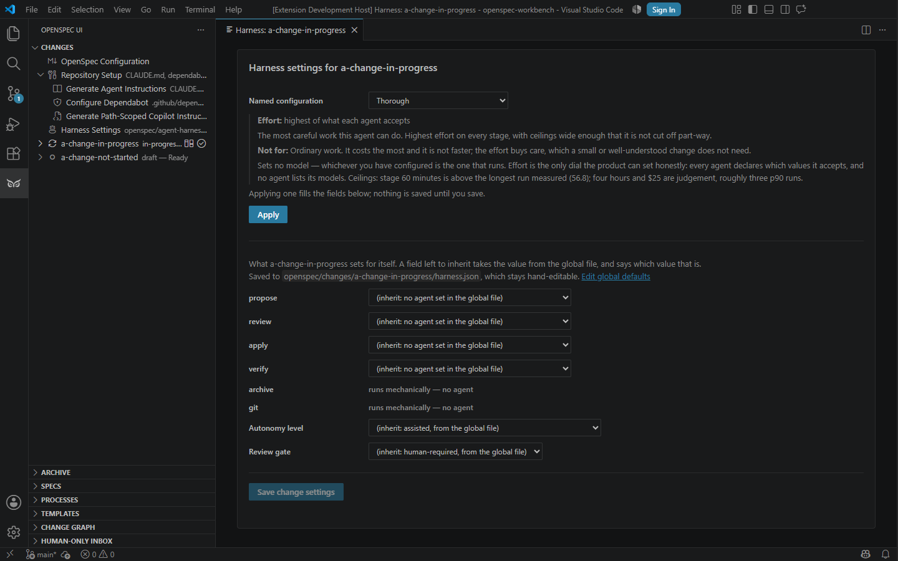

# The Agentic Harness

A reference for configuring and running the Agentic Harness — what each
setting means, what accepts it, and where it is edited. This document
describes what exists; it changes no setting, default, or validation rule.
For spending ceilings specifically (what caps a run, in what unit, and
what does **not** cap it), see [`LIMITS.md`](LIMITS.md).

## Find what you need

The reference is below. Where a row names a **short path**, that is a
page stating the goal, the file it edits and the two steps that reach
it — start there and come back here for the detail.

| I want to... | Short path | Reference |
| --- | --- | --- |
| Understand the run from proposal to merge | — | [The stage sequence](#the-stage-sequence) |
| Configure global defaults or one change | — | [Two configuration files](#two-configuration-files) and [Every key](#every-key-and-its-accepted-values) |
| Find a setting in the standalone app or VS Code | — | [Where each setting is edited](#where-each-setting-is-edited) |
| Run a change with nobody watching | [How to](docs/how-to/run-a-change-unattended.md) | [Where a chain starts](#where-a-chain-starts-and-what-a-user-can-steer) |
| Allow push, pull-request creation, and merge | — | [The `git` stage](#the-git-stage) |
| Compare agents, models, effort, and caps | — | [Agent reference](#agents-models-effort-and-spending-caps) |
| Use your own agent definition for a stage | [How to](docs/how-to/use-your-own-agent-definition.md) | [`stepAgents`](#stepagents) |
| Hand one numbered task to an agent | [How to](docs/how-to/hand-a-task-to-an-agent.md) | [`taskAgents`](#taskagents) |
| Set a spending ceiling | [How to](docs/how-to/cap-what-a-run-can-spend.md) | [Harness Spending Limits](LIMITS.md) |
| Run a change from a terminal | [How to](docs/how-to/run-a-change-from-a-terminal.md) | [CI CLI](README.md#ci-cli-merge-gate) |
| Run two changes at the same time | [How to](docs/how-to/run-changes-side-by-side.md) | [CI CLI](README.md#ci-cli-merge-gate) |
| Find out what would stop a run here | — | `openspec-ui-cli doctor`, and `doctor --change <id>` for one change |

The harness sequences CLI-agent runs (or a mechanical action) across the
stages of one OpenSpec change: `propose → review → apply → verify →
archive → git`. Configuration lives in two JSON files —
`openspec/agent-harness.json` (workspace-wide default) and a per-change
`openspec/changes/<id>/harness.json` (override) — read by
`packages/core/src/harness-config.ts`. Both hosts (the standalone app and
the VS Code extension) read the same configuration through the same code;
neither has a setting the other lacks.

## The stage sequence

| Stage | What runs it | What it produces |
| --- | --- | --- |
| `propose` | The `stepAgents.propose` CLI agent, dispatched as a `plan` command. | Drafts or updates the change's `proposal.md`/`design.md`/`tasks.md`. |
| `review` | The `stepAgents.review` CLI agent, dispatched as a `review` command. | A review verdict on the change's artifacts — does not itself modify them. |
| `apply` | The `stepAgents.apply` CLI agent, dispatched as an `implement` command. | Implements `tasks.md`'s tasks and ticks each one as soon as its own verification has passed — the product's instruction says so, whatever a project's rules add. A before/after checkpoint of the workspace is captured around this stage so `verify` can be handed the actual delta; a run that changed files and ticked no task is named on the chain's timeline. |
| `verify` | Mechanical checks first (see "Mechanical checks" below), then the `stepAgents.verify` CLI agent, dispatched as a `verify` command — only if every declared check passed. | A verification report. The agent ticks each unticked task whose verification it confirmed itself — checking an effect that is not a file, such as a command that must pass — and unticks each that does not hold; it never ticks a `**Human-only**` or `**Delegated to …**` task. A failing mechanical check skips the agent entirely. |
| `archive` | **Mechanical.** `HarnessChainRunner` calls `openspec archive` directly — no CLI agent runs, and `stepAgents` has no `archive` key to set (see "Two configuration files" below). | The change moves to `openspec/changes/archive/`. Refuses outright unless every task in `tasks.md` is checked, naming the tasks that are not. |
| `git` | **Mechanical, and gated.** Push, open a pull request, wait for its checks, merge — see "The `git` stage" below. Runs only when the resolved `reviewGate.mode` is `"agent-sufficient"`. | A merged pull request, or nothing at all under the default `reviewGate.mode`. |

`archive` is mechanical and `git` is gated: neither is a CLI-agent stage
like the first four, and a reader should not have to infer either from
the table above — both are called out here explicitly.

## Two configuration files

- **Global**: `openspec/agent-harness.json` — the workspace-wide default.
  Applies to every change unless a per-change file overrides it.
- **Per-change**: `openspec/changes/<id>/harness.json` — overrides the
  global file for one change only.

`resolveHarnessConfig(workspaceRoot, changeName)` reads both and merges
the per-change file over the global one (`mergeHarnessConfig`):

- `stepAgents` merges **key by key**, and each stage's entry merges
  **field by field** — a per-change file overriding only
  `stepAgents.apply` still inherits every other stage from the global
  file, and one that sets only an effort for `apply` still inherits the
  model, budget and custom agent the global file set for it. Every field
  an entry may carry is merged: the merge iterates `STEP_AGENT_KEYS`
  (`packages/core/src/harness-step-agent.ts`), the same list the
  validator reads, so the next field added to an entry arrives already
  merged.

  With one exception: naming a **different agent** for a stage inherits
  nothing. A stage's model, effort, budget and custom agent belong to
  its agent — effort vocabularies differ between agents (`copilot`
  accepts seven values, `claude` five, `codex` four, and five agents
  accept none), a budget is denominated in whichever unit its agent
  reports, and a custom agent is a definition one CLI reads — so
  carrying them across a change of agent would build a configuration
  nobody wrote.

  Until `stage-override-keeps-the-rest` a stage's entry was replaced
  outright, so setting an effort silently discarded the model. Until
  `a-stage-override-keeps-its-custom-agent` the merge named three fields
  where the entry carried four, so an override naming the same agent
  plus a `customAgent` resolved without it and the chain ran with no
  `--agent` flag.
- `autonomyLevel`, `reviewGate`, `checkpoints`, `budget`,
  `gitStageAllowlist` and `taskAgents` are each a **whole-value
  override** — if the per-change file sets one at all, its value is used
  exactly as written, never merged field-by-field with the global file's
  own value.

Five settings a **global** `openspec/agent-harness.json` may not set —
each one raises a dedicated `InvalidHarnessConfigError` subclass naming
the reason if a global file tries:

| Setting | Global file may set it? | Why |
| --- | --- | --- |
| `autonomyLevel: "autonomous"` | No — `GlobalAutonomousAutonomyLevelError` | An unattended chain (no checkpoint, ever) is a decision one change opts into deliberately, not something a workspace default should hand every change silently. |
| `reviewGate.mode: "agent-sufficient"` | No — `GlobalAgentSufficientReviewGateError` | This is what allows the `git` stage to push/PR/merge without a human present. A workspace default must never grant that; only a specific change's own file can. Two exceptions, each narrow: [`branches.rebaseWhenBehind`](#branches), which pushes only what the server already has, onto a newer base ([ADR 0034](docs/adr/0034-a-behind-branch-is-rebased-for-you.md)); and [`archive.whenLanded`](#archive), which pushes only `openspec archive`'s result over changes the default branch says are finished, through a pull request and its checks ([ADR 0035](docs/adr/0035-a-landed-change-is-archived-for-you.md)). |
| `checkpoints.requireConfirmationBetweenSteps: false` | No — `GlobalCheckpointsDisabledError` | Same reasoning as `autonomyLevel: "autonomous"`, one field over: skipping the pause between stages is a per-change opt-in. |
| `gitStageAllowlist` (the key itself, any value) | No — `GlobalGitAllowlistError` | The allowlist is what a real `git push`/`gh pr create`/`gh pr merge` is checked against. A workspace-wide allowlist would apply to every change's git actions by default, which is exactly the blast radius this setting exists to avoid. |
| `taskAgents` (the key itself, any value) | No — `GlobalTaskAgentsError` | Not too powerful, but meaningless: a task number belongs to the change whose `tasks.md` wrote it, so the same statement made workspace-wide is about a different piece of work in every change. |

A per-change file may set any of the five above without restriction —
including a `budget` (see below) **higher** than the global file's. There
is no equivalent restriction on the chain-level `budget` field itself: any
file, global or per-change, may set any positive value for it.

## Every key and its accepted values

Read from `packages/core/src/harness-config.ts` and
`packages/core/src/harness-step-agent.ts` — the two modules that validate
a harness configuration file. A top-level key outside this list is
rejected outright (`unrecognized top-level key`), naming the key and, if
it matches a known stage name, suggesting `stepAgents.<key>` instead.

**Top-level keys**: `stepAgents`, `autonomyLevel`, `reviewGate`,
`checkpoints`, `budget`, `timeout`, `maxStageAttempts`,
`gitStageAllowlist`, `taskAgents`, `steps`, `hints`,
`allowAgentMessages`, `branches`. Nothing else is accepted, at either
file.

### `stepAgents`

An object whose keys are stage names — `propose`, `review`, `apply`,
`verify` — and whose values name what runs that stage. **Not**
`archive` or `git`: each is a mechanical or dedicated-sequence stage with
nothing to configure, and a `stepAgents.archive`/`stepAgents.git` entry
from before this restriction existed is read and dropped with a warning,
not rejected outright.

Each entry is either a bare agent-id string (`"claude-cli"`) or an object:

```json
{ "agent": "claude-cli", "model": "claude-opus-4-6", "effort": "high", "budget": { "maxCostUsd": 5 }, "customAgent": "reviewer" }
```

| Field | Accepted values |
| --- | --- |
| `agent` | Any id in the agent table below, plus `"vscode-chat"` (only valid when the resolved `autonomyLevel` is `"assisted"` — a chain can never select it). |
| `model` | A string matching `/^[A-Za-z0-9][A-Za-z0-9._:-]*$/`, and only for an agent whose registry entry declares a `modelFlag` (`claude-cli`, `copilot-cli`, `claude-cli-acp`, `copilot-cli-acp`). |
| `effort` | One of `none`, `minimal`, `low`, `medium`, `high`, `xhigh`, `max` — restricted per agent; see the reference table below. |
| `budget` | `{ "maxCostUsd": <positive number> }` or `{ "maxAiCredits": <positive integer, minimum 30> }` — whichever field the chosen agent's own capabilities accept; the other field is rejected. |
| `customAgent` | The name of a custom agent you defined yourself, passed to the CLI as `--agent <name>`. A string matching `/^[A-Za-z0-9][A-Za-z0-9._:-]*$/` — the same rule `model` obeys, and for the same reason: both reach the CLI as the value of a flag, so a value beginning with `-` could be read as a second flag. Only for an agent whose registry entry declares a `customAgentFlag` — the `claude-cli` and `copilot-cli` families, raw and ACP alike. Setting one for any other agent is rejected rather than dropped. |

Custom agents are discovered from the directories the CLIs themselves
read: `.claude/agents/*.md` for Claude, in the project and for the user,
and `.github/agents/*.md` for Copilot. A name defined in both the project
and the user directory is offered once, with the project's winning — it
is the one its own CLI would use. Neither CLI has a command that lists
them, and neither needs one: the definitions are files. A definition
whose file name the rule above would refuse is reported as found and not
offered, rather than dropped without a word — discovery and validation
say the same thing about the same name.

**Gemini and Codex cannot be given one.** Both CLIs have custom agents
and both read them from directories, so what is missing is not
discovery — it is selection. Read from each CLI's own published
documentation on 2026-09-12:

| CLI | Where its definitions live | How one is selected |
| --- | --- | --- |
| [Gemini](https://github.com/google-gemini/gemini-cli/blob/main/docs/core/subagents.md) | `.gemini/agents/*.md` and `~/.gemini/agents/*.md` — Markdown with YAML frontmatter, the same shape Claude uses | `@name` at the start of the prompt, or the interactive `/agents` command. **No documented flag.** |
| [Codex](https://learn.chatgpt.com/docs/customization/overview) | `.codex/agents/*.toml` and `~/.codex/agents/*.toml` — TOML, whose `name` field rather than the file name is the agent's name | Named in the prompt. **No documented `codex exec` flag.** |

A custom agent reaches its CLI here as the value of a flag on an
allowlisted invocation (`customAgentFlag` in the agent registry), so
neither of these has anything to bind to. A prompt-prefix mechanism
would put the agent's name inside the prompt rather than in the argument
list, which the allowlist does not constrain — a different security
question, and one nobody has asked for. If either CLI gains a flag,
adding it here is a line: the conventions in
`packages/core/src/custom-agents.ts` are data.

They are chosen in the standalone UI's harness settings, beside the
stage's agent, effort and budget — one picker per stage, listing only the
definitions that stage's own CLI accepts. A stage whose agent takes none
says so instead of showing an empty control, as does a workspace that
defines none, which also names the directories that were read. A name in
the file that the discovery no longer finds stays selected and is marked
as not found rather than being replaced.

In VS Code they are chosen in the same view, in the panel — see "Where
each setting is edited" below.

Gemini and Codex accept no custom agent here. Their CLIs were not
installed on the machine this was verified on, so their convention could
not be checked, and offering one that cannot be passed is the same defect
as a ceiling that cannot act.

**`stepAgents.git` is not accepted by this schema.** `HarnessChainRunner`'s
`runStage` routes the `"git"` stage straight to its own push/PR/merge
sequence (`runGitStage`); no `CommandKind` exists for it, and no CLI agent
runs during this stage under any configuration. Neither settings surface
offers an agent, effort or budget control for it. A `stepAgents.git`
entry written before this restriction existed is read and dropped with a
warning, not rejected outright, the same way `stepAgents.archive` is. See
"The `git` stage" below for what actually runs it.

VS Code's wizard does not offer either `archive` or `git`:
`HARNESS_TEMPLATE_STAGES` in `commands.ts` lists `propose`, `review`,
`apply`, `verify` and `archive`, and its loop skips any stage that is not
a `stepAgents`-configurable one — so it never asks about `archive` or
`git` either. Both hosts agree.

### `autonomyLevel`

`"assisted"` | `"semi-autonomous"` | `"autonomous"`. `"assisted"` runs one
stage at a time from the picker; a chain command requires
`"semi-autonomous"` or `"autonomous"` and fails immediately, rather than
silently running one stage, against an `"assisted"` change. See "Where a
chain starts" below for how each behaves.

### `reviewGate`

`{ "mode": "human-required" | "agent-sufficient" }`. Default
`"human-required"`. Only `"agent-sufficient"` lets the `git` stage run at
all — see "The `git` stage" below.

### `checkpoints`

`{ "requireConfirmationBetweenSteps": <boolean> }`. Optional; absent
means "confirmation required" wherever a `semi-autonomous` chain would
otherwise pause. See "What a checkpoint offers" below.

### `hints`

`{ "enabled": <boolean> }`. Optional; absent means enabled, which is what
every configuration written before this key existed says.

The suggestions are derived from the readiness report — which changes can
be started alongside each other, which is ready with nowhere to run,
which workspace is held by a run that stopped reporting itself. They are
shown in the Pipeline tab and printed by `openspec-ui-cli advise`, and
they create nothing and start nothing: each carries the fact it came from
and the commands a person would run.

`false` means **not computed**, never computed-and-hidden: the payload
carries no suggestions at all. Read from the workspace file rather than
from a change's — the report they come from is about the whole
repository, so a per-change value would be answering a different
question.

### `branches`

`{ "rebaseWhenBehind"?: <boolean>, "followMain"?: <boolean> }`. Optional;
absent means every default below. Allowed in the global file and in a change's own file,
which overrides it key by key.

**`rebaseWhenBehind`** - absent means **`true`**. A change's branch that
has fallen behind the default branch is rebased onto it and pushed with
`--force-with-lease`, by the sweep that also removes a working directory
whose work has landed ([ADR 0034](docs/adr/0034-a-behind-branch-is-rebased-for-you.md)).
Its pull request's checks then run again, against the current default
branch - which is what closes the gap left by `main` no longer requiring
an up-to-date branch: two pull requests green apart, broken together.

It happens only when every one of these holds, and each is checked:

- the branch bears the name of a change - a branch this product did not
  name is never touched;
- it was pushed, and is still on the server;
- it is equal to its upstream: nothing of it exists only here, and
  nothing of the server's is missing here;
- its working tree is clean, and no run is recorded against it;
- it is behind the default branch.

A **conflict is never resolved**: the rebase is aborted, the branch is
left as it was, and the sweep says which files conflict. A push the lease
refuses - somebody else pushed first - puts the branch back where it was.

Every host that sweeps says what it did: the editor in its output
channel, and a warning for a conflict; the standalone under "Done for
you".

**This is one of the two workspace defaults that let the product push**
(the other is [`archive.whenLanded`](#archive)), and an exception to the
rule in the table above. It is safe to have on
because a rebase adds nothing to the server: it moves commits that are
already there onto a newer base, and the lease makes it unable to take
anything away. It does not widen `gitStageAllowlist` or `reviewGate`, and
it cannot push a commit the server has never seen.

Turn it off - `"branches": { "rebaseWhenBehind": false }` - where change
branches are shared between people: somebody with the branch checked out
elsewhere sees its history rewritten, and each rebase costs a full run of
the pull request's checks.

**`followMain`** - absent means **`true`**. The same sweep brings the main
working directory's `main` up to `origin/main`, by fast-forward alone, so
the views show what the server has: a change that landed, or an archive
the sweep opened, appears or leaves without anybody pulling
(main-follows-what-landed). It happens only in the checkout the host has
open, only where that is the main working directory on `main`, only where
its tree is clean and `main` has no commits of its own, and never while a
run works in it. Otherwise `main` is left where it is, and the sweep says
how far behind it is and why. It pushes nothing. Pipeline's drift line also
names the changes on `origin/main` this checkout does not hold. Turn it
off - `"branches": { "followMain": false }` - where the main checkout is
moved only by hand. Read from the workspace file.

### `archive`

`{ "whenLanded"?: <boolean> }`. Optional; absent means every default
below. Allowed in the global file and in a change's own file, which
overrides it key by key.

**`whenLanded`** - absent means **`true`**. A change that has landed and
owes nothing is archived for you, by the same sweep
([ADR 0035](docs/adr/0035-a-landed-change-is-archived-for-you.md)). A
change is finished when, on the default branch as the server has it:

- its directory is still in `openspec/changes/`;
- its `tasks.md` has at least one item, and every item is closed and says
  how - the reading the merge gate and the archive command use;
- no pull request from a branch named after it is open.

Every finished change goes into **one pull request per pass**, on a branch
named `archive-landed-<date>`. The pull request is made in a directory
outside the workspace, and the directory and the local branch are
removed. While such a pull request is open, no other is made. A change
whose archive fails is left out and named.

**The product merges it itself**
([ADR 0036](docs/adr/0036-the-product-merges-what-it-archives.md)). No
forge is asked for an automatic merge, so a repository's merge settings
change nothing. From the next pass on, the sweep reads the pull request's
checks:

| The checks | The sweep |
| --- | --- |
| still running | waits |
| every one that ran passed | merges: squash, else merge, else rebase, as the repository allows |
| none ran at all | merges - an archive only moves what `openspec archive` wrote |
| one failed | does not merge, and names it |

A forge that refuses the merge for any other reason - a required
approval, a protected branch, a token that may not merge - leaves the pull
request open. The sweep says the forge's own reason (in the editor as a
warning, once per reason) and merges once it can. While an archive pull
request is open, the editor and the standalone sweep again every five
minutes. A merge is fetched at once, so it reaches the main checkout in
the same pass.

A change whose own pull request **merged while it still owes something**
is never archived. The sweep names what it owes: in the editor as a
warning, once a session, and in the standalone under "Done for you". The
merge gate should make that impossible, so it is an alert, not a state.

This is the **second workspace default that lets the product push**, after
`branches.rebaseWhenBehind`. It pushes only the result of `openspec
archive` over changes the default branch says are finished, and that
lands only through a pull request and its checks. It does not widen
`gitStageAllowlist` or `reviewGate`.

Turn it off - `"archive": { "whenLanded": false }` - where archiving is
somebody's deliberate step. Set it in one change's own file to keep that
change live after it lands.

It needs the openspec CLI and a forge the product can ask. Where either is
missing, nothing is archived and the sweep says why.

**Which forge.** The one `origin` is on (the-forge-is-gitlab-or-gitea-too):

| `origin` on | Asked through | Credentials |
| --- | --- | --- |
| github.com | GitHub's REST API where `GITHUB_TOKEN` or `GH_TOKEN` is set; `gh` otherwise, as before | a token with `repo` (and `workflow` where the repository has workflows), or a signed-in `gh` |
| gitlab.com | GitLab's REST API (`/api/v4`) | `GITLAB_TOKEN`: a personal access token with `api`, or a fine-grained one that may read and create projects, read and write merge requests, and write the repository |
| another host | whichever answers: Gitea's `/api/v1/version`, else GitLab's `/api/v4/version` | `GITEA_TOKEN` (repository and issue read and write) or `GITLAB_TOKEN` |

An ssh `origin` does not say where the forge's web root is: set `GITEA_URL`
or `GITLAB_URL` to it (for example `http://gitea.local:3000`). A host that
answers neither is taken for GitHub, as every workspace was before. Tokens
are read from the environment the host runs in - in the editor, restart it
after setting one - and are sent only to the forge they belong to.

The same forge answers the standings (which change's pull request is open
or merged), the directory sweep, and the `git` stage's pull request, its
checks and its merge (github-without-gh). With neither a token nor `gh`,
the product says so: "gh is not installed, and GITHUB_TOKEN is not set".

### `allowAgentMessages`

`<boolean>`. Optional; absent means `false`.

Whether a run in this workspace takes notes and questions written by
**another run**, rather than only by a person. A person's messages are
always taken.

Runs can see each other in the roster, so they can address each other;
that is exactly why this is off. A run that takes instructions from
another run has a second operator nobody chose, and nothing in the audit
would distinguish the two. A refused message is recorded with its id and
the reason, and left where it is rather than removed - a run whose
configuration changes may take it later.

What a taken message does: it is handed to the agent in the prompt of the
next stage that starts, marked as words from a person rather than as
content read from the repository, and a question is answered by what that
stage says when it ends. See `the-operator-can-say-something-to-a-run`.

### `budget` (chain-level)

`{ "maxCostUsd"?: <positive number>, "maxTokens"?: <positive integer> }`.
Both fields optional and independent. This is the **chain-level** ceiling
`HarnessChainRunner` checks between stages — distinct from a
`stepAgents.<stage>.budget`, which caps one CLI invocation. See
[`LIMITS.md`](LIMITS.md) for the full distinction, including why there is
no single `budget: number`.

`maxStageCostUsd` and `maxStageTokens` bound one stage, enforced here
rather than by the agent's CLI. Checked when a stage ends and stopping
the chain — not the stage, which a spending ceiling cannot do. Neither
may exceed its whole-chain counterpart.

### `timeout`

`{ "maxRunSeconds"?: <positive integer>, "maxStageSeconds"?: <positive
integer> }`. Both optional and independent; absent means unbounded.

Unlike `budget`, this ceiling **stops a stage that is already running** —
elapsed time is known during a run where a run's cost is not. It is also
the only ceiling with any force over an agent that reports no usage,
which is six of the ten supported. Reaching it ends the run as
*cancelled*, with a reason naming the ceiling and its value, rather than
as a failure.

Time counts while a stage runs and not while the chain waits at a
checkpoint. `maxStageSeconds` may not exceed `maxRunSeconds` — the run
ceiling would stop the chain first, so the stage ceiling could never
fire. See [`LIMITS.md`](LIMITS.md) for the full picture, including how a
run ceiling under five minutes interacts with the `git` stage's own
check-polling.

### `maxStageAttempts`

`<positive integer>`, counting the first attempt. Absent means one, which
is today's behaviour.

Deliberately one number covering every reason a stage is attempted again,
rather than one per reason: separate ceilings multiply, and three
attempts for a time cut plus three for another reason would produce nine
runs of a stage nobody configured. Each attempt records its own reason.

### `gitStageAllowlist`

`{ "remotes": string[], "branches": string[] }`. Both arrays non-empty;
entries are exact strings or simple `*` wildcards. Per-change only — see
"Two configuration files" above. Detailed in "The `git` stage" below.

### `taskAgents`

Which agent runs one numbered task of this change, keyed by the task's
number exactly as `tasks.md` writes it:

```json
{ "taskAgents": { "5.4": { "agent": "copilot-cli", "customAgent": "reviewer" } } }
```

The value is the same entry a `stepAgents` stage takes — the bare string
form or the object with `model`, `effort`, `budget` and `customAgent` —
validated by the same rules, including the character rule on
`customAgent`. Two rules are this section's own: a key must be a task
number (`1`, `1.1`, `1.1.1`), and `vscode-chat` is refused, because a
delegated item's run spawns a CLI and cannot be handed to the editor's
chat.

**Per-change only.** The global `openspec/agent-harness.json` may not set
it (`GlobalTaskAgentsError`) — not because the value is too powerful for
one file to set for every change, which is why `autonomyLevel:
"autonomous"` is refused there, but because it would be meaningless: a
task number belongs to the change whose `tasks.md` wrote it, so "5.4 runs
on copilot-cli" stated workspace-wide is a statement about a different
piece of work in every change.

**Precedence**, highest first:

1. `taskAgents["<number>"]` in this change's `harness.json`;
2. the `**Delegated to <agent-id>**` marker in the task's own text;
3. nothing — the item is not delegated and is offered no run.

Where the file and the task text name different agents, the file wins
**and both are reported**: the row says "claude-cli (this change's
harness.json names it; the task text names copilot-cli)". A
disagreement between two statements about one task is worth seeing
rather than resolving in silence.

A key matching no open task line is reported as unmatched rather than
ignored — in the inbox's own sentence, since it is otherwise visible
nowhere. Two reasons are distinguished, because they are fixed
differently: no open task carries that number (a renumbered or deleted
task — change the key), or the task it names is marked `**Human-only**`
(remove the key; an item marked for a person is never offered a run,
whatever the file says).

**What running one checks, and what it does not.** An item run this way
goes through the same allowlist, working-directory sandbox and audit log
as any stage, and its audit entry carries the change and the
`taskNumber`. Afterwards the item's line and indented body are compared
with what they were: an item that came back **ticked while saying
nothing it did not say before** has the tick reverted and the run
reported as refused. That is the whole of the check. It does not judge
whether written evidence is true — nothing mechanical can — so a passed
gate means something was recorded, never that it was verified.

## Where each setting is edited

Neither UI is a full editor for every field above — some settings have no
control in either host and must be hand-edited in the JSON file directly.
State this plainly rather than let a reader discover it by searching a
settings screen that doesn't have the control:

| Setting | Standalone (webui) | VS Code |
| --- | --- | --- |
| `stepAgents.<stage>.agent`, `.model`, `.effort`, `.budget`, `.customAgent` | The global file in the **Harness Settings** tab (`GlobalHarnessSettingsView.tsx`). A change's own file in the Change Editor's **Harness** tab, for the loaded change (`ChangeHarnessSettingsView.tsx`), where each inherit option names the value it resolves to. The model, effort, budget and custom-agent fields only appear once a stage's agent accepts them; the model is typed as the agent's CLI names it (`claude-sonnet-5`), since no agent lists its models. | **OpenSpec Workbench: Configure Harness Settings** opens the global file in a panel of its own, `OpenSpec Workbench: Harness Settings`. **OpenSpec Workbench: Configure Harness for this Change** opens that change's file in its own panel, `Harness: <change>`, already loaded; each change gets its own. Both files stay hand-editable and each view names its file. |
| `autonomyLevel` | Both views. `autonomous` is offered only in a change's view: a workspace-level file may not set it, and the global view says so beside the select. | Both panels, on the same rule. The separate **OpenSpec Workbench: Set Up Agentic Harness** command has a guided Quick Pick flow for the global setup, but it is not the general config editor. |
| `reviewGate.mode` | A change's view only (the global value is fixed at `"human-required"` and shown, not editable). | A change's panel only. |
| `checkpoints.requireConfirmationBetweenSteps` | **Not editable in either UI.** Hand-edit the JSON file. | Same — not editable in either UI. |
| `budget` (chain-level `maxCostUsd`/`maxTokens`) | **Not editable in either UI.** Hand-edit the JSON file. | Same — not editable in either UI. |
| `gitStageAllowlist` | **Not editable in either UI.** Hand-edit the per-change JSON file. | Same — not editable in either UI. |
| `taskAgents` | **Not editable in either UI.** Hand-edit the per-change JSON file. The resolved answer is visible: the "Waiting on somebody" block names the agent each open item resolves to, and offers a **Run** button where that agent is one this build carries. | Same — not editable. The **Human-Only Inbox** view names it per row, and a row naming a registered agent carries **OpenSpec Workbench: Run This Delegated Item**. |
| `archive.whenLanded` | **Not editable in either UI.** Hand-edit the global or the per-change JSON file; absent means on. What the sweep archived, and a change that landed owing something, is said under **Done for you** in the Summary. | Same - not editable. What the sweep did is said in the output channel; an archive pull request it opened is also raised as a notification, and a change that landed owing something as a warning. |
| `branches.followMain` | **Not editable in either UI.** Hand-edit the global JSON file; absent means on. What the sweep did is said under **Done for you** in the Summary, and the Pipeline's drift line names what landed and is not shown here. | Same - not editable. What the sweep did is said in the output channel. |
| `branches.rebaseWhenBehind` | **Not editable in either UI.** Hand-edit the global or the per-change JSON file; absent means on. What the sweep did with a branch is said under **Done for you** in the Summary. | Same - not editable. What the sweep did is said in the output channel, and a conflict is also raised as a warning. |

### Standalone settings, in pictures

The captures below come from the running application, not a mock. Select
either image to open the original PNG at full resolution.

#### Global defaults

[](./docs/images/standalone/harness-settings.png)

*The global view: a named configuration chosen from one list, then the
stage runner, effort, and per-invocation budget controls together with the
workspace autonomy level. Nothing on it is about a single change; a
change's own settings are in the Change Editor. The footer records the
package versions rendered by the capture.*

#### One change's own settings

[](./docs/images/standalone/harness-change-override.png)

*The Change Editor's **Harness** tab, for the change loaded there. A field
left to inherit says which value it inherits and from where, and explicit
values show exactly what the change overrides. Each autonomy level is named
by what running under it does, and `autonomous` appears only here — a
workspace-level file may not set it, so the global view does not offer it.
See [Where a chain starts](#where-a-chain-starts-and-what-a-user-can-steer).*

**A named configuration** is chosen the same way in both views and in the
run dialog: select it, read its description beneath the list, and press
**Apply**. In a settings view applying fills the fields and nothing is
written until you save. In the run dialog it writes the change's
`harness.json`, and the dialog then shows what the change resolves to.

Both are produced by `packages/server/e2e/harness-screenshots.spec.ts`,
which also produces the run dialog picture and the checkpoint screenshot in
"What a checkpoint offers" below. Regenerate them with, from
`packages/server`:

```
npm run test:browser -- harness-screenshots.spec.ts
```

### VS Code settings, in pictures

Each file has a panel of its own. **OpenSpec Workbench: Configure Harness
Settings** opens the global one:

[](./docs/images/extension/harness-settings.png)

**OpenSpec Workbench: Configure Harness for this Change**, from a change's context
menu, opens that change's own, titled with its name and already loaded:

[](./docs/images/extension/harness-change.png)

Both are produced by `packages/extension/e2e/editor-screenshots.spec.ts`.
Regenerate them with `npm run test:pictures` from `packages/extension`.

## Mechanical checks

Before the `verify` stage's agent runs, `HarnessChainRunner` runs every
mechanical check the change's own `tasks.md` declares
(`runMechanicalChecksForVerify`, `packages/core/src/mechanical-checks.ts`).
**A failing check skips the verifying agent entirely** — the stage fails
immediately with the failing checks' reasons, and no agent run is spent
reviewing work a mechanical check already found broken. A `tasks.md` that
declares no checks at all runs `verify` exactly as before this capability
existed.

The complete, closed set of six check names
(`MECHANICAL_CHECK_NAMES`):

| Name | What it runs |
| --- | --- |
| `validate-change` | `openspec change validate --strict <changeName>` |
| `typecheck` | `npm run typecheck` |
| `test` | `npm run test` |
| `lint` | `npm run lint` |
| `path-unchanged` | `git diff --quiet -- <path>` — requires a repository-relative path parameter |
| `changeset-present` | A pending `.changeset/*.md` file exists for the change |

A task line declares one with a trailing inline-code span:

```
- [ ] 6.1 `openspec change validate --strict my-change` `check(validate-change)`
- [ ] 6.5 No source changes outside this path. `check(path-unchanged, packages/core/src)`
```

`` `check(name)` `` or `` `check(name, param)` ``, matched by
`TASK_CHECK_DECLARATION_RE` at the very end of the task's text. A name
outside the six above fails to parse (`UnknownMechanicalCheckError`)
rather than silently becoming an ordinary, unchecked task.

## Where a chain starts, and what a user can steer

### One way in

There is one entry, in both hosts: **Run** — the
`openspec-ui.runWithHarness` command in VS Code (the id is unchanged, so
existing keybindings still work), one button in the standalone Change
Editor.

It is named `Run` and not after any one of the three paths it offers.
Naming it after one of them is how it came to sit beside a second entry
named after another.

A run can also be asked for at a time rather than now. The schedule is
kept in `.openspec-ui/scheduled-runs.json`, gitignored beside the audit
log: "start this one at six" is one person's intent on one machine, not
project configuration.

It needs the application open at that time. If it is closed, **opening
the application is enough**: the workspace is read on open and the
schedule with it, so the run starts on the next open with nothing else
done, and says how late it is. It starts on the path that was chosen
when it was asked for, not on whatever the configuration resolves to at
that hour; where that path is no longer offered for the change, the
dialog opens for a choice and says the configured paths changed. The
entry leaves the file only once the run has been opened — a failure to
open reports itself as that, and the schedule keeps the run.

**A change archived after being scheduled drops its schedule**, and the
drop says it was archived — distinct from a change that was deleted. A
chain does not run against an archived change: its work is done by
definition. A run due behind such an entry starts on the same reading.

What to do with a schedule is decided in one place,
`planScheduleFiring` in `packages/core/src/scheduled-runs.ts`; each host
performs the effects it is handed and decides nothing itself. See
a-run-can-be-scheduled, corrected by a-schedule-keeps-its-promise.

It is a panel in both hosts. In VS Code it used to be a quick-pick, which
gives one line per item and cuts the rest without saying so — measured
from a screenshot on 2026-09-08, every named configuration's intent ended
mid-word. The panel renders the same components the standalone shell
does, so neither host shows less than the other. See
run-dialog-in-the-panel.

It shows what the change's configuration resolves to before starting
anything: which path will run and why, which agent each stage will use,
whether every ceiling can act (said either way, so "examined and fine"
never looks like "not examined"), and which named configuration is
recommended, with the observations behind it.

The recommendation appears in both hosts. It reads the change's open task
count — over HTTP in the standalone shell, from the file in the editor —
and, in the editor, the audit log as well. Where a host cannot read the
run history, the recommendation says there is no previous run to go on
rather than implying it looked.

Four named configurations are offered in the same place — **Thorough**,
**Careful**, **Balanced**, **Economy** — each with what it is for, when
it is the wrong choice, and where each of its ceilings came from.

They are named by the effort they ask for, and each carries a *level*
rather than a value: a position in the agent's own range, at the top,
two thirds up, a third up, or at the bottom. The value is resolved when
the configuration is applied, against the agent that stage will use —
`max` for `claude-cli` and `high` for `codex-cli` are both "highest",
and five of the ten registered agents accept no effort at all, for which
the surface says the configurations differ in their ceilings alone
rather than showing a dial that does nothing.

The positions are thirds, not quarters, and the words are the position
rather than a synonym for it: "the middle" of a seven-value range is not
where `medium` lands. Resolved per registered agent, from
`HARNESS_AGENT_CAPABILITIES` (this is `presets-by-effort`'s own table,
carried here so a reader sees the value before choosing):

| Agent | Thorough (highest) | Careful (high) | Balanced (medium) | Economy (lowest) |
| --- | --- | --- | --- | --- |
| `claude-cli` | `max` | `xhigh` | `medium` | `low` |
| `claude-cli-acp` | `max` | `xhigh` | `medium` | `low` |
| `codex-cli` | `high` | `medium` | `low` | `minimal` |
| `copilot-cli` | `max` | `high` | `low` | `none` |
| `copilot-cli-acp` | `max` | `high` | `low` | `none` |
| `codex-cli-acp` | — | — | — | — |
| `deepseek-cli-acp` | - | - | - | - |
| `gemini-cli` | — | — | — | — |
| `gemini-cli-acp` | — | — | — | — |
| `local-llm` | — | — | — | — |
| `vscode-chat` | — | — | — | — |

Even thirds — 1, 2/3, 1/3, 0 — rather than the tidier-looking 1, 0.75,
0.5, 0: over `codex-cli`'s four values those two put `high` and `medium`
on the same one and left `low` unreachable. The mapping lives in
`packages/core/src/harness-effort-level.ts`, and
`effortLevelCollisions` reports where two levels still resolve alike.

None of them sets a model. The model is whichever the workspace already
configured, and each says so in its own text rather than leaving it to be
inferred from an absence.

Applying one **writes** the change's `harness.json` and starts nothing: a
path is chosen for one run, a configuration is chosen until someone
changes it, and the run that follows should be the one the file
describes. What is written is the change's existing file with the
configuration laid over it — including the stage's agent beside the
resolved effort, since an effort without its agent means nothing — so a
key the configuration does not mention, `gitStageAllowlist` above all, is
kept.

Three paths are offered, with the configured one pre-selected:

- **Run the chain** — `propose → review → apply → verify`, pausing where
  the configuration says to. This is what `semi-autonomous` and
  `autonomous` resolve to.
- **Run one stage** — the single-stage picker. This is what `assisted`
  resolves to.
- **Implement with the VS Code agent** — the `apply` stage run by
  `vscode-chat`. Offered in VS Code only; the standalone shell has no VS
  Code Chat to open.

Choosing a path other than the configured one applies to that run alone
and writes nothing to `harness.json`. A run is not a configuration
change.

The third path used to be its own command, `Implement with VS Code
Agent`. It no longer appears in any menu: two entries whose correct
choice depended on a file one of them never read is what made picking
between them guesswork.

`Explain Harness Settings` and `Recommend a Harness Configuration` also
leave the active-change menu, because the Run dialog now shows both. They
remain in the command palette, and on an archived change — which cannot
be started, so there they are the only way to ask.

### Resuming, not always starting at `propose`

A chain does not always start at `propose`. `determineStartStage`
(`harness-chain-runner.ts`) reads the change's own artifacts and task
counts and enters at the first stage that still has work:

- **`propose`**, while `openspec status`'s proposal, design, or tasks
  artifact is not yet `"done"`/`"complete"`.
- **`apply`**, once those three are done but at least one `tasks.md`
  checkbox is still unchecked. (`review` is never a resume point on its
  own — it has no durable artifact of its own; a chain that resumes after
  `propose` finished goes straight to `apply`.)
- **`verify`**, once every task is checked but the change is not yet
  archived.

This is resuming, not restarting: running the same chain command twice
against a partially-worked change picks up where the previous run left
off, rather than repeating finished work.

### The unknown-progress case enters at `apply`, deliberately

When the change's `tasks.md` cannot be read at all, `determineStartStage`
returns `"apply"` rather than failing or guessing `"verify"`/`"archive"`.
This is a safety choice, not an arbitrary default: a redundant `apply`
costs one wasted run; a wrong `archive` costs an unimplemented change
being marked done. The cheaper mistake is the one the harness risks.

### A chain runs forward, with one exception it can justify

**There is no control that steps a running chain back to an earlier
stage,** and there is exactly one edge the chain takes on its own. Three
things answer "can I move around inside a change":

- A **chain** (`propose -> review -> apply -> verify -> archive -> git`)
  advances. Cancelling ends it; there is no "go back one stage."
- **`verify` may send work back to `apply`**, and only that. `verify`
  writes each declared mechanical check's result onto its own task's
  checkbox, so a failing check unchecks the task — which `archive` would
  then refuse. Where `maxStageAttempts` allows another attempt, the chain
  returns to `apply` instead of failing at the next stage; where it does
  not, `archive` refuses exactly as before. This is not a general
  step-back: it is one condition the machine can evaluate, from the one
  stage that produces a machine-checked statement that earlier work is
  unfinished.
- The panel's **per-stage commands** (`plan`, `review`, `implement`,
  `verify`) go through `RunController` directly, independent of any
  chain. Running `review` again by itself, after a chain has already
  moved past it, is how you "go back" anywhere else — as a fresh,
  standalone run, not as a rewound chain.

### What a checkpoint offers

Under `semi-autonomous` (with the default
`checkpoints.requireConfirmationBetweenSteps`, i.e. not explicitly set to
`false`), a chain pauses between stages and waits for a `confirmCheckpoint`
or `cancel` command. Confirming continues to the next stage; cancelling
ends the chain cleanly without starting it. **There is no third option** —
a checkpoint never offers "redo the previous stage."

[](./docs/images/standalone/harness-checkpoint.png)

*A real chain paused before `verify`. Select the image to inspect the event
log and checkpoint controls at full resolution.*

### Only one mutating run at a time, for the whole workspace

`WorkbenchProcessScheduler` holds a single `mutationLocked` flag and a
queue per workspace — starting a second mutating run (an `implement`, a
chain, anything that writes) while one is already active **enqueues** it
rather than running both concurrently. ADR 0010's cross-host lease extends
the same rule across a second editor or a second host open on the same
workspace root. This is easy to assume away — "the UI is stuck" reads
differently from "the queue is doing its job" — so it is stated here
directly.

**What is concurrent**: a non-mutating run (`status`, `list`, `show`,
`validate`) is never blocked by a mutating one. That distinction is the
whole difference between the two symptoms above.

## The `git` stage

The last stage in the sequence, after `archive`. When it runs, it pushes
the change's current branch, opens a pull request, waits for that pull
request's checks, and — only if they pass — merges it.

**It runs only when the resolved `reviewGate.mode` is
`"agent-sufficient"`, which only a per-change `harness.json` may set.**
Under the default `"human-required"`, a chain ends cleanly after
`archive` and **nothing is pushed** — stated first, here, because a
reader must not have to work out for themselves that the default is safe.

### The allowlist

A per-change `gitStageAllowlist` gates every push/PR/merge action before
any `git` or `gh` process starts — an action matching nothing in it is
**blocked**, not attempted:

```json
{
  "gitStageAllowlist": {
    "remotes": ["origin"],
    "branches": ["feature/*"]
  },
  "taskAgents": {
    "5.4": { "agent": "copilot-cli", "customAgent": "reviewer" }
  }
}
```

`remotes`/`branches` are non-empty string arrays; each entry may use a
simple `*` wildcard. A global `openspec/agent-harness.json` may not set
this key at all (see "Two configuration files" above).

### The merge waits for checks, and refuses without them

**The merge waits for the pull request's own checks and refuses one whose
checks have not passed. This is not configurable** — no setting and no
allowlist entry permits merging past a red check (ADR 0014). An absent
check result, or a pull request where every check merely skipped, is
treated as a **refusal**, not as permission: `gh-pr-gateway.ts`'s
`parseCheckStatus` requires at least one check to have actually passed. On
any refusal, the pushed branch and the already-open pull request are left
exactly as they are — the work is not lost, it waits for a person to pick
up.

### Prerequisites

The stage opens its pull request, reads its checks and merges it on the
forge `origin` is on: GitHub, GitLab or Gitea (see `archive` above for how
it is chosen). It needs that forge's token in the environment -
`GITHUB_TOKEN` or `GH_TOKEN`, `GITLAB_TOKEN`, `GITEA_TOKEN` - or, for
GitHub, a `gh` on `PATH` that is already authenticated (`gh auth login`).
The push is git's own, with whatever credentials git has on that machine.
This project stores no credential: a token is read from the environment
when it is needed and sent only to its forge.

### Audit

Every push, pull-request creation, and merge this stage attempts —
including a blocked attempt — is written to the audit log at
`.openspec-ui/audit.jsonl` under the workspace root.

### Nobody has run this stage end to end yet

**State this plainly: no one has run the `git` stage against a real,
running pull request from this repository.**
`agentic-harness-git-stage` task 4.4 (a live end-to-end run) is still
open, and three of the four defects found during that change's own review
sat directly behind this untested path. Anyone deciding whether to let a
chain merge their code unattended is entitled to know that before
deciding, not after.

## Agents, models, effort, and spending caps

One row per registered agent id — ten in total: five raw CLI adapters,
four ACP-flavored adapters, and the VS Code chat dispatch target. Columns
below come from `HARNESS_AGENT_CAPABILITIES`
(`packages/core/src/harness-step-agent.ts` — the single source of truth
both the validator and each settings UI read) and `modelFlag`
(`packages/core/src/agents/registry.ts`); the "run against the real
binary here" column repeats `README.md`'s own agent table.

| id | What it runs | Accepts a `model` | Accepts an `effort`, and which values | Accepts a spending cap, and in which unit | Run against the real binary here? |
| --- | --- | --- | --- | --- | --- |
| `claude-cli` | `claude` | Yes (`--model`) | `low`, `medium`, `high`, `xhigh`, `max` | `maxCostUsd` (`--max-budget-usd`, Claude Code v2.1.217+) | Yes — used continuously in development |
| `copilot-cli` | `copilot` | Yes (`--model`) | `none`, `minimal`, `low`, `medium`, `high`, `xhigh`, `max` | `maxAiCredits` (`--max-ai-credits`, minimum 30) | Yes |
| `codex-cli` | `codex` | No | `minimal`, `low`, `medium`, `high` (from OpenAI's documented config, not live-verified here) | No | **No — never** |
| `gemini-cli` | `gemini` | No | No mechanism | No | **No — never** |
| `local-llm` | HTTP to `http://localhost:30000` by default | No | No mechanism | No | Not exercised live |
| `claude-cli-acp` | `claude --input-format stream-json --output-format stream-json` | Yes (`--model`) | Same as `claude-cli` | Same as `claude-cli` (`maxCostUsd`) | Progress only — no permission gate, see below |
| `copilot-cli-acp` | `copilot --acp` | Yes (`--model`) | Same as `copilot-cli` | Same as `copilot-cli` (`maxAiCredits`) | Yes |
| `codex-cli-acp` | externally installed `codex-acp` | No | No mechanism (deliberately empty — see below) | No mechanism (deliberately empty) | **No — never** |
| `gemini-cli-acp` | `gemini --experimental-acp` | No | No mechanism (deliberately empty — see below) | No mechanism (deliberately empty) | **No — never** |
| `deepseek-cli-acp` | `dsh --profile acp` (the DeepSeek CLI, `@deepseek-ai/dsh`) | No: the model is an ACP session option, DeepSeek-V4-Flash by default | No mechanism | No mechanism | Yes: an implement run on 2026-09-22 wrote its file and ticked its task in 22 s. **Needs a Node newer than 22.11 first on the PATH**, see below |
| `vscode-chat` | Dispatches the stage to VS Code's own Chat panel — spawns no CLI process at all | No | No mechanism | No mechanism | Not applicable — only valid under `autonomyLevel: "assisted"` |

**On the "run against the real binary here" column, plainly: `codex` and
`gemini` have never been run by this project at all**, raw or
ACP-flavored — see `README.md`'s "Agent Selection" section for the full
statement. If you configure either and it misbehaves, that is the most
likely reason.

### ACP effort and budget capabilities

`copilot-cli-acp` and `claude-cli-acp` accept the same `effort` and
per-invocation `budget` fields as their plain counterparts. This is read
from `HARNESS_AGENT_CAPABILITIES`, so configuration validation and both
settings surfaces use the same capability set as the table above.

### What changes when an `-acp` id is chosen

Choosing `claude-cli-acp`/`copilot-cli-acp`/`codex-cli-acp`/`gemini-cli-acp`
instead of the plain counterpart changes three things:

1. **Structured progress instead of scraped text.** The adapter speaks
   the [Agent Client Protocol](https://agentclientprotocol.com)'s
   `session/update` notifications rather than parsing free-form stdout.
   The AI panel, the VS Code output channel and the terminal show the
   agent's words as prose, each tool call by what it acts on
   (`Edit packages/core/src/index.ts`, `Bash: npm test`), a failed call
   as failed, and a plan by its progress. `claude-cli-acp` has no ACP
   mode of its own; its adapter translates Claude's stream into the same
   updates, so it is shown exactly as a native ACP agent is.
2. **A permission gate, where the agent offers one.** ACP defines
   `session/request_permission`; the UI can answer it when the agent
   actually sends it.
3. **A recorded agent version, compared against the version this project
   verified against**, rather than no version check at all.

**Documented exception: `claude-cli-acp` never emits a permission
request.** `claude` has no native ACP mode; its adapter translates
`claude`'s own structured output into ACP shape, and that translation
never produces `session/request_permission` — its own permission gate is
not something to rely on. Separately (not a documented exception, a
live-verified fact): `copilot --acp` completes file writes and shell
commands **without ever asking for permission** either, despite ACP
supporting the mechanism — see `README.md`'s "Agent Selection" section.

**`deepseek-cli-acp` needs a Node newer than 22.11.** `dsh` runs on whatever
`node` its shim finds, and on 22.11 it exits with code 0 before answering,
without a word; the same run on 24.18 completed. This repository pins
22.11 with Volta, and Volta puts that Node first on the PATH of every
process it starts, so a server started with `npm` inside the repository
starts `dsh` on 22.11. The editor's host is not started by Volta and finds
the system Node. A run that ends this way says which Node it met. Like
`copilot --acp`, `dsh` wrote its file without asking for permission. Every
prompt it is given starts with a short instruction to follow the steps
literally and in order, since it does best with instructions taken that
way.

`codex-cli-acp` and `gemini-cli-acp` carry a deliberately empty
capabilities entry (`{}`) — their adapters render neither an effort flag
nor a budget flag at all, by design, not by omission (see
`agents/codex-acp.ts` and `agents/gemini-acp.ts`'s own header comments).
This is different from the `copilot-cli-acp`/`claude-cli-acp` defect
above: here, an empty row is the documented, intended state, not a gap
between two tables that drifted apart.

## Worked examples

Both examples below are asserted to load through `resolveHarnessConfig`
without error — an example that does not parse is worse than none (see
`packages/core/src/harness-config.test.ts`'s `describe("HARNESS.md")`
block).

### A worked `openspec/agent-harness.json` (global)

```json
{
  "stepAgents": {
    "propose": "claude-cli",
    "review": { "agent": "copilot-cli", "effort": "medium" },
    "apply": "claude-cli",
    "verify": "claude-cli"
  },
  "autonomyLevel": "assisted"
}
```

### A worked `openspec/changes/<id>/harness.json` (per-change)

```json
{
  "autonomyLevel": "semi-autonomous",
  "reviewGate": { "mode": "agent-sufficient" },
  "checkpoints": { "requireConfirmationBetweenSteps": true },
  "budget": { "maxCostUsd": 25, "maxTokens": 2000000 },
  "stepAgents": {
    "apply": { "agent": "claude-cli", "effort": "high", "budget": { "maxCostUsd": 10 } }
  },
  "gitStageAllowlist": {
    "remotes": ["origin"],
    "branches": ["feature/*"]
  }
}
```

This per-change example is the one configuration shape in this document
that actually reaches the `git` stage (`reviewGate.mode:
"agent-sufficient"` plus a `gitStageAllowlist`) — see "The `git` stage"
above for what that stage does and its current, unverified state.
