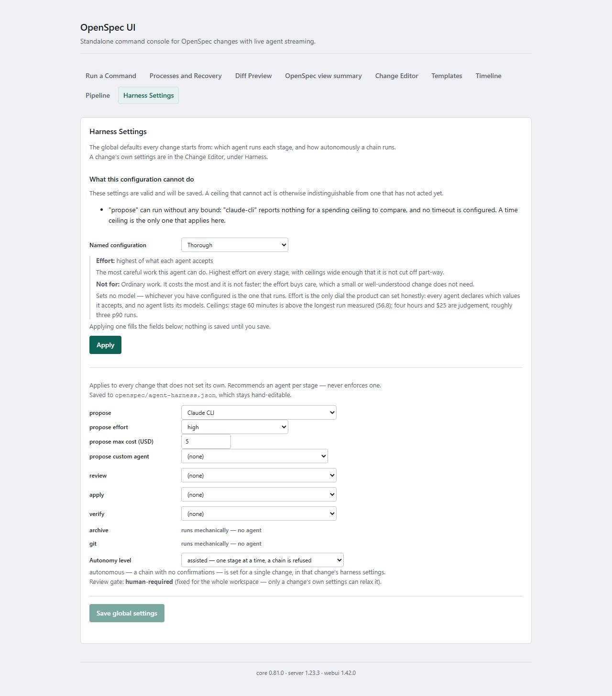

# Harness Spending Limits

What actually stops an Agentic Harness run, in what unit, evaluated when
— and, stated plainly, what does **not** exist as a limit at all. For
everything else the harness can be configured to do, see
[`HARNESS.md`](HARNESS.md).

## At a glance

| Scope | Configuration | Unit | Enforced |
| --- | --- | --- | --- |
| Whole chain | `budget.maxCostUsd` / `budget.maxTokens` | USD and/or tokens | Before each stage starts — **only for agents that report usage** (see below) |
| One agent invocation | `stepAgents.<stage>.budget` | The selected agent's native unit | By that agent's CLI |
| Elapsed time | Not available | — | No wall-clock or per-stage timeout exists |

Two boundaries matter, and both are easy to assume away:

1. A chain ceiling can prevent the **next** stage from starting; it
   cannot interrupt the stage that is already running.
2. A chain ceiling counts only what an agent **reported**. Over an agent
   that reports nothing, it counts nothing and never fires — see
   [Which agents report usage](#which-agents-report-usage).

## Two independent levels

There are exactly two ceilings, checked in two different places, in two
different units, and neither one substitutes for the other.

### 1. `HarnessConfig.budget` — caps a whole chain, between stages

```json
{ "budget": { "maxCostUsd": 25, "maxTokens": 2000000 } }
```

`maxCostUsd` and `maxTokens` are both optional and independent — a
configuration may cap cost only, tokens only, both, or (by omitting
`budget` entirely) neither.

`HarnessChainRunner.checkBudget` sums this change's own recorded audit
usage — usage the agent reported, for the agents that report any — and
compares it against this ceiling **before starting each stage**
— never during one. **This cannot stop a stage already running.** A stage
that is mid-run when the ceiling is crossed is allowed to finish; the
chain simply does not start the next one. This is a deliberate property
of the design (ADR 0018 decision 7: a run's cost is not known until it
ends), not an oversight to work around.

### 2. `stepAgents.<stage>.budget` — passed to one CLI invocation

```json
{ "stepAgents": { "apply": { "agent": "claude-cli", "budget": { "maxCostUsd": 10 } } } }
```

`maxCostUsd` **or** `maxAiCredits` — exactly one field, in whichever unit
the chosen agent's own CLI accepts (see the table below) — passed straight
through as that CLI's own flag for a single invocation. This is not a
chain-wide ceiling; it bounds one stage's one agent run.

The standalone **Harness Settings** view reveals the budget input only
after an agent with a supported budget unit is selected. In this generated
capture, `claude-cli` exposes **propose max cost (USD)**:

[](./docs/images/standalone/harness-settings.png)

*Select the image for the full-resolution settings view. See
[`HARNESS.md`](HARNESS.md#where-each-setting-is-edited) for the complete
control map and the screenshot regeneration command.*

## Why there is no single `budget: number`

A portable, unit-agnostic `budget` field was rejected, for three concrete
reasons found investigating what the underlying CLIs actually accept:

1. **GitHub publishes one AI credit as $0.01 — a vendor decision, not a
   fixed exchange rate.** A configuration written in a currency amount
   would silently mean something different if that rate changed, and
   nothing here would notice.
2. **`copilot-cli`'s `--max-ai-credits` has a 30-credit floor.** A dollar
   figure converted downward could land below that floor, in which case
   the CLI's own minimum — not the user's configured value — would be
   what actually governed the run.
3. **Rounding dollars to whole credits either exceeds or tightens the cap
   the user wrote**, in either rounding direction, for the same reason:
   the conversion is lossy and one-way.

Each agent's own field, in its own native unit, avoids all three: no
conversion happens at all, so nothing to silently drift.

## Which agent honours which field

| Agent | Field | CLI flag | Notes |
| --- | --- | --- | --- |
| `claude-cli`, `claude-cli-acp` | `maxCostUsd` | `--max-budget-usd` | Requires Claude Code v2.1.217 or later. |
| `copilot-cli`, `copilot-cli-acp` | `maxAiCredits` | `--max-ai-credits` | Minimum 30 — a configured value below this is rejected before any run starts. |
| `codex-cli`, `gemini-cli`, `local-llm`, `codex-cli-acp`, `gemini-cli-acp`, `vscode-chat` | Neither | — | No spending-cap mechanism at all; a `stepAgents` entry setting either field for one of these is rejected. |

**A mismatched field is refused when the configuration resolves, not
minutes into a run.** Setting `stepAgents.apply.budget.maxAiCredits` while
`stepAgents.apply.agent` is `"claude-cli"` fails
`resolveHarnessConfig`/`writeGlobalHarnessConfig`/`writeChangeHarnessConfig`
immediately, before any CLI process is spawned — not as a runtime error
partway through a stage.

## What does not exist

**There is no wall-clock or duration limit on a harness run, and no
per-stage timeout.** A chain, and each of its stages, can run
indefinitely. This is stated outright because the request that prompted
this document asked about time limits as though one existed, and a reader
who assumes a run cannot exceed some duration will be wrong.

The durations that do exist in the codebase are not user-configurable
harness settings — naming them here precisely so none is mistaken for
one:

- `external-waiter.ts`'s `maxDurationMs` — a generic poller's own
  parameter, built for the suspendable-stage capability
  (`harness-suspendable-stage`). Not a harness config field; whatever
  calls `waitForExternalSignal` would supply it — and, as of this
  writing, nothing in `packages/core/src` actually calls it yet (the `git`
  stage's own check-polling, below, uses a separate loop instead).
- `gh-pr-gateway.ts`'s `maxWaitMs` (default 300000ms / 5 minutes) — how
  long the `git` stage polls a pull request's checks before giving up and
  treating the wait as a refusal (see `HARNESS.md`'s "The `git` stage").
  Not user-configurable.
- Agent detection's own timeout (the best-effort "is this CLI on `PATH`"
  probe each host's picker runs) — unrelated to a run's own duration.
- The CI job ceilings in `.github/workflows/quality.yml` — see below.
  These bound CI, not a harness run.

None of the above is reachable from `openspec/agent-harness.json` or a
per-change `harness.json`. If a run needs to be stopped, the only
mechanism is a human (or another process) sending `"cancel"` — there is no
setting that does it automatically on a clock.

## Where the numbers come from

Every ceiling above is compared against **recorded audit usage** —
`.openspec-ui/audit.jsonl` under the workspace root, read back by
`buildUsageReport` (`packages/core/src/usage-report.ts`). Each
`AuditEntry`'s `usage` field is "resource usage reported for this run, as
reported by the agent only — never estimated or derived." Absent means no
usage was reported, **not zero usage**.

The practical consequence: **a ceiling can only count what an agent
actually reported.** A change whose runs never report usage at all never
trips the chain-level `budget` ceiling — not because it stayed under
budget, but because there is nothing recorded to compare against. This is
the same "fail open when the evidence is absent" posture
`HarnessChainRunner.checkBudget` documents explicitly for itself.
[Which agents report usage](#which-agents-report-usage) below says which
agents those are.

## Which agents report usage

A chain ceiling is only as wide as the reporting behind it. Which agent
ran a stage decides whether that stage counted toward the ceiling at all.

| Agent | Reports usage | Evidence | Source |
| --- | --- | --- | --- |
| `copilot-cli-acp` | Input, output and thought **tokens**. **No cost.** | **Measured** — see below | ACP's `PromptResponse.usage` |
| `claude-cli-acp` | Cost (USD), input/output/cache tokens, per-model split | *Expected* — from the documented format and its unit tests, not yet seen in a run | `claude`'s own terminal `"result"` line (`total_cost_usd`, `usage`, `modelUsage`) |
| `gemini-cli-acp`, `codex-cli-acp` | Whatever that CLI sends over ACP — token totals, a cost, or nothing | *Unobserved* | ACP's `PromptResponse.usage` and `usage_update` notifications |
| `claude-cli`, `copilot-cli`, `codex-cli`, `gemini-cli`, `local-llm` | Nothing | Certain — plain text carries no figure to record | Plain text output |
| `vscode-chat` | Nothing | Certain | The run is handed to VS Code chat; this project never sees its cost |

### What that means for a ceiling, per agent

**On `copilot-cli-acp`, `budget.maxCostUsd` can never fire.** It reports
tokens and no cost, so a cost ceiling compares against nothing however
large the spend. `budget.maxTokens` is the ceiling that can act on it.

Measured on 2026-09-04 from this repository's own
`.openspec-ui/audit.jsonl`: one completed run recorded
`{inputTokens: 786966, outputTokens: 4732, thoughtTokens: 1308}` and no
cost field of any kind.

That is one observation, of one version of one CLI. ACP marks the usage
field on a prompt response `UNSTABLE`/`@experimental`, so a later
version may send something else — including a cost. Read the audit log
rather than trusting this line indefinitely.

**`claude-cli-acp` is expected to report cost, and has not been seen to.**
Its row above comes from `claude`'s documented stream format and from
the unit tests over that parsing. Its one run since this capability
shipped failed before reporting. Expected is not measured, and this
table says which is which rather than letting a reader assume.

**A run that fails may record nothing.** Three of the four runs that
terminated after this capability shipped failed, and none recorded usage:
the agent never finished its turn, so it never reported. Their spend
counts toward no ceiling. A ceiling protects you from a long
*successful* run, not from a sequence of expensive failures.

**The raw-text CLIs report nothing, so a ceiling over them counts nothing
and cannot fire.** `claude-cli` and `claude-cli-acp` drive the same
underlying `claude` binary, but only the latter asks for the structured
output the figure lives in. If a chain ceiling matters to you, that
choice of agent is what decides whether it can act at all.

One figure is deliberately **not** recorded: an ACP `usage_update`'s
`used` is how much of the context window is currently occupied, and it
goes *down* after a compaction. Counting it as consumption would
under-count exactly the long runs that compact.

## Watching it while it runs

A chain run shows what it has spent as it goes: a usage summary beside
the event log, with a row per stage that has started, and the configured
ceiling beside the recorded total when one is configured.

Two things there are deliberately not the same number:

- **The recorded total** is what agents reported for stages that have
  finished. It is the figure a ceiling is compared against.
- **A live figure**, where an agent sends one, is that agent's own
  running report during a stage — including how much of its context
  window is occupied, which falls after a compaction and is never an
  amount spent. It is shown as the agent's commentary and counts toward
  nothing.

A stage whose agent reported nothing reads "not reported", never
`$0.00`. Reaching a ceiling stops the chain before the next stage; it
does not interrupt the stage already running.

## CI job timeouts (not a harness setting)

`.github/workflows/quality.yml` sets a `timeout-minutes` per job — these
are real ceilings, but they bound CI runs, not Agentic Harness runs, and
nothing here configures them. See that workflow file directly for the
current values.
