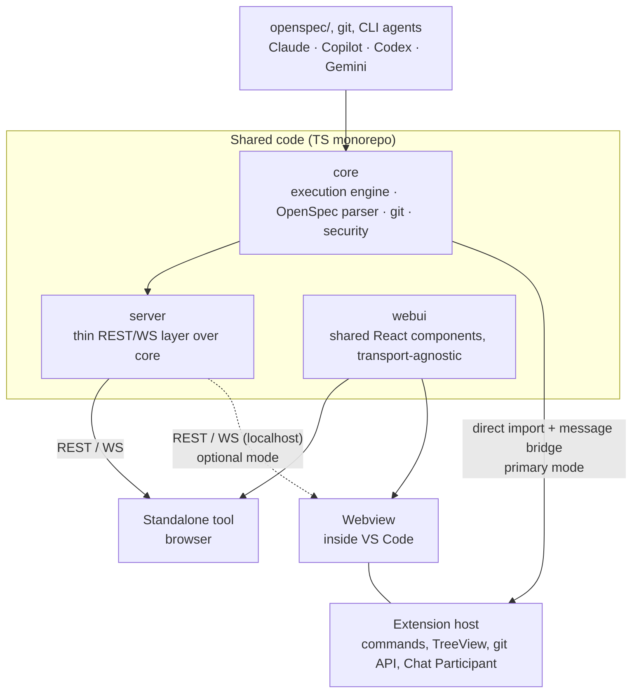

# OpenSpec UI

Dashboard for [OpenSpec](https://github.com/Fission-AI/OpenSpec) — a view
over Changes/Archive/Specs/Tasks and a launcher for CLI agents (Claude CLI,
GitHub Copilot CLI, Codex CLI, Gemini CLI, and a local LLM via an
OpenAI-compatible API) for working with change proposals. The product ships
in two forms with shared code: a standalone web tool and a VS Code extension.

## Status

Active development. The repository contains a working standalone application,
shared core and web UI packages, and a native VS Code OpenSpec Workbench. See
`openspec/README.md` for the governed change workflow.

## Why not just `openspec view`

OpenSpec CLI already has `openspec view` — an interactive dashboard for
specs/changes. This project does not reinvent it: the reasons for existing are
(1) diffs between versions of archived changes (not covered by `openspec
view`), (2) launching CLI agents directly from the UI with a unified
command/event protocol, and (3) VS Code integration as a native extension
rather than a separate window.

Before implementing any capability, check whether it has already appeared in
upstream `openspec view` so we do not duplicate it.

## Architecture at a Glance

Shared code (`packages/core`, `packages/webui`) is reused in two delivery
forms: a standalone tool (browser + local REST/WS server) and a VS Code
extension (Webview + direct `core` import in the extension host, without HTTP
where possible). See `docs/adr/0001-shared-core-two-delivery-targets.md` for
the full rationale and `openspec/specs/` (after the first `apply`) for the
detailed behavioral contract of each part.

## Packages

| Package | Purpose | Capability |
| --- | --- | --- |
| `packages/core` | Execution engine, OpenSpec parser, git wrapper, CLI-agent orchestration, security model, derived change-state machine | `execution-core` |
| `packages/server` | Thin REST/WS layer over `core`, used only for standalone | `standalone-app` |
| `packages/webui` | Shared React components (Changes/Archive/Specs/Tasks/AI panel), transport-agnostic | `shared-ui` |
| `packages/extension` | VS Code extension — TreeView/Commands/Settings/Chat Participant on top of native VS Code API + Webview for what is not covered natively | `vscode-extension` |

## Technology Stack

TypeScript, npm workspaces (monorepo) — rationale in
`docs/adr/0001-shared-core-two-delivery-targets.md`. Testing uses Vitest;
contract tests between `webui` and `server` are required before archiving
`standalone-app` (see `openspec/config.yaml`, `operations.archive.guidance`).

## Runtime Environment (Node.js)

This repository uses npm workspaces and pins the local runtime with Volta in
the root `package.json` (`volta` + `engines` fields).

For Windows setup:

1. Install Volta: `winget install Volta.Volta`
2. Open a new terminal in the repository root.
3. Install dependencies: `npm install`
4. Verify pinned runtime: `volta list`

After that, regular project commands (`npm run typecheck`, `npm run lint`,
`npm run test`) use the pinned Node.js/npm versions automatically.

## Versioning

The project uses semver per package, not only at the standalone/extension
delivery level.

- `patch` — bug fixes, documentation, and refactoring without external
  contract changes.
- `minor` — new capabilities that remain compatible with the current contract.
- `major` — breaking changes in public behavior, protocol, data format, or
  promised UX.

If a change is visibly user-facing, the affected package version in
`package.json` must be bumped in the same change. For delivery forms, an
aggregated release version is allowed, but package versions — especially
`core` — remain the source of truth and should be shown separately when the UI
displays build information.

The private root package remains `0.0.0`; it is a workspace container, not a
release artifact. Current release versions are:

| Package | Version | Release role |
| --- | ---: | --- |
| `@openspec-ui/core` | 0.7.0 | Shared behavior and persistence contract |
| `openspec-ui-vscode` | 0.3.0 | VS Code delivery |
| `@openspec-ui/server` | 0.1.3 | Standalone server delivery |
| `@openspec-ui/webui` | 0.2.0 | Shared browser UI |

## Delivery Capability Matrix

| Capability | Standalone | VS Code |
| --- | --- | --- |
| Browse changes, archive, specs, and tasks | Yes | Yes |
| Create and edit change artifacts | Yes | Yes, through native editors |
| Deterministic OpenSpec status and validation | Yes | Yes |
| Shared command/event protocol | Yes | Yes |
| Native VS Code Chat and Agent handoff | Not applicable | Yes |
| Processes view and checkpoint rollback | Not yet exposed | Yes |
| Persistent run journal engine | Available in core, adapter pending | Yes |

Host-specific UX is allowed to differ, but business behavior must remain in
`packages/core`. Standalone process/recovery parity is explicit follow-up work,
not an implied capability. See ADR 0004.

## Getting Started

1. Read `docs/adr/0001-*.md` — the architecture decisions and rejected
    alternatives.
2. Start with `openspec/changes/execution-core/`: `server`, `webui`, and
    `extension` depend on the contract defined there (the unified
    command/event protocol and the security model).
3. Then `shared-ui`, followed by `standalone-app` and `vscode-extension` in
    parallel.
4. For each change: run `openspec change validate --strict <id>` before
    marking tasks done; run `openspec archive <id> --yes` only after a live
    verification (see `operations.archive.guidance` in `openspec/config.yaml`) —
    not earlier.

## Change Governance

Every repository modification must go through an OpenSpec change entry in
`openspec/changes/<id>/`. This includes code, tests, docs, and tooling.
Direct ad-hoc commits without a change entry are out of process.

All architecture-level changes must be documented through ADR files in
`docs/adr/`, and the related OpenSpec change must reference that ADR.
