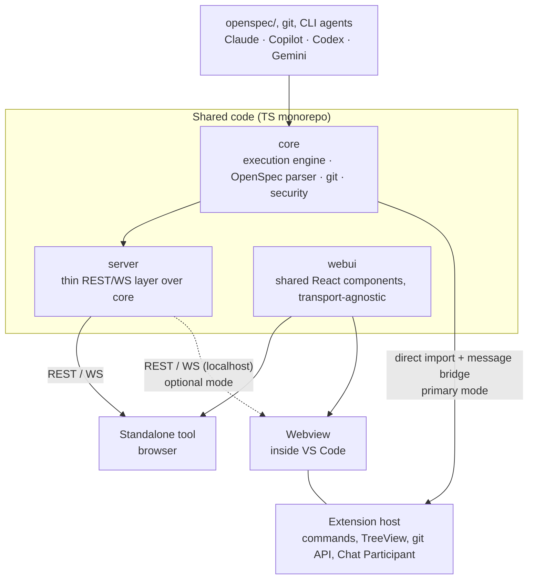

# OpenSpec UI

Dashboard for [OpenSpec](https://github.com/Fission-AI/OpenSpec) — a view
over Changes/Archive/Specs/Tasks and a launcher for CLI agents (Claude CLI,
GitHub Copilot CLI, Codex CLI, Gemini CLI, and a local LLM via an
OpenAI-compatible API) for working with change proposals. The product ships
in two forms with shared code: a standalone web tool and a VS Code extension.

## Status

Planning. No application code has been written yet. This repository currently
contains the architecture decisions (`docs/adr/`) and the OpenSpec proposals
for each capability (`openspec/changes/`), which are enough to start
implementation from each change's `tasks.md`. See `openspec/README.md` for
the continuation workflow.

## Why not just `openspec view`

OpenSpec CLI already has `openspec view` — an interactive dashboard for
specs/changes. This project does not reinvent it: the reasons for existing are
(1) diffs between versions of archived changes (not covered by `openspec
view`), (2) launching CLI agents directly from the UI with a unified
command/event protocol, and (3) VS Code integration as a native extension
rather than a separate window.

Before implementing any capability, check whether it has already appeared in
upstream `openspec view` so we do not duplicate it.

## Architecture at a Glance

Shared code (`packages/core`, `packages/webui`) is reused in two delivery
forms: a standalone tool (browser + local REST/WS server) and a VS Code
extension (Webview + direct `core` import in the extension host, without HTTP
where possible). See `docs/adr/0001-shared-core-two-delivery-targets.md` for
the full rationale and `openspec/specs/` (after the first `apply`) for the
detailed behavioral contract of each part.

## Packages

| Package | Purpose | Capability |
|---|---|---|
| `packages/core` | Execution engine, OpenSpec parser, git wrapper, CLI-agent orchestration, security model, derived change-state machine | `execution-core` |
| `packages/server` | Thin REST/WS layer over `core`, used only for standalone | `standalone-app` |
| `packages/webui` | Shared React components (Changes/Archive/Specs/Tasks/AI panel), transport-agnostic | `shared-ui` |
| `packages/extension` | VS Code extension — TreeView/Commands/Settings/Chat Participant on top of native VS Code API + Webview for what is not covered natively | `vscode-extension` |

## Technology Stack

TypeScript, npm workspaces (monorepo) — rationale in
`docs/adr/0001-shared-core-two-delivery-targets.md`. Testing uses Vitest;
contract tests between `webui` and `server` are required before archiving
`standalone-app` (see `openspec/config.yaml`, `operations.archive.guidance`).

## Versioning

The project uses semver per package, not only at the standalone/extension
delivery level.

- `patch` — bug fixes, documentation, and refactoring without external
  contract changes.
- `minor` — new capabilities that remain compatible with the current contract.
- `major` — breaking changes in public behavior, protocol, data format, or
  promised UX.

If a change is visibly user-facing, the affected package version in
`package.json` must be bumped in the same change. For delivery forms, an
aggregated release version is allowed, but package versions — especially
`core` — remain the source of truth and should be shown separately when the UI
displays build information.

## Getting Started

1. Read `docs/adr/0001-*.md` — the architecture decisions and rejected
    alternatives.
2. Start with `openspec/changes/execution-core/`: `server`, `webui`, and
    `extension` depend on the contract defined there (the unified
    command/event protocol and the security model).
3. Then `shared-ui`, followed by `standalone-app` and `vscode-extension` in
    parallel.
4. For each change: run `openspec change validate --strict <id>` before
    marking tasks done; run `openspec archive <id> --yes` only after a live
    verification (see `operations.archive.guidance` in `openspec/config.yaml`) —
    not earlier.
