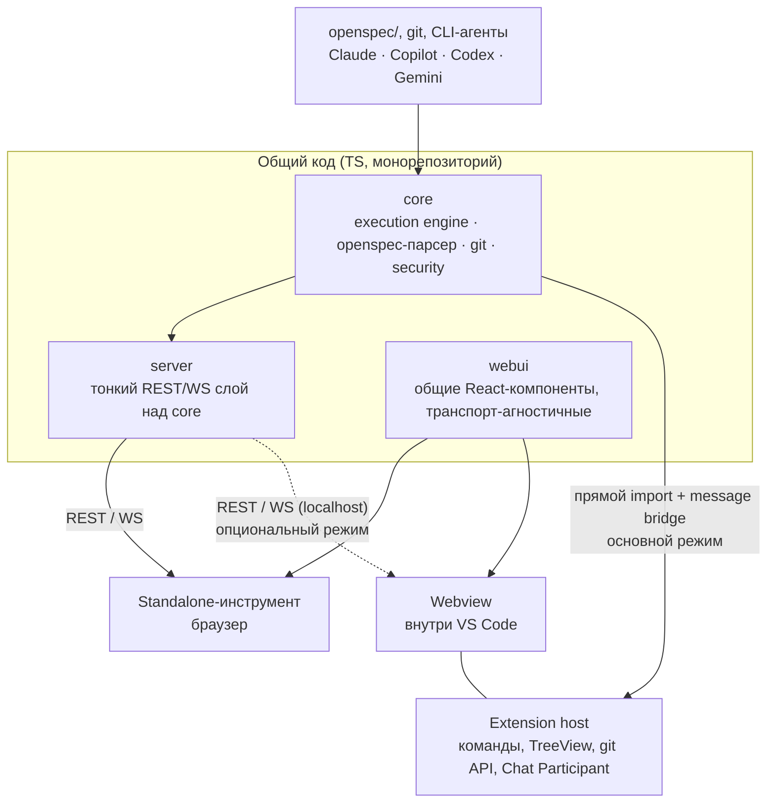

# OpenSpec UI

Дашборд для [OpenSpec](https://github.com/openspec-ai/openspec) — визуализация
Changes/Archive/Specs/Tasks и запуск CLI-агентов (Claude CLI, GitHub Copilot
CLI, Codex CLI, Gemini CLI, локальная LLM через OpenAI-совместимый API) для
работы с change-предложениями, поставляется в двух формах с общим кодом:
standalone web-инструмент и расширение VS Code.

## Статус

Планирование. Код ещё не написан — этот репозиторий сейчас содержит
архитектурные решения (`docs/adr/`) и OpenSpec-предложения по каждой
капабилити (`openspec/changes/`), достаточные, чтобы начать реализацию по
`tasks.md` каждого change'а. См. `openspec/README.md` за тем, как продолжать
работу.

## Почему не просто `openspec view`

У самого OpenSpec CLI уже есть `openspec view` — интерактивный дашборд
specs/changes. Этот проект не переизобретает его: причина существования —
(1) diff между версиями архивных changes (не покрыт `openspec view`), (2)
запуск CLI-агентов прямо из UI с унифицированным протоколом команд/событий,
(3) интеграция с VS Code как нативное расширение, а не отдельное окно.
Перед реализацией любой capability — проверить, не появилось ли это в
апстриме `openspec view`, чтобы не дублировать.

## Архитектура — коротко

Общий код (`packages/core`, `packages/webui`) переиспользуется в двух
формах поставки: standalone-инструмент (браузер + локальный REST/WS сервер)
и расширение VS Code (Webview + прямой импорт `core` в extension host, без
HTTP, где это возможно). См. `docs/adr/0001-shared-core-two-delivery-targets.md`
за полным обоснованием и `openspec/specs/` (после первого `apply`) за
детальным поведенческим контрактом каждой части.

## Пакеты

| Пакет | Назначение | Capability |
|---|---|---|
| `packages/core` | Execution engine, openspec-парсер, git-обёртка, оркестрация CLI-агентов, security-модель, derived change-state machine | `execution-core` |
| `packages/server` | Тонкий REST/WS слой над `core`, только для standalone | `standalone-app` |
| `packages/webui` | Общие React-компоненты (Changes/Archive/Specs/Tasks/AI-панель), транспорт-агностичные | `shared-ui` |
| `packages/extension` | VS Code расширение — TreeView/Commands/Settings/Chat Participant поверх нативного VS Code API + Webview для того, что нативно не покрывается | `vscode-extension` |

## Технологический стек

TypeScript, npm workspaces (монорепозиторий) — обоснование в
`docs/adr/0001-shared-core-two-delivery-targets.md`. Тестирование —
Vitest; contract tests между `webui` и `server` — обязательны перед
архивацией `standalone-app` (см. `openspec/config.yaml`, `operations.archive.guidance`).

## С чего начать реализацию

1. Прочитать `docs/adr/0001-*.md` — архитектурные решения и отклонённые
   альтернативы.
2. `openspec/changes/execution-core/` — начинать отсюда: `server`,
   `webui`, `extension` зависят от контракта, определённого здесь
   (унифицированный протокол команд/событий, security-модель).
3. Далее — `shared-ui`, затем параллельно `standalone-app` и
   `vscode-extension`.
4. По каждому change: `openspec change validate --strict <id>` перед тем,
   как отмечать задачи выполненными; `openspec archive <id> --yes` только
   после живой проверки (см. `operations.archive.guidance` в
   `openspec/config.yaml`) — не раньше.
