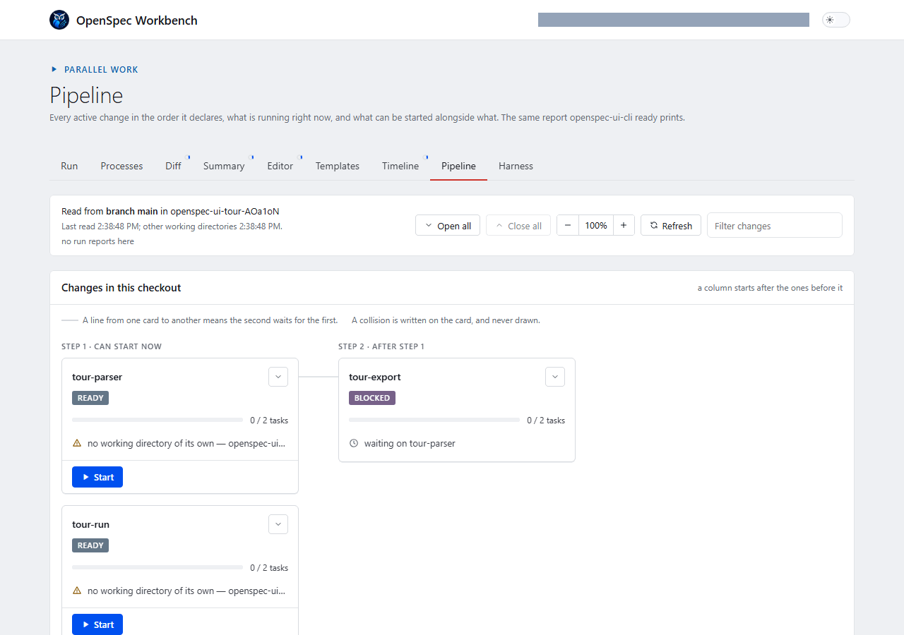
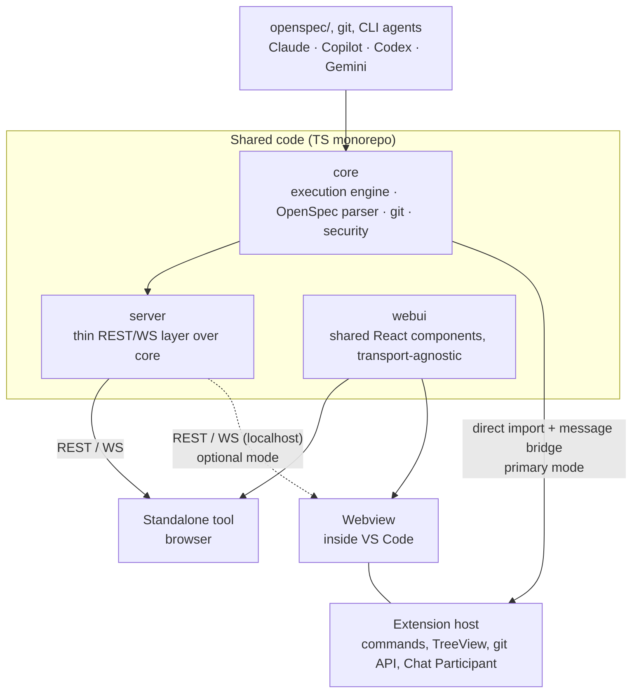

# OpenSpec Workbench

**Run and supervise coding agents on [OpenSpec](https://github.com/Fission-AI/OpenSpec)
changes.** Start a run from a change, watch what the agent is doing while it
does it, stop it where its work is sound, and see every change's standing
across every working directory you have open.



## Install

**In VS Code**, from the
[Visual Studio Marketplace](https://marketplace.visualstudio.com/items?itemName=openspec-ui.openspec-ui-vscode),
or from a terminal:

```bash
code --install-extension openspec-ui.openspec-ui-vscode
```

**As a local web application**, from a clone of this repository:

```bash
npm install
npm run build --workspace @openspec-ui/server
npm run start --workspace @openspec-ui/server -- <workspaceRoot> 4317
```

The build step is not optional: the server serves a bundle that is not
committed. `<workspaceRoot>` is the repository you want it to work on. It
prints a URL carrying a one-time token; open that exact URL. Everything
runs on your machine, against your own agent CLIs.

**The name is the product's; the code keeps its own.** The repository, the
npm packages (`@openspec-ui/core`, `@openspec-ui/server`,
`@openspec-ui/webui`), the CLI (`openspec-ui-cli`), the extension id
(`openspec-ui.openspec-ui-vscode`) and the site
[openspec-ui.dev](https://openspec-ui.dev) are all still OpenSpec-UI. If you
came here looking for that, you are in the right place.

It ships in two forms with shared code: the VS Code extension and the
standalone web application. The agents it can drive are Claude CLI, GitHub
Copilot CLI, Codex CLI, Gemini CLI, and a local LLM over an
OpenAI-compatible API.

Project site: [https://openspec-ui.dev](https://openspec-ui.dev) — downloads, release notes and
what each delivery target does.

[A Tool That Watched Itself Get Built](https://www.linkedin.com/pulse/tool-watched-itself-get-built-alexander-ivanov-q57ne?lipi=urn%3Ali%3Apage%3Ad_flagship3_pulse_read%3BHDMlQK%2BGTcemHEauLJbbBA%3D%3D)

## Product Tour

The standalone application and VS Code extension expose the same OpenSpec
workflows through interfaces suited to their respective hosts.

### Standalone application

Pictured above: the application bar with the workspace and the theme
switch, the Run tab beside Processes, Diff, Summary, Editor, Templates,
Timeline, Pipeline and Harness, and a completed command with its analysis
and streamed output.

### VS Code extension


The **Change Graph** view nests each change under the ones it
follows, marks anything waiting on a change that has not landed, folds
away the branches where every change has landed, and lets a relation be
added or removed from the row that shows it. The Archive, Specs and
Change Graph views each take a filter from their title bar.

Both hosts also carry, beyond the views above:

- **The Pipeline** - every change as a card in the order the changes
  declare, with what a live run last said and what can start alongside
  what. A card starts a run, answers a checkpoint, and asks a run to stop
  with a reason.
- **The Timeline** - one change as a line of moments read from git, and a
  comparison of every change on a grid of days.
- **What waits on somebody** - every task marked human-only or delegated
  to a named agent, with the run offered where this build carries that
  agent. A panel of the Summary in the standalone app; a view of its own
  in the editor.
- **Harness Settings** - the per-stage agent, model, effort and budget,
  globally and per change.
- **What the archive left behind** - a directory holding nothing but a
  file this product wrote is cleared, and anything else with no documents
  in it is shown rather than removed.

See the complete screenshot galleries for the
[standalone application](packages/server/README.md#screenshots) and the
[VS Code extension](packages/extension/README.md#screenshots).

## Local Delivery Modes

This repository effectively ships two independent products that share one
common core:

- VS Code extension for users who already work inside VS Code
- Standalone web application for users who do not use VS Code

Both products solve the same problem set: viewing and editing OpenSpec
changes, validating artifacts, and running local AI-assisted workflows from
the same shared execution engine. They are designed to operate only on the
local machine and do not require Internet access for normal use. The split is
purely about UI host preference: if VS Code is available, the extension is the
most natural path; otherwise, the standalone web app is the equivalent local
product.

### UI reception and launch

- Standalone web app: start the local standalone app from source, then open
  the tokenized localhost URL printed by the server. The same two commands
  as above, with the build step written out:

  ```bash
  npm install
  npm run build --workspace @openspec-ui/server
  npm run start --workspace @openspec-ui/server -- <workspaceRoot> 4317
  ```

  Here, `<workspaceRoot>` is the absolute path to the local project or repo
  that the app should inspect and manage. In practice, this is usually the
  folder you want to open, such as the current repository root or another Git
  working directory on your machine. After startup, the server prints a URL in
  the console similar to:

  ```text
  OpenSpec Workbench server listening on http://127.0.0.1:4317/#token=PU32_AOBt0lG6sHhYQtCMwSU6ZmcXtIJX0-4RUe1FQM (workspaceRoot: ., allowExternalCwd: false)
  ```

  You must open that exact URL in the browser to connect to the server. The
  URL contains a temporary one-time access token; without it, you cannot access
  the running server. The default port is `4317`.
- VS Code extension: install it from the
  [Visual Studio Marketplace](https://marketplace.visualstudio.com/items?itemName=openspec-ui.openspec-ui-vscode)
  and open the workbench from the activity bar. The extension uses the same
  shared core logic and local-only data access path as the web app.

### Installing without the Marketplace

For a machine that cannot reach the Marketplace, or to pin an exact
version:

- Take the packaged artifact from the official GitHub Release for the
  extension. The built package is published as a `.vsix` file; it is not
  committed into the repository.
- In VS Code, open the Extensions view and choose "Install from VSIX...".
- Select the downloaded `.vsix` file, confirm the installation prompt, and
  reload the window if VS Code asks for it.
- After reload, the extension is available as a local VS Code product and can
  be used without any remote service dependency.

## Status

Active development. The repository contains a working standalone application,
shared core and web UI packages, and a native VS Code OpenSpec Workbench. See
`openspec/README.md` for the governed change workflow.

What the current releases added, written for somebody using the tool rather
than building it:
[What you can see and stop: 0.44 → 0.56](docs/articles/2026-09-14-what-you-can-see-and-stop-0-44-to-0-56.md).

## Why not just `openspec view`

OpenSpec CLI already has `openspec view` — an interactive dashboard for
specs/changes. This project does not reinvent it: the reasons for existing are
(1) diffs between versions of archived changes (not covered by `openspec
view`), (2) launching CLI agents directly from the UI with a unified
command/event protocol, and (3) VS Code integration as a native extension
rather than a separate window.

Before implementing any capability, check whether it has already appeared in
upstream `openspec view` so we do not duplicate it.

## How this differs from BMAD

[BMAD](https://github.com/bmad-code-org/BMAD-METHOD), the BMad Method, sets
out to "turn an idea or change request into working software without giving
up the thinking". Its own pages, read on 2026-09-13, describe it as "a set
of named commands, called skills", added "to AI coding tools such as Claude
Code and Cursor". It works in a loop of *clarify → plan → build and verify →
learn and adjust*, drawing on "product, architecture, UX, development, and
testing expertise".

**What the two share.**

- **Written before it is built.** Work is written down before it is built:
  BMAD's briefs, specifications and architecture; here, an OpenSpec change's
  `proposal.md`, `design.md`, `tasks.md` and spec deltas.
- **Steps taken in turn.** The work passes through steps that different
  expertise, or different agents, take in turn.
- **Checked before accepted.** Building is followed by checking, before
  anything is accepted.

**Where this repository differs.**

- **It runs the agents itself.** BMAD's skills run inside whichever AI tool
  you work in. Here, the Agentic Harness starts and supervises a CLI agent
  (Claude, Copilot, Codex, Gemini or a local model) for each stage of a
  change: `propose → review → apply → verify → archive → git`. It runs the
  same way from the standalone app, the VS Code extension, or
  `openspec-ui-cli run`. See [`HARNESS.md`](HARNESS.md).
- **A specification outlives its change.** Archiving a change merges its
  spec deltas into `openspec/specs/`. The next change is proposed against
  what the system does now, not against a document written for an earlier
  task. See [`openspec/README.md`](openspec/README.md).
- **Where a person decides is configuration, and the runner enforces it.**
  - an autonomy level;
  - checkpoints between stages;
  - a review gate that only a change's own settings can relax;
  - tasks marked **Human-only** or **Delegated to** a named agent;
  - a delegated item whose tick records nothing new has the tick reverted.

  See [`HARNESS.md`](HARNESS.md).
- **Spending is capped, and every run is recorded.** Each stage has its own
  spending cap, in the unit its agent honours, and each chain has a ceiling.
  Every run lands in an audit log, and the product states plainly which
  limits do not exist. See [`LIMITS.md`](LIMITS.md).
- **Several changes run at once, and you can see them.**
  - Each change can have its own git worktree, guarded by a lease.
  - A readiness report says which ready changes can start alongside which,
    and why the others cannot.
  - The Pipeline shows every working directory, and what each run says it
    is doing.
  - Every run keeps a log of what it said, in `.openspec-ui/runs/`, and a
    change's card opens them: its runs, newest first, and each one's output,
    replies, tool calls and how it ended.
  - A working directory whose work has landed is removed, and a change's
    branch that has fallen behind is rebased and pushed with a lease, so
    its checks run again against the current default branch. A conflict is
    never resolved for you: the branch is left as it was and the files are
    named. `branches.rebaseWhenBehind` turns the rebase off; see
    [`HARNESS.md`](HARNESS.md#branches).
  - A change that has landed with every task item closed is archived for
    you, in one pull request per pass that merges when its checks pass.
    One that landed still owing something is named, not archived. The
    main checkout's `main` then follows what landed, by fast-forward, when
    its tree is clean; `branches.followMain` turns that off.
    `archive.whenLanded` turns it off; see
    [`HARNESS.md`](HARNESS.md#archive).

  See [`docs/adr/`](docs/adr/), 0025 to 0029, 0034 and 0035.

BMAD's pages were not found to describe spending limits, an audit log or
parallel runs. That is not a claim that BMAD lacks them, only that this
comparison could not find them.

The two are not exclusive: planning done with BMAD can be written down as an
OpenSpec change here and run through the harness.

## How this differs from the other OpenSpec viewers

Several projects put a user interface over OpenSpec. Read on 2026-09-20,
in their own words:

- **[ToruAI/openspec-ui](https://github.com/ToruAI/openspec-ui)** — "a
  single kanban board over every OpenSpec repo you work in — which change
  is where in the workflow, what is ready to write next, and what is still
  blocked". It is read-only by design and says it "never writes to your
  specs". It covers several repositories at once, which this one does not:
  it reads the working directories of one.
- **[jixoai/openspecui](https://github.com/jixoai/openspecui)** — "a web
  interface for OpenSpec workflows (live mode + static export)", with
  viewers and editors for the config and schema, a compose panel for change
  actions, and a static snapshot you can host as documentation. The static
  export is its own, and this one has nothing like it. It also offers a
  terminal panel, in which a person can of course run whatever they like.
- **[coderj001/openspec-ui-vscode](https://github.com/coderj001/openspec-ui-vscode)**
  — "a visual workspace for browsing, reviewing, and understanding Openspec
  changes in VS Code", with line-level comments on artifacts and a "Copy
  Comments" action for pasting into "Codex, Claude Code, or another CLI
  tool". Its line-level commenting is its own; this one has no equivalent.

What they share is showing a change's documents and where it stands. The
difference is what happens next: **none of them starts an agent, and this
one does.** Here a change is run — propose, review, apply, verify, archive,
git — by the agent CLI you configure per stage; the run says what it is
doing while it does it; a person can stop it, or tell it to stop after a
named task; a checkpoint can ask before the next stage; there are spending
and time ceilings, an audit log, a lease on the working directory, and a
signed channel for asking a run elsewhere to stop or leaving it a note.

If you want to read and review OpenSpec changes, any of these will do it,
and two of them do things this one does not. If you want to set agents
working on them and keep your hand on the wheel, that is what this is for.

## Architecture at a Glance

Shared code (`packages/core`, `packages/webui`) is reused in two delivery
forms: a standalone tool (browser + local REST/WS server) and a VS Code
extension (Webview + direct `core` import in the extension host, without HTTP
where possible). See `docs/adr/0001-shared-core-two-delivery-targets.md` for
the full rationale and `openspec/specs/` for the detailed behavioral
contract of each part.



## Packages

| Package | Purpose | Capability |
| --- | --- | --- |
| `packages/core` | Execution engine, OpenSpec parser, git wrapper, CLI-agent orchestration, security model, derived change-state machine | `execution-core` |
| `packages/server` | Thin REST/WS layer over `core`, used only for standalone | `standalone-app` |
| `packages/webui` | Shared React components (Changes/Archive/Specs/Tasks/AI panel), transport-agnostic | `shared-ui` |
| `packages/extension` | VS Code extension — TreeView/Commands/Settings/Chat Participant on top of native VS Code API + Webview for what is not covered natively | `vscode-extension` |
| `packages/cli` | Non-interactive CLI over `core` for CI merge gates (no HTTP, no webview) | `ci-cli` |

## Technology Stack

TypeScript, npm workspaces (monorepo) — rationale in
`docs/adr/0001-shared-core-two-delivery-targets.md`. Testing uses Vitest;
contract tests between `webui` and `server` are required before archiving
`standalone-app` (see `openspec/config.yaml`, `operations.archive.guidance`).

## Runtime Environment (Node.js)

This repository uses npm workspaces and pins the local runtime with Volta in
the root `package.json` (`volta` + `engines` fields).

For Windows setup:

1. Install Volta: `winget install Volta.Volta`
2. Open a new terminal in the repository root.
3. Install dependencies: `npm install`
4. Verify pinned runtime: `volta list`

After that, regular project commands (`npm run typecheck`, `npm run lint`,
`npm run test`) use the pinned Node.js/npm versions automatically.

## Versioning

The project uses semver per package, not only at the standalone/extension
delivery level.

- `patch` — bug fixes, documentation, and refactoring without external
  contract changes.
- `minor` — new capabilities that remain compatible with the current contract.
- `major` — breaking changes in public behavior, protocol, data format, or
  promised UX.

If a change is visibly user-facing, the affected package's version bump and
`CHANGELOG.md` entry are proposed via a [changeset](.changeset/README.md)
(`npx changeset`) in the same change, instead of hand-editing `package.json`'s
`version` field directly — see `.changeset/README.md` for the full workflow
and why this repository adopted it. For delivery forms, an aggregated release
version is allowed, but package versions — especially `core` — remain the
source of truth and should be shown separately when the UI displays build
information.

The private root package remains `0.0.0`; it is a workspace container, not a
release artifact, and is excluded from changesets accordingly
(`.changeset/config.json`'s `ignore`). Current release versions (as of
2026-09-19; each package's own `package.json` is the live source of truth,
this table is a snapshot, not authoritative, and the standalone app's
footer prints the live figures):

| Package | Version | Release role |
| --- | ---: | --- |
| `@openspec-ui/core` | 0.98.0 | Shared behavior and persistence contract |
| `openspec-ui-vscode` | 0.63.0 | VS Code delivery |
| `@openspec-ui/server` | 1.30.0 | Standalone server delivery |
| `@openspec-ui/webui` | 1.62.0 | Shared browser UI |
| `@openspec-ui/cli` | 0.14.0 | CI merge-gate delivery |

`@vscode/vsce` (the extension's packager) already names the built
artifact with its version (`openspec-ui-vscode-<version>.vsix`) — no
extra step needed there. On every push to `main` where that version has
no matching git tag yet, CI (`release-extension` job in
`.github/workflows/quality.yml`) tags the commit
(`openspec-ui-vscode@<version>`) and publishes a GitHub Release with the
`.vsix` attached — that Release page is the permanent, versioned place to
download a specific build; the artifact itself is never committed into
`packages/` or anywhere else in git.

Reaching the Visual Studio Marketplace is a separate step, and a manual
one: not every release is meant for it. Somebody dispatches the
`Publish to the Marketplace` workflow
(`.github/workflows/publish-marketplace.yml`), names the version and types
the confirmation, and that run publishes the `.vsix` from that version's
GitHub Release — the artifact the extension integration suite exercised,
never a rebuild. No push, tag or merge publishes anything. The token is a
repository secret read by that one job;
`scripts/check-publish-workflow.mjs` fails the lint gate if any of that
stops holding.

## Delivery Capability Matrix

| Capability | Standalone | VS Code |
| --- | --- | --- |
| Browse changes, archive, specs, and tasks | Yes | Yes |
| Create and edit change artifacts | Yes | Yes, through native editors |
| Deterministic OpenSpec status and validation | Yes | Yes |
| Shared command/event protocol | Yes | Yes |
| Native VS Code Chat and Agent handoff | Not applicable | Yes |
| Agent selection (plan/implement/review via this app's own protocol) | Yes | Yes |
| Processes view and checkpoint rollback | Yes | Yes |
| Persistent run journal engine | Yes | Yes |
| Built-in template catalog (17 templates, 10 categories) | Yes | Yes |
| Recorded agent spend, and a ceiling that stops a chain | Yes | Yes |
| Change relation graph (`follows`/`supersedes`/`blocked_by`) | No — `@openspec-ui/cli change-graph` | View, filter, fold what has landed, and add or remove a relation from a row |
| Clear what the archive left behind | Yes | Yes |

Host-specific UX is allowed to differ, but business behavior must remain in
`packages/core`. Both delivery targets expose the same core recovery behavior
through host-specific interfaces. See ADR 0004.

## Agent Selection

The AI panel (in both the standalone browser tab and the VS Code Webview,
either transport mode) has an **agent picker** next to the command picker.
Selecting `plan`, `implement`, or `review` sends the picked agent id as
`Command.agentId`; the host resolves it to a real `AgentRunner` from
`buildDefaultAgentRunners()` (`packages/core/src/default-runners.ts`) and
streams events over the same protocol already used for
`status`/`list`/`show`/`validate`. Available agents (see
`packages/core/src/agents/registry.ts`):

| Agent | Underlying CLI | Run against the real binary here? |
| --- | --- | --- |
| Claude CLI | `claude` | Yes — used continuously in development |
| GitHub Copilot CLI | `copilot` | Yes |
| Codex CLI | `codex` | **No — never** |
| Gemini CLI | `gemini` | **No — never** |
| Local LLM (OpenAI-compatible) | HTTP to `http://localhost:30000` by default | Not exercised live |
| Claude CLI (ACP) | `claude --input-format stream-json --output-format stream-json` | Progress only — no permission gate, see below |
| GitHub Copilot CLI (ACP) | `copilot --acp` | Yes |
| Codex CLI (ACP) | externally installed `codex-acp` | **No — never** |
| Gemini CLI (ACP) | `gemini --experimental-acp` | **No — never** |
| DeepSeek CLI (ACP) | `dsh --profile acp` (`@deepseek-ai/dsh`) | Yes: needs a Node newer than 22.11 first on the host's PATH, see `HARNESS.md` |

**On that last column, plainly: `codex` and `gemini` have never been run
by this project at all.** Neither CLI is installed on the maintainer's
machine and neither is expected to be, so their adapters — raw and
ACP-flavored alike — are written to the vendors' documented interfaces
and unit-tested against a spec-compliant mocked peer, but have never met
the real thing. If you use either and it misbehaves, that is the most
likely reason, and a report would be genuinely useful. See
`docs/adr/0013-acp-agent-adapters.md`'s Consequences for the full record.

The ACP-flavored adapters speak the [Agent Client Protocol](https://agentclientprotocol.com),
which carries structured progress and, where the agent supports it, a
permission request the UI can answer — instead of the opaque text the
raw adapters pass through. Two caveats worth knowing before choosing one:
`claude` has no native ACP mode, so its ACP adapter translates
`claude`'s own structured output and **never** emits a permission
request; and `copilot --acp`, live-verified here, completes file writes
and shell commands **without ever asking for permission**, so its
permission gate is likewise not something to rely on.

Each CLI tool must already be installed and authenticated on the machine
running the server/extension — this app never handles API keys or
credentials directly; it only shells out to (or, for the local LLM, sends
HTTP requests to) a tool that manages its own login. If the selected
tool is not installed, the run fails immediately with a clear `failed`
event instead of hanging.

**Convenience worth calling out explicitly: none of these agents need to
be "installed in VS Code."** This picker talks to each tool's plain CLI
binary on `PATH`, the same way a terminal would — not a VS Code extension,
not a VS Code-specific integration. A CLI authenticated for one editor or
none at all still works here. This holds for the standalone delivery too,
which has no VS Code dependency whatsoever. Practically: install
`claude`/`copilot`/`codex`/`gemini` however you'd normally install any CLI
tool, log in once, and it becomes available in this picker in both hosts —
no VS Code-specific setup step exists or is required.

Each option in the picker also carries a best-effort **detected** / **not
detected** annotation (standalone: on load and via a "Refresh agents"
button; VS Code message-bridge mode: refreshed automatically every time
the AI panel is opened). This is a presence check only (the CLI resolves
on `PATH`) — it never hides or disables an option, and a "detected" result
is not a guarantee the tool is actually authenticated or otherwise usable;
the run's own `failed` event remains the real source of truth for that.

**This is a separate mechanism from VS Code's native Chat/Agent handoff**
(the "Implement with VS Code Agent" command and the `@openspec` Chat
Participant's `/plan`/`/implement`/`/review`), which opens VS Code's own
Copilot Chat panel and uses whatever model the user has already selected
there. Neither replaces the other: the native path is VS Code-only and
uses VS Code's own model picker; the agent picker described here works
identically in both hosts through this app's own CLI-runner protocol.

## Agentic Harness

The Agentic Harness sequences the agent picker above across a whole
change — `propose → review → apply → verify → archive → git` — with
per-stage agent/model/effort/budget choices, an autonomy level, review
gates, and checkpoints, all read from `openspec/agent-harness.json` and a
per-change `openspec/changes/<id>/harness.json`. See
[`HARNESS.md`](HARNESS.md) for the full reference (every setting, what
accepts it, and where each is edited in both hosts) and
[`LIMITS.md`](LIMITS.md) for what actually caps a run's spending — and
what does not.

For one specific thing rather than the whole reference,
[`docs/how-to/`](docs/how-to/) has a page per common goal: the goal, the
file it edits, and the two steps that reach it.

## CI CLI (merge gate)

`packages/cli` (see `docs/adr/0007-ci-cli-third-delivery-target.md`) is a
third, non-interactive delivery target: a thin adapter over `core`, no
HTTP server and no webview. It started as a merge gate with one command,
`validate`, and now runs, checks and watches changes from a terminal too.
`openspec-ui-cli --help` prints the full usage; in short:

| Command | What it does |
| --- | --- |
| `validate` | Strict validation of every active change, as one report. |
| `run <change>` | Runs a change's chain, as its own harness settings permit. |
| `check <change>` | Runs the checks a change's `tasks.md` declares. |
| `ready` | What can start now, and alongside what. |
| `doctor` | What this machine and workspace are missing before a run. |
| `advise` | What the readiness report suggests, with the commands for it. |
| `lease`, `lease release` | Who holds the workspace; clear a lease whose holder is gone. |
| `status` | What every run of the repository last said it was doing. |
| `stop <instanceId> --reason <text> [--after <task>]` | Asks a live run to stop where its work is sound, or after it finishes a named task. |
| `enrol [<keyId>]` | Lists unenrolled keys signing live runs; confirms one was yours. |
| `worktree add`, `list`, `move`, `remove` | A working directory per change. |
| `change-graph` | What each change follows. |
| `release-manifest` | The manifest the project site reads; used by CI. |

Unless a command says otherwise below, the exit codes are shared: `0`
the check passed or the chain completed, `1` the change did not pass or
did not complete, `2` the CLI itself could not complete the check or
declined to start.

### `validate` — the merge gate

`validate` lists every active OpenSpec change and runs strict validation
on each, printing an aggregated report.

```bash
npm run start --workspace @openspec-ui/cli -- validate --cwd . --format text
```

- Default output is JSON (`{ ok, results: [...] }`); `--format text`
  prints a human-readable table for local use.
- Exit codes are part of the contract: `0` every change is valid, `1` at
  least one change failed strict validation, `2` the check itself could
  not run (bad arguments, `openspec` CLI missing, etc.) — `1` and `2` are
  deliberately distinct so CI can tell "your change is broken" apart from
  "the tooling is broken."
- One broken change never aborts the run — the report still covers every
  other change in the same pass.
- This repository's own CI (`.github/workflows/quality.yml`,
  `openspec-validate` job) runs it against `openspec/changes/` on every
  pull request, as the real merge gate; `main`'s ruleset requires it on a
  branch that is up to date with `main`.

### `doctor` — what would stop a run here

`openspec-ui-cli doctor` answers, before a run is started, what this
machine and this workspace are missing: the runtime against the pinned
`engines`, the `openspec` CLI, which agents are installed, whether the
harness configuration reads, who holds the workspace, and whether a git
identity is configured. `--change <id>` adds the preflight's own answer
for one change, from the same resolution a run would use.

```bash
npm run start --workspace @openspec-ui/cli -- doctor --cwd .
```

Exit codes: `0` nothing found would stop a run, `1` something would, `2`
it could not look. A workspace held by a live run is reported and exits
`0` — being busy is not being broken, which is the answer `lease`
already gives.

### `status` — what every run says it is doing

`openspec-ui-cli status` prints every run of this repository, whichever
host started it and whichever working directory it runs in: whose it is,
where, what it last said it was doing, and how long ago. It never says
whether a run is stuck or healthy: a silent agent and a hung one look
identical, and telling them apart is a person's judgement.

A run says whose it is only as far as its signature shows: signed by an
enrolled person, not verified, or a signature that does not check out. It
exits `0` whether or not anything is running.

```bash
npm run start --workspace @openspec-ui/cli -- status --cwd .
```

### `stop` — ask a run to stop

`openspec-ui-cli stop <instanceId> --reason <text>` asks a live run to
stop where its work is sound, through a request signed with this
machine's key. The run reads the request at its next renewal, and acts on
it only if the request is verified and fresh. It prints the request's
message id. It exits `1` when no live run reports itself under that
instance id; `status` lists the instance ids.

```bash
npm run start --workspace @openspec-ui/cli -- stop <instanceId> --reason "wrong branch" --cwd .
```

`--after <task>` asks the run to finish that task first: `--after 4.6`
lets 4.6 be ticked and stops at the next sound point after it. A task the
change's list does not have is refused before anything is written, and a
run asked for a task it has already passed stops at the next sound point
and says so.

See [`docs/how-to/stop-a-run.md`](docs/how-to/stop-a-run.md) for stopping a
run from its Pipeline card, in either host.

### `enrol` — say a run was yours

`openspec-ui-cli enrol` lists the keys that sign a live run's record and
are not enrolled, with where the run is, its machine and its git author.
`openspec-ui-cli enrol <keyId>` says a listed run was yours: its key is
enrolled, and its runs then read as signed by you. The same confirmation
is offered in the Human-Only Inbox of both hosts as "It was me". It exits
`1` when the confirmation is refused.

## Getting Started

1. Read `docs/adr/0001-*.md` — the architecture decisions and rejected
    alternatives.
2. Read `openspec/README.md` — the runbook for this repository's governed
    change workflow.
3. The four foundational changes (`execution-core`, `shared-ui`,
    `standalone-app`, `vscode-extension`) are already implemented; find them
    under `openspec/changes/archive/`. Run `openspec list` to see what is
    currently active in `openspec/changes/`.
4. Every further repository modification — code, tests, docs, or tooling —
    follows the same cycle:

    ```mermaid
    flowchart LR
        A["openspec/changes/&lt;id&gt;/<br/>proposal.md + tasks.md"] --> B["Implement tasks.md;<br/>tsc / eslint / vitest green"]
        B --> C["openspec change validate<br/>--strict &lt;id&gt;"]
        C --> D["openspec archive &lt;id&gt;<br/>(after live verification)"]
        D --> E["openspec/changes/archive/<br/>+ openspec/specs/ updated"]
    ```

    See `operations.apply.guidance` and `operations.archive.guidance` in
    `openspec/config.yaml` for exactly what must be verified at each step —
    archiving before live verification is out of process.

## Change Governance

Every repository modification must go through an OpenSpec change entry in
`openspec/changes/<id>/`. This includes code, tests, docs, and tooling.
Direct ad-hoc commits without a change entry are out of process.

All architecture-level changes must be documented through ADR files in
`docs/adr/`, and the related OpenSpec change must reference that ADR.
