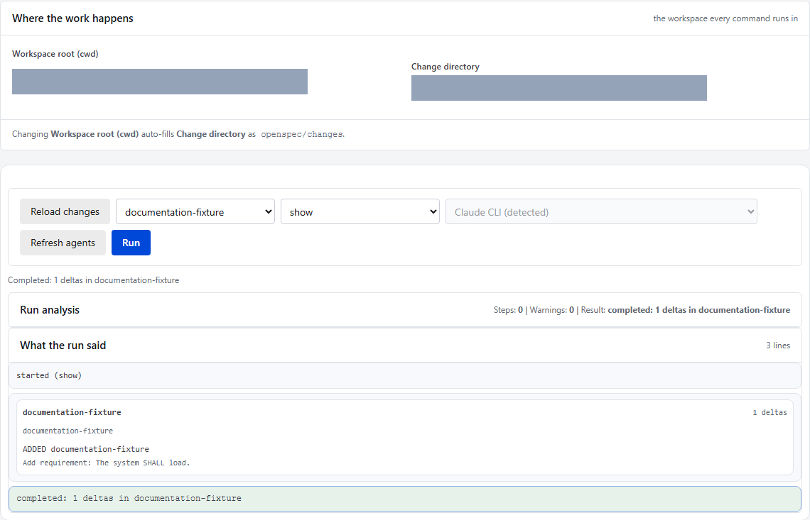
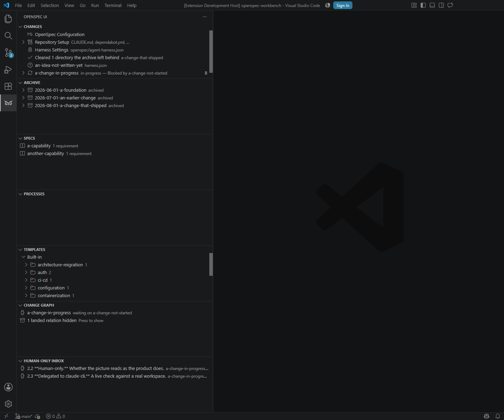
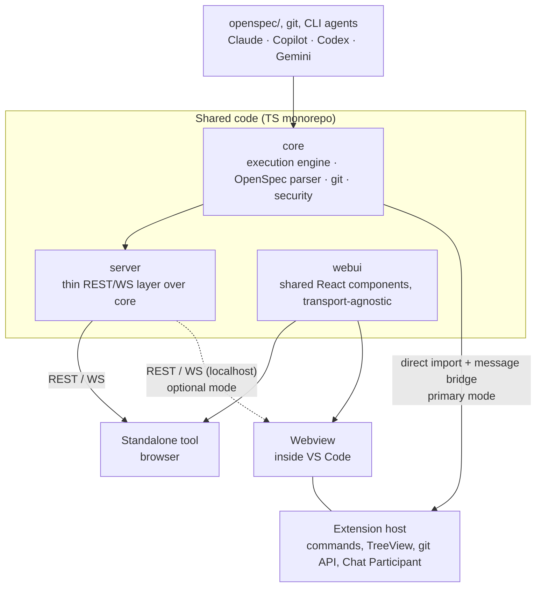

# OpenSpec UI

Dashboard for [OpenSpec](https://github.com/Fission-AI/OpenSpec) — a view
over Changes/Archive/Specs/Tasks and a launcher for CLI agents (Claude CLI,
GitHub Copilot CLI, Codex CLI, Gemini CLI, and a local LLM via an
OpenAI-compatible API) for working with change proposals. The product ships
in two forms with shared code: a standalone web tool and a VS Code extension.

[A Tool That Watched Itself Get Built](https://www.linkedin.com/pulse/tool-watched-itself-get-built-alexander-ivanov-q57ne?lipi=urn%3Ali%3Apage%3Ad_flagship3_pulse_read%3BHDMlQK%2BGTcemHEauLJbbBA%3D%3D)

## Product Tour

The standalone application and VS Code extension expose the same OpenSpec
workflows through interfaces suited to their respective hosts.

### Standalone application



### VS Code extension



See the complete screenshot galleries for the
[standalone application](packages/server/README.md#screenshots) and the
[VS Code extension](packages/extension/README.md#screenshots).

## Local Delivery Modes

This repository effectively ships two independent products that share one
common core:

- VS Code extension for users who already work inside VS Code
- Standalone web application for users who do not use VS Code

Both products solve the same problem set: viewing and editing OpenSpec
changes, validating artifacts, and running local AI-assisted workflows from
the same shared execution engine. They are designed to operate only on the
local machine and do not require Internet access for normal use. The split is
purely about UI host preference: if VS Code is available, the extension is the
most natural path; otherwise, the standalone web app is the equivalent local
product.

### UI reception and launch

- Standalone web app: build the server bundle and start the local standalone
  app from source, then open the tokenized localhost URL printed by the server.
  Example commands from the repository root:

  ```bash
  npm install
  npm run build --workspace @openspec-ui/server
  npm run start --workspace @openspec-ui/server -- <workspaceRoot> 4317
  ```

  Here, `<workspaceRoot>` is the absolute path to the local project or repo
  that the app should inspect and manage. In practice, this is usually the
  folder you want to open, such as the current repository root or another Git
  working directory on your machine. After startup, the server prints a URL in
  the console similar to:

  ```text
  OpenSpec UI server listening on http://127.0.0.1:4317/#token=PU32_AOBt0lG6sHhYQtCMwSU6ZmcXtIJX0-4RUe1FQM (workspaceRoot: ., allowExternalCwd: false)
  ```

  You must open that exact URL in the browser to connect to the server. The
  URL contains a temporary one-time access token; without it, you cannot access
  the running server. The default port is `4317`.
- VS Code extension: install the extension into VS Code and open the native
  workbench from the editor. The extension uses the same shared core logic and
  local-only data access path as the web app.

### VSIX package reception and installation in VS Code

- Receive the packaged artifact from the official GitHub Release for the
  extension. The built package is published as a `.vsix` file; it is not
  committed into the repository.
- In VS Code, open the Extensions view and choose "Install from VSIX...".
- Select the downloaded `.vsix` file, confirm the installation prompt, and
  reload the window if VS Code asks for it.
- After reload, the extension is available as a local VS Code product and can
  be used without any remote service dependency.

## Status

Active development. The repository contains a working standalone application,
shared core and web UI packages, and a native VS Code OpenSpec Workbench. See
`openspec/README.md` for the governed change workflow.

## Why not just `openspec view`

OpenSpec CLI already has `openspec view` — an interactive dashboard for
specs/changes. This project does not reinvent it: the reasons for existing are
(1) diffs between versions of archived changes (not covered by `openspec
view`), (2) launching CLI agents directly from the UI with a unified
command/event protocol, and (3) VS Code integration as a native extension
rather than a separate window.

Before implementing any capability, check whether it has already appeared in
upstream `openspec view` so we do not duplicate it.

## Architecture at a Glance

Shared code (`packages/core`, `packages/webui`) is reused in two delivery
forms: a standalone tool (browser + local REST/WS server) and a VS Code
extension (Webview + direct `core` import in the extension host, without HTTP
where possible). See `docs/adr/0001-shared-core-two-delivery-targets.md` for
the full rationale and `openspec/specs/` for the detailed behavioral
contract of each part.



## Packages

| Package | Purpose | Capability |
| --- | --- | --- |
| `packages/core` | Execution engine, OpenSpec parser, git wrapper, CLI-agent orchestration, security model, derived change-state machine | `execution-core` |
| `packages/server` | Thin REST/WS layer over `core`, used only for standalone | `standalone-app` |
| `packages/webui` | Shared React components (Changes/Archive/Specs/Tasks/AI panel), transport-agnostic | `shared-ui` |
| `packages/extension` | VS Code extension — TreeView/Commands/Settings/Chat Participant on top of native VS Code API + Webview for what is not covered natively | `vscode-extension` |
| `packages/cli` | Non-interactive CLI over `core` for CI merge gates (no HTTP, no webview) | `ci-cli` |

## Technology Stack

TypeScript, npm workspaces (monorepo) — rationale in
`docs/adr/0001-shared-core-two-delivery-targets.md`. Testing uses Vitest;
contract tests between `webui` and `server` are required before archiving
`standalone-app` (see `openspec/config.yaml`, `operations.archive.guidance`).

## Runtime Environment (Node.js)

This repository uses npm workspaces and pins the local runtime with Volta in
the root `package.json` (`volta` + `engines` fields).

For Windows setup:

1. Install Volta: `winget install Volta.Volta`
2. Open a new terminal in the repository root.
3. Install dependencies: `npm install`
4. Verify pinned runtime: `volta list`

After that, regular project commands (`npm run typecheck`, `npm run lint`,
`npm run test`) use the pinned Node.js/npm versions automatically.

## Versioning

The project uses semver per package, not only at the standalone/extension
delivery level.

- `patch` — bug fixes, documentation, and refactoring without external
  contract changes.
- `minor` — new capabilities that remain compatible with the current contract.
- `major` — breaking changes in public behavior, protocol, data format, or
  promised UX.

If a change is visibly user-facing, the affected package version in
`package.json` must be bumped in the same change. For delivery forms, an
aggregated release version is allowed, but package versions — especially
`core` — remain the source of truth and should be shown separately when the UI
displays build information.

The private root package remains `0.0.0`; it is a workspace container, not a
release artifact. Current release versions are:

| Package | Version | Release role |
| --- | ---: | --- |
| `@openspec-ui/core` | 0.20.2 | Shared behavior and persistence contract |
| `openspec-ui-vscode` | 0.16.2 | VS Code delivery |
| `@openspec-ui/server` | 1.8.0 | Standalone server delivery |
| `@openspec-ui/webui` | 1.9.0 | Shared browser UI |
| `@openspec-ui/cli` | 0.1.0 | CI merge-gate delivery |

`@vscode/vsce` (the extension's packager) already names the built
artifact with its version (`openspec-ui-vscode-<version>.vsix`) — no
extra step needed there. On every push to `main` where that version has
no matching git tag yet, CI (`release-extension` job in
`.github/workflows/quality.yml`) tags the commit
(`openspec-ui-vscode@<version>`) and publishes a GitHub Release with the
`.vsix` attached — that Release page is the permanent, versioned place to
download a specific build; the artifact itself is never committed into
`packages/` or anywhere else in git.

## Delivery Capability Matrix

| Capability | Standalone | VS Code |
| --- | --- | --- |
| Browse changes, archive, specs, and tasks | Yes | Yes |
| Create and edit change artifacts | Yes | Yes, through native editors |
| Deterministic OpenSpec status and validation | Yes | Yes |
| Shared command/event protocol | Yes | Yes |
| Native VS Code Chat and Agent handoff | Not applicable | Yes |
| Agent selection (plan/implement/review via this app's own protocol) | Yes | Yes |
| Processes view and checkpoint rollback | Yes | Yes |
| Persistent run journal engine | Yes | Yes |
| Built-in template catalog (16 templates, 9 categories) | Yes | Yes |

Host-specific UX is allowed to differ, but business behavior must remain in
`packages/core`. Both delivery targets expose the same core recovery behavior
through host-specific interfaces. See ADR 0004.

## Agent Selection

The AI panel (in both the standalone browser tab and the VS Code Webview,
either transport mode) has an **agent picker** next to the command picker.
Selecting `plan`, `implement`, or `review` sends the picked agent id as
`Command.agentId`; the host resolves it to a real `AgentRunner` from
`buildDefaultAgentRunners()` (`packages/core/src/default-runners.ts`) and
streams events over the same protocol already used for
`status`/`list`/`show`/`validate`. Available agents (see
`packages/core/src/agents/registry.ts`):

| Agent | Underlying CLI |
| --- | --- |
| Claude CLI | `claude` |
| GitHub Copilot CLI | `copilot` |
| Codex CLI | `codex` |
| Gemini CLI | `gemini` |
| Local LLM (OpenAI-compatible) | HTTP to `http://localhost:30000` by default |

Each CLI tool must already be installed and authenticated on the machine
running the server/extension — this app never handles API keys or
credentials directly; it only shells out to (or, for the local LLM, sends
HTTP requests to) a tool that manages its own login. If the selected
tool is not installed, the run fails immediately with a clear `failed`
event instead of hanging.

**Convenience worth calling out explicitly: none of these agents need to
be "installed in VS Code."** This picker talks to each tool's plain CLI
binary on `PATH`, the same way a terminal would — not a VS Code extension,
not a VS Code-specific integration. A CLI authenticated for one editor or
none at all still works here. This holds for the standalone delivery too,
which has no VS Code dependency whatsoever. Practically: install
`claude`/`copilot`/`codex`/`gemini` however you'd normally install any CLI
tool, log in once, and it becomes available in this picker in both hosts —
no VS Code-specific setup step exists or is required.

Each option in the picker also carries a best-effort **detected** / **not
detected** annotation (standalone: on load and via a "Refresh agents"
button; VS Code message-bridge mode: refreshed automatically every time
the AI panel is opened). This is a presence check only (the CLI resolves
on `PATH`) — it never hides or disables an option, and a "detected" result
is not a guarantee the tool is actually authenticated or otherwise usable;
the run's own `failed` event remains the real source of truth for that.

**This is a separate mechanism from VS Code's native Chat/Agent handoff**
(the "Implement with VS Code Agent" command and the `@openspec` Chat
Participant's `/plan`/`/implement`/`/review`), which opens VS Code's own
Copilot Chat panel and uses whatever model the user has already selected
there. Neither replaces the other: the native path is VS Code-only and
uses VS Code's own model picker; the agent picker described here works
identically in both hosts through this app's own CLI-runner protocol.

## CI CLI (merge gate)

`packages/cli` (see `docs/adr/0007-ci-cli-third-delivery-target.md`) is a
third, non-interactive delivery target: a thin adapter over `core`, no
HTTP server and no webview, meant to run in CI. It has one command,
`validate`: list every active OpenSpec change and run strict validation
on each, printing an aggregated report.

```bash
npm run start --workspace @openspec-ui/cli -- validate --cwd . --format text
```

- Default output is JSON (`{ ok, results: [...] }`); `--format text`
  prints a human-readable table for local use.
- Exit codes are part of the contract: `0` every change is valid, `1` at
  least one change failed strict validation, `2` the check itself could
  not run (bad arguments, `openspec` CLI missing, etc.) — `1` and `2` are
  deliberately distinct so CI can tell "your change is broken" apart from
  "the tooling is broken."
- One broken change never aborts the run — the report still covers every
  other change in the same pass.
- This repository's own CI (`.github/workflows/quality.yml`,
  `openspec-validate` job) runs it against `openspec/changes/` on every
  push/PR, as the real merge gate.

## Getting Started

1. Read `docs/adr/0001-*.md` — the architecture decisions and rejected
    alternatives.
2. Read `openspec/README.md` — the runbook for this repository's governed
    change workflow.
3. The four foundational changes (`execution-core`, `shared-ui`,
    `standalone-app`, `vscode-extension`) are already implemented; find them
    under `openspec/changes/archive/`. Run `openspec list` to see what is
    currently active in `openspec/changes/`.
4. Every further repository modification — code, tests, docs, or tooling —
    follows the same cycle:

    ```mermaid
    flowchart LR
        A["openspec/changes/&lt;id&gt;/<br/>proposal.md + tasks.md"] --> B["Implement tasks.md;<br/>tsc / eslint / vitest green"]
        B --> C["openspec change validate<br/>--strict &lt;id&gt;"]
        C --> D["openspec archive &lt;id&gt;<br/>(after live verification)"]
        D --> E["openspec/changes/archive/<br/>+ openspec/specs/ updated"]
    ```

    See `operations.apply.guidance` and `operations.archive.guidance` in
    `openspec/config.yaml` for exactly what must be verified at each step —
    archiving before live verification is out of process.

## Change Governance

Every repository modification must go through an OpenSpec change entry in
`openspec/changes/<id>/`. This includes code, tests, docs, and tooling.
Direct ad-hoc commits without a change entry are out of process.

All architecture-level changes must be documented through ADR files in
`docs/adr/`, and the related OpenSpec change must reference that ADR.
