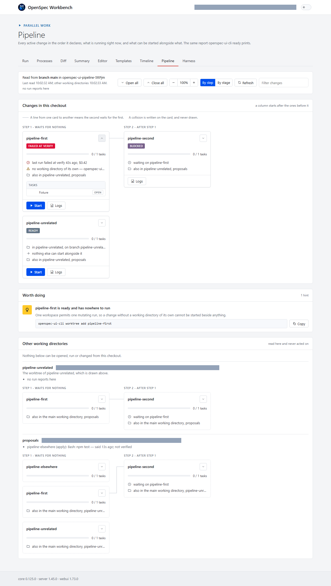

For a year the honest answer to "can I run two of these at once" was no.

One workspace permits one mutating run. That is not a limitation anybody
designed; it is what happens when two agents edit the same files. So the
queue was the product: one change at a time, watched, from an editor that
had to stay open.

Six releases later, the same rule holds and none of that is true.

A change runs from a terminal — `openspec-ui-cli run my-change` — with
three exit codes that a CI job can tell apart: the change failed, or the
tooling failed. Several changes run side by side, each in its own git
worktree, each taking its own lease, and which two may safely share a
moment is decided from the capabilities their spec deltas name and the
files their branches touched. Not from prose.

`openspec-ui-cli ready` says what can start now and alongside what — and
exits 0 when nothing can, because a repository whose changes are all
running is in a perfectly good state, and a command that called that a
failure would be useless in anything checking an exit code.

One numbered task can be handed to one agent and actually run, from the
inbox that lists every item waiting on somebody. A run can be scheduled
for four in the morning, and a time that passed with nothing open starts
on the next opening rather than being quietly dropped.

Mechanical checks a change declares about itself run before the verifying
agent, and a failing one skips that agent entirely — no agent run spent
reviewing work a check already found broken.

And when two people share a machine, the workspace lease says whose run
holds it: the git identity of the directory that took it. Attribution,
never authentication — anybody can set `user.email` to anything, so
nothing is gated on it, and the line says "git author" rather than
"user" for exactly that reason.

The full write-up, with the change behind each one:
https://openspec-ui.dev
