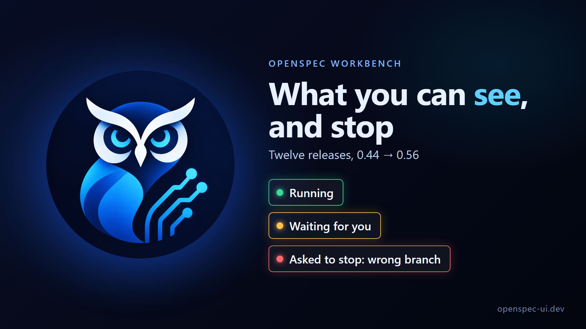
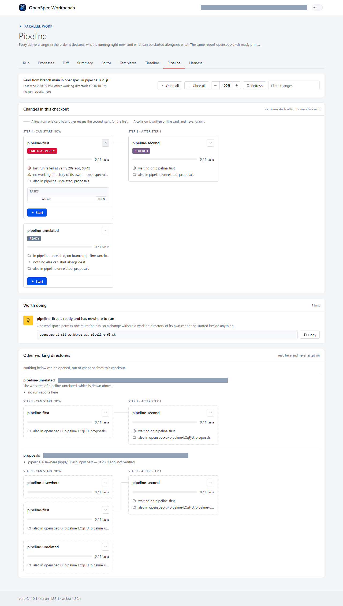
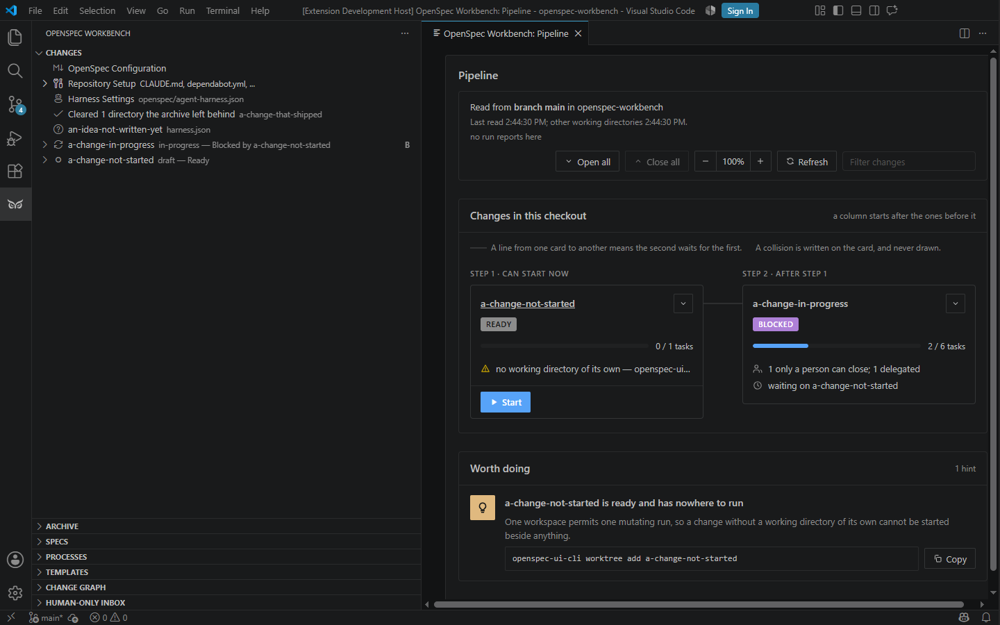
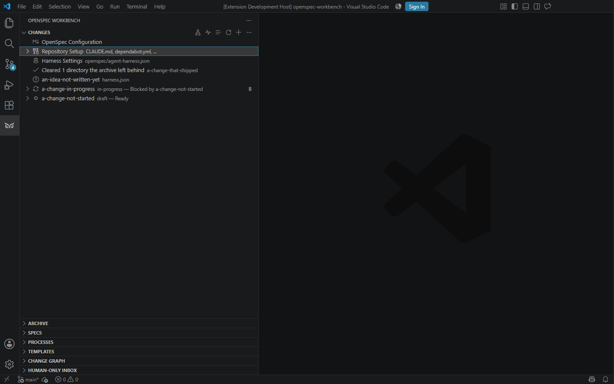
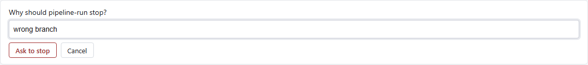
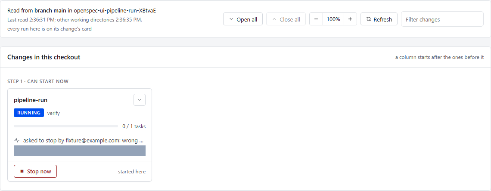

# What you can see, and stop: OpenSpec Workbench 0.44 → 0.56



The last article ended at 0.44. It was about a single run explaining
itself: what it is about to do, what it cannot do, and why it stopped.

Twelve minor releases later, one run is rarely the situation. A change
runs from a terminal while another runs in its own working directory, an
agent works through a delegated task, and a schedule starts a fourth at
four in the morning. This stretch of releases answers three questions in
that order:

1. **Can I run more than one?** Yes, and the tool decides from facts what
   may run beside what.
2. **Can I see what each of them is doing?** Every run now says so, in the
   terminal, in the standalone app and in VS Code, and one word says where
   each change stands.
3. **Can I stop one?** From its card, in either host, or from a terminal.
   It stops where its work is sound, and only the person it belongs to can
   ask.

Written against `openspec-ui-vscode` 0.56.0, `@openspec-ui/core` 0.88.0,
`@openspec-ui/server` 1.26.1, `@openspec-ui/webui` 1.48.0 and
`@openspec-ui/cli` 0.14.0. Every section names the change it came from,
under `openspec/changes/archive/`, so nothing here has to be taken on
trust.

---

# Part 1. Running more than one

## A change runs from a terminal

```bash
openspec-ui-cli run my-change
```

The chain runs, printing stages as they happen: propose, review, apply,
verify, archive. With `--format json` it prints one JSON event per line.

The three exit codes are the point. `0` means the chain completed. `1`
means the change did not: a stage failed, a declared check failed, or the
run was cancelled. `2` means the CLI declined to start or could not. A CI
job can tell "your change is broken" from "the tooling is broken" without
reading the output.

What it deliberately lacks is a flag that overrules the change. No `--yes`
answers a confirmation the change asked for, and no flag starts a chain
for a change configured to run one stage at a time. A terminal run does
what that change's own `harness.json` permits, and says so when it
refuses. It takes the same workspace lease the editor and the standalone
app take, so a terminal and an editor cannot mutate one directory at once.

*From `2026-09-11-a-change-runs-from-the-terminal/`.*

## Several changes at once, each in its own directory

One workspace permits one mutating run. That rule does not bend, so two
changes at once means two workspaces:

```bash
openspec-ui-cli worktree add my-change
openspec-ui-cli worktree list
openspec-ui-cli worktree remove my-change
```

Each change gets a git worktree of its own, on a branch named after the
change and cut from `main`. Each takes its own lease.

Since 0.50, those directories live under one root rather than beside the
repository: `<root>/<repository>/<change>`. The root is
`OPENSPEC_UI_WORKTREE_ROOT`, then `~/.openspec-ui/settings.json`, then
`.worktrees` beside the repository. It is never read from the repository's
own configuration, which would travel to every checkout.

`worktree remove` now merges the directory's `audit.jsonl` into the
repository's own before deleting anything. That file is gitignored, and
`git worktree remove` does not see ignored files. Until then, the run
history that every recommendation, timeline and quality figure is built
from went with the directory.

*From `2026-09-11-changes-run-side-by-side/` and
`2026-09-12-a-working-directory-is-disposable/`.*

## What can start now, and alongside what

```bash
openspec-ui-cli ready
```

It lists every active change and its state. For each ready change, it
names the others it can start alongside, and what any two would collide
over: the capabilities their spec deltas name, and the files their
branches have already changed. It decides from those facts, not from
prose and not from a guess.

It exits `0` whether or not anything is ready. A repository whose changes
are all running, or all waiting on each other, is in a perfectly good
state. Reporting that as a failure would make the command useless in
anything that checks an exit code.

`openspec-ui-cli advise` turns the same facts into suggestions:
- which ready changes can be started together;
- which change is ready with nowhere to run;
- which workspace is held by a run that stopped reporting itself.

Each suggestion carries the fact it came from and the exact commands. They
are printed, never run, and the Pipeline shows them too.

*From `2026-09-11-what-can-start-now/`,
`2026-09-11-an-empty-queue-is-not-a-failure/` and
`2026-09-12-a-hint-says-what-can-run-together/`.*

## What would stop a run here

```bash
openspec-ui-cli doctor --change my-change
```

Before a run starts, `doctor` reports what this machine and this
workspace are missing:
- the runtime against the pinned engines;
- the `openspec` CLI, and which agents are installed;
- whether the harness configuration reads;
- who holds the workspace, and whether a git identity is configured.

`--change` adds the preflight's own answer for one change. It exits `0`
when nothing would stop a run, `1` when something would, and `2` when it
could not look. A workspace held by a live run exits `0`: being busy is
not being broken.

*From `2026-09-12-a-doctor-says-what-would-stop-a-run/`.*

## Who holds this workspace

```bash
openspec-ui-cli lease
```

```text
Held by terminal run on HPP-NTB63, pid 3992.
Last reported itself 1s ago.
Git author somebody@example.com.
```

The identity is the working directory's `user.email`, the same
self-declared label that signs every commit. It is attribution, never
authentication, which is why the line says "git author" rather than
"user".

`lease release` clears a lease only where its holder can be shown to be
gone. Either its heartbeat is already stale, or it is on this machine and
its process is not running. A live holder is refused: taking its lease
would let a second mutating run start against files it still has open.

*From `2026-09-12-a-lease-says-who/`.*

## One task, one agent

A `tasks.md` item can say it is waiting on somebody:

```markdown
- [ ] 5.4 **Delegated to claude-cli**: with a real run holding a
  workspace, ask who holds it and try to clear it.
```

The standalone app's "Waiting on somebody" block and the extension's
Human-Only Inbox list every such item across every change. Where the
agent named is one this build carries, the row offers **Run**, and the
agent runs against that one item.

An item waiting on a person gets no button, because there is nothing to
press. A control exists only where it can do something.

Since 0.50 a delegated run also says what happened:
- **A failure quotes the agent.** A run that fails carries the last lines
  the agent wrote to stderr: "claude exited with code 1. It last said: …".
- **Its request and reply are recorded** in the audit log, and the inbox
  shows the latest reply beneath the item.
- **It keeps a status record** like any other run, so `status` and the
  Pipeline see it whichever host started it.

*From `2026-09-11-a-delegated-item-runs-its-agent/`,
`2026-09-10-human-only-inbox-in-the-shell/` and
`2026-09-13-a-delegated-run-says-what-happened/`.*

## A run that starts without you

A run can be scheduled: pick the change, the path (a single stage or the
chain) and the time, and close the laptop.

What matters is what happens when the time passes with nothing open. A
time that has already passed starts on the next opening, instead of being
dropped. A schedule set for the night does not depend on somebody leaving
a browser tab running.

*From `2026-09-10-a-run-can-be-scheduled/` and
`2026-09-11-a-schedule-keeps-its-promise/`.*

## Checks before the verifier is spent

A change's own `tasks.md` can declare what must hold mechanically:

```markdown
- [ ] 6.1 `openspec change validate --strict my-change` `check(validate-change)`
- [ ] 6.2 The whole suite passes. `check(test)`
```

The names form a closed set: `validate-change`, `typecheck`, `test`,
`lint`, `path-unchanged` and `changeset-present`. They run before the
verifying agent. A failing one skips that agent and fails the stage with
the check's own reason, so no agent run is spent reviewing work a check
already found broken.

Since 0.50, a chain can also archive a change in a repository whose rules
never said to tick tasks:
- **The implementing agent** ticks each task as soon as its own
  verification passes.
- **The verifying agent** ticks what it confirmed, unticks what does not
  hold, and never ticks a human-only or delegated task.
- **An implementing run that changed files and ticked nothing** is named on
  the chain's timeline.

*From `2026-09-10-a-check-that-passes-checked-something/` and
`2026-09-13-a-done-task-is-ticked/`.*

## A change can say what it needs, and what it waits for

A change can declare a step the standard sequence does not have. It is
inserted at a stated position, from a registry, and never as a free-form
command. A free-form step would be a hole in the allowlist and the
working-directory sandbox. A named one is a step this product knows how
to run.

A change can also declare a blocker: `blocked_by: another-change` in its
`.openspec.yaml`. A blocked change is reported as blocked rather than
started, and the relation resolves the moment the named change is
archived. A cycle among blockers is reported as a deadlock.

*From `2026-09-11-a-change-can-declare-a-step/` and
`2026-09-11-a-declared-blocker-blocks/`.*

---

# Part 2. Seeing what every run is doing

## An agent says what it is doing

A hung agent renews its workspace lease exactly as a working one does, and
its process still answers a liveness check. The missing signal was never
liveness. It was progress.

Every run now writes its own status record. The records sit in one
directory shared by every working directory of a repository, and outside
all of them, so removing a directory never takes a record with it. Each
record is named by the run's own identifier, never by a person, because
one person routinely runs two agents at once.

A record reports:
- the chain's stage;
- the last complete line the agent wrote, or the tool it is running
  (`Bash: npm test`, `Edit packages/core/src/index.ts`);
- how long ago the run last said something.

It never says whether a run is stuck, hung or unhealthy. A long turn and a
hang produce the same silence, and telling them apart stays a person's
judgement.

```bash
openspec-ui-cli status
```

`status` prints every run of the repository: whose it is, where, doing
what, and since when. It exits `0` whether or not anything is running.

Getting there took two more fixes:
- **Claude's stream reads as ACP.** `claude-cli-acp` now translates it into
  ACP's own session updates. Before, the AI panel repeated
  `agent update: assistant` and the terminal printed nothing but the final
  words. Every surface now shows each tool call by what it acts on, and
  each result as completed or failed.
- **A status write never stops a run.** On Windows a rename refused with
  `EPERM` used to escape as an unhandled rejection, and ended the run about
  fifteen seconds into a stage. The writer now takes one write at a time,
  retries a rename refused because the name is in use, and never lets a
  later write end the run.

A record left by a run that crashed is swept, but only if it is still
stale when read again just before removal. A malformed record is never
removed.

*From `2026-09-13-an-agent-says-what-it-is-doing/`,
`2026-09-13-an-agent-update-says-something/`,
`2026-09-13-a-status-write-never-stops-a-run/` and
`2026-09-13-a-stale-status-is-swept/`.*

## The Pipeline shows every working directory

The Pipeline draws every active change as a card, in the order the changes
declare. A solid line means the second change waits for the first.

Beneath it, every other working directory of the repository gets a
recessed section of its own. Each section shows the directory's branch,
its changes laid out against its own queue, who holds it, and what its
runs say they are doing. Those sections are read and never acted on. A
directory where no run reports is said to be one, never called idle.

The picture also says what it read: the branch of this checkout, and when
each reading was taken.



*From `2026-09-13-what-the-others-are-doing/` and
`2026-09-13-the-pipeline-shows-what-it-has-read/`.*

## The Pipeline opens in VS Code

**OpenSpec UI: Open Pipeline**, also in the Changes view's title bar, opens
the same picture in a panel of its own. Choosing a change's card reveals it
in the Changes tree and opens its `proposal.md`.

The panel does not poll. While it is visible, the editor watches
`openspec/changes` and the directory the status records are written to,
and tells the picture which reading is out of date. A reading every minute
covers anything that raises no file event.



*From `2026-09-14-the-pipeline-opens-in-vs-code/`.*

## One word for where a change stands

A change can be in several places at once: this checkout, a working
directory of its own, `main`, its branch, and a pull request. Core reads
all of them and says how fresh each source is. One function gives the one
word every surface shows:
- **Running**, or **Running in** another directory;
- **Waiting for you**, or **Waiting in** another directory;
- **Failed at** or **Stopped at** a stage;
- **Blocked**, **Ready** or **Done**;
- **Further along** in another copy;
- **Merged in #N**, **Archived on main**, or **Deleted on main**.

The same word shows in the VS Code Changes tree, the standalone Changes
list, on the Pipeline's cards and in `openspec-ui-cli ready`, so no two
surfaces disagree. Hovering a change in the tree shows where each part of
the word was read from. The run dialog leads with the word, and asks
before starting a change that is running, settled on `main`, or merged.



*From `2026-09-14-a-change-says-where-it-stands/`.*

## A card says what its change is doing

Each card is derived from readings the hosts already take. It gives:
- its state word;
- the task a live run is on: in the agent's own words where the agent
  reports it, otherwise the task it was given, or a guess marked as one;
- what the run is doing or waiting on, and how long ago it said so;
- how many tasks are done, and how many only a person can close or are
  delegated;
- how the last run ended, what it cost where that was reported, and why a
  stopped run stopped.

A chain now writes one audit entry as it ends, saying how, at which stage
and why. The card reads each change's last run from every directory's
audit log.

**Show tasks** opens a card to its task list, under its section headings.
The row a run is on stands out in words and weight. The picture zooms from
75% to 150%, and each host remembers the zoom and which cards were open.

*From `2026-09-14-a-card-says-what-its-change-is-doing/`,
`2026-09-14-a-run-says-which-task-it-is-on/` and
`2026-09-14-a-card-opens-to-its-tasks/`.*

---

# Part 3. Knowing whose run it is

## A run is signed by its person

The lease's git author is attribution: anybody can set `user.email` to
anything. That is fine for saying who probably holds a workspace. It is
not enough for letting one person stop another's run.

So each person now gets an Ed25519 key per machine, made on first need
under `~/.openspec-ui/identity`. A run seals its status record's exact
bytes with that key, and a reader verifies them before parsing anything.
Every record reads as one of three states:
- **verified**, signed by an enrolled person;
- **unverified**;
- **does not check out**, in which case nothing from its contents is shown,
  and the sweep keeps the file.

A key that signs a live run and is not enrolled waits in the Human-Only
Inbox of both hosts, with **It was me**. The same list comes from
`openspec-ui-cli enrol`, and `enrol <keyId>` confirms it. From then on,
`status` and the Pipeline say whose each run is, as far as its signature
shows.

*From `2026-09-14-a-run-is-signed-by-its-person/`.*

---

# Part 4. Acting on what you see

## A change is configured from the change

"Configure Harness for this Change" used to open a view that showed the
global settings first. Global settings and a change's own settings are now
two views, each about one file:
- **The global view** has nothing about any one change.
- **A change's view** loads that change's `harness.json` with nothing
  typed, and names on each inherited option the value it resolves to, and
  where from.

In the standalone app a change's view is the Change Editor's **Harness**
tab. In VS Code it is a panel per change, titled `Harness: <change>`.

A recommendation drawn from past runs can be applied from the run dialog:
"Use `<agent>` for every stage".

*From `2026-09-14-a-change-is-configured-from-the-change/`.*

## A change is run from its card

**Start** on a card opens the run dialog for that change, in both hosts. On
a run this host holds, the card answers it:
- **Continue to `<stage>`** at a checkpoint;
- **Allow** or **Deny** on a permission request;
- **Stop**, which asks for a reason, and **Stop now** once a stop has been
  asked.

A stop is taken where the work is sound. At a checkpoint that is at once.
On a permission request, it denies the request. Inside a stage, it is the
next task marker that names another task, or the next ticked task.
Nothing is cut off mid-edit. The status record states the request, and
the chain's ending audit entry carries the reason and who asked.





A run held somewhere else, before 0.55, offered only its folder path to
copy.

*From `2026-09-14-a-change-is-run-from-its-card/`.*

## A run elsewhere can be asked to stop

A run held in another working directory, or by another host, cannot be
reached by calling it. So the request is a file:
- **Where it goes.** It is written into a directory beside the status
  records, inside no working directory, and sealed with the asker's
  machine key.
- **When the run reads it.** Each time the run renews its status record,
  every five seconds.
- **When the run acts.** Only if the request is verified, fresh and new. A
  request older than sixty seconds is refused as stale, because a request
  kept for later is not the request a person made. A request already read
  is refused too.
- **When a request is refused,** the run says so once in its activity, and
  records an audit message.

A card offers Stop on a run held elsewhere only when that run's verified
record is signed by the same person this host's key is enrolled as. That
is you, on another checkout. Any other run says whose it is, or that it is
not verified. Until the run reads the request, the card says it is waiting
for the run to read it.

The same request from a terminal:

```bash
openspec-ui-cli status
openspec-ui-cli stop <instanceId> --reason "wrong branch"
```

`stop` prints the request's message id. It exits `1` when no live run
reports itself under that id.

*From `2026-09-14-a-run-elsewhere-can-be-asked-to-stop/`.*

---

# 0.56: the owl

The standalone app, its browser tab and the extension now carry the
project's logo, an owl. In VS Code it is the extension's icon, and its
drawing of brows, eyes and beak is the Activity Bar icon. The images ship
inside what already ships, so nothing new is fetched from anywhere.

*From `2026-09-14-the-owl-marks-the-app/`.*

---

## Where the settings live

Nothing above is configured by a flag. Each reads the change's own
`openspec/changes/<id>/harness.json`, or the workspace default in
`openspec/agent-harness.json`.

- [`HARNESS.md`](../../HARNESS.md) lists every key, its accepted values,
  and which ones a global file may not set.
- [`LIMITS.md`](../../LIMITS.md) says what actually caps a run's spending.
- [`docs/how-to/`](../how-to/) has a page per common goal, including
  [stopping a run](../how-to/stop-a-run.md).
