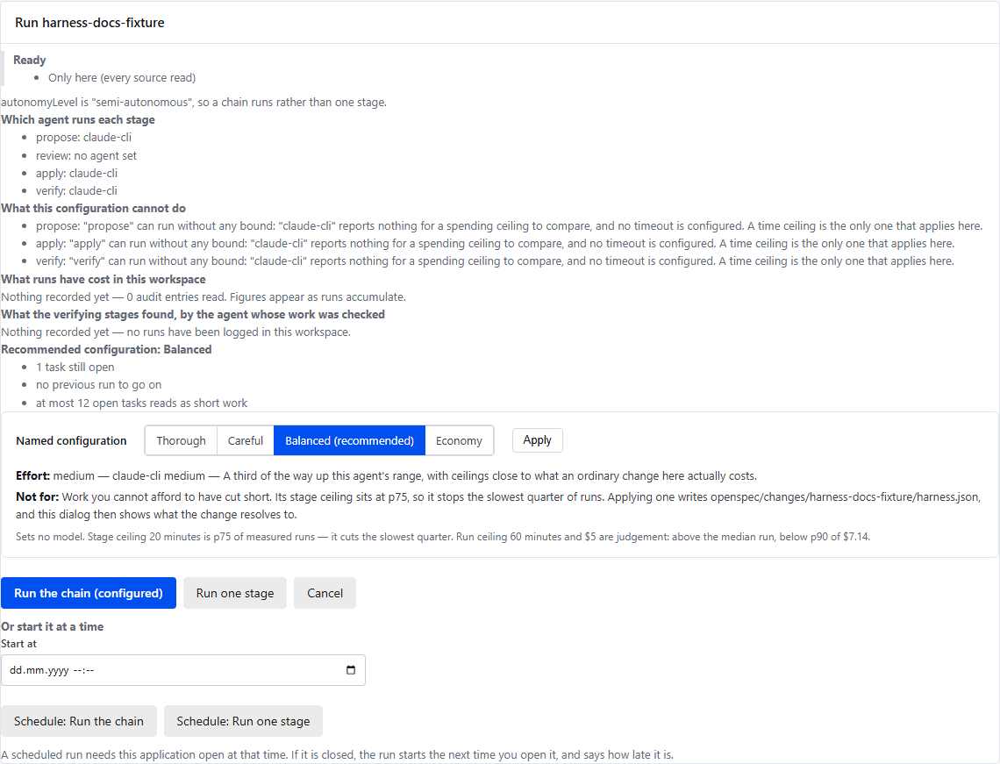

Spec-driven development gives a coding agent a brief: a proposal, a design, a
list of tasks. There are already several good ways to read that brief. Boards,
dashboards and editor views show a change's documents and where it stands. I
read three of them on 2026-09-20, in their own words, and none of the three
starts an agent.

That is a fine thing for a viewer to be. But the moment an agent runs, the
questions change. Not "what does the change say?" but "what is it doing now,
what will it cost, and how do I stop it?" A viewer has no answer to those,
because it is not in the loop. A cockpit is.

I am building one, OpenSpec Workbench, and most of what I know about what a
cockpit needs I learned from it getting things wrong. Three of those mistakes
are worth writing down.

## A run that hangs tells you less than one that fails

An agent asked for permission in the middle of a chain. The chain had no way to
answer. The request was routed to nobody, so the run did not fail and did not
time out. It waited, on a promise that nothing in the system could resolve.

The fix was to route the answer to the stage in flight, and, where a chain runs
fully autonomously with nobody to ask, to fail the stage with a stated reason
instead of waiting on a channel that does not exist. Failure is information.
Hanging is not.

## A limit that cannot act reads as protection

A spending ceiling can be configured, saved, accepted by validation and never
fire. It counts only what an agent reports, and of the ten agents the tool
supports, six report no usage at all. Over those six a spending ceiling counts
nothing.

Two facts about ceilings are easy to assume away. A spending ceiling can stop
the next stage from starting, but it cannot interrupt the stage that is
already running, because a run's cost is not known until it ends. Only a time
ceiling can. And a run that fails may record nothing, so a ceiling protects you
from a long successful run, not from a sequence of expensive failures.

So the tool says which of a change's ceilings cannot act, where the
configuration is edited and before the run starts:

## Silence is not a diagnosis

An agent that has said nothing for ten minutes might be thinking, or might be
hung. From outside the two look identical. A tool that draws a red "stuck"
badge is guessing, and a guess that looks like a measurement is worse than
none.

So the Workbench never says a run is stuck. It says what the run last said it
was doing, and how long ago. Telling a long turn from a hang is a person's
judgement, and the tool leaves it there.

## What a cockpit has to do

Those three come down to four obligations.

- **Say what it will do before it does it.** Which agent runs each stage, which
  setting it read, and which limits will not act.
- **Say what it is doing while it does it.** The stage, the last thing said, how
  long ago.
- **Stop where the work is sound.** A stop asks for a reason, is signed with the
  machine's key, and is honoured only if it is verified and fresh.
- **Say why it stopped.** A run that hits a time ceiling ends as cancelled, with
  the reason naming the ceiling and its value, so a rule firing is not mistaken
  for a person's click, or for a failure.

None of that is about agents being smarter. It is about a tool being answerable
for what it is doing with your time and money.

## What it still does not do

Claude CLI and Copilot CLI have been run against the real binaries. Codex and
Gemini never have: their adapters follow the vendors' documented interfaces and
are tested against a mocked peer, and a report from anyone who runs them would
be useful. Two ACP caveats: the Claude adapter never asks for permission, and
`copilot --acp` completed file writes and shell commands here without asking.

## Try it

OpenSpec Workbench is a VS Code extension and a local web application, both over
the same core. There is a short tour of it in
[Supervise the agents that build your OpenSpec changes](https://openspec-ui.dev/articles/supervise-agents-on-openspec-changes/).
The code and the issues are at
[github.com/VeryComplexAndLongName/OpenSpec-UI](https://github.com/VeryComplexAndLongName/OpenSpec-UI),
where the repository and packages keep the name OpenSpec-UI.

## Where each claim comes from

- That none of three other OpenSpec interfaces starts an agent, read on
  2026-09-20: the repository's
  [README](https://github.com/VeryComplexAndLongName/OpenSpec-UI/blob/main/README.md),
  "How this differs from the other OpenSpec viewers".
- The permission request that waited, and routing the answer to the stage in
  flight: the project's own write-up,
  [What a run tells you: 0.40 to 0.44](https://github.com/VeryComplexAndLongName/OpenSpec-UI/blob/main/docs/articles/2026-09-09-what-a-run-tells-you-0.40-to-0.44.md).
- Which ceilings can act, that six of the ten agents report no usage, that a
  spending ceiling cannot interrupt a running stage, that a failed run may
  record nothing, and that a time ceiling ends a run as cancelled with a
  reason: [LIMITS.md](https://github.com/VeryComplexAndLongName/OpenSpec-UI/blob/main/LIMITS.md),
  "At a glance", "timeout", and "Which agents report usage".
- That a status never says "stuck", and that a stop is signed and needs a
  reason: the README's "CI CLI" section, `status` and `stop`.
- Which agents have been run against a real binary, and the ACP caveats: the
  README's "Agent Selection" section.
