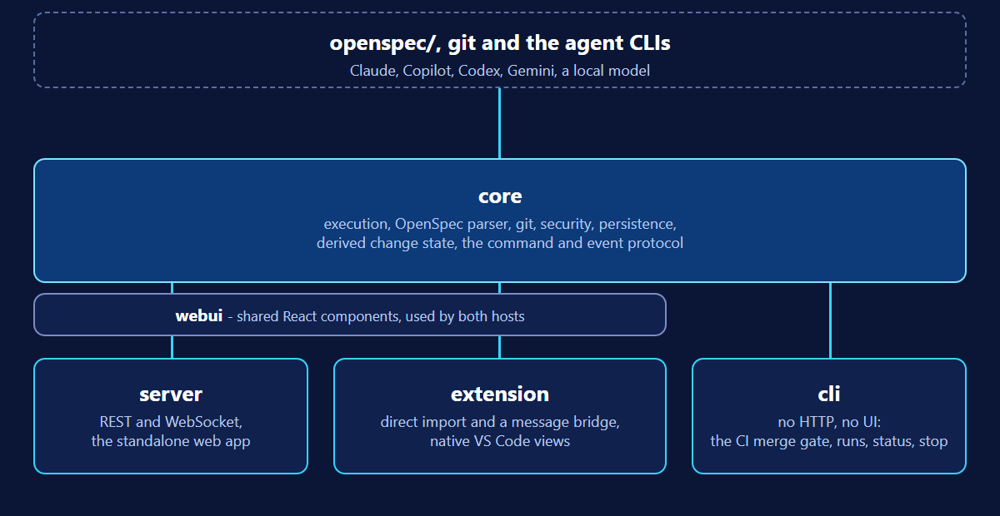

OpenSpec Workbench ships in two forms: a VS Code extension and a standalone
web application that runs on your machine. They show the same OpenSpec and Git
data and run the same workflows. The first architectural decision was how to
stop them from becoming two different products, because two deliveries of "the
same" behaviour diverge, and they do it quietly.

The answer was to write the behaviour once and let each host be a thin adapter
around it. This is what that looks like, what was turned down, and where "thin"
turned out to cost something.

## The decision

Five packages, one of them holding all of the behaviour:

- `core` owns execution, OpenSpec and Git integration, security, persistence
  and the derived state of a change.
- `webui` holds the React components, written so they do not know how they are
  reached.
- `server` and `extension` are the two hosts, and `cli` is a third,
  non-interactive one for CI.

The protocol began as five commands (`plan`, `implement`, `review`,
`status` and `cancel`) and seven events (`started`, `stdout`, `stderr`,
`progress`, `completed`, `failed` and `cancelled`), and it has grown since,
with events such as `checkpoint` and `permissionRequest`. It is defined in
`core` and nowhere else. A host serialises it and does not reimplement any of the
execution behind it.

Security is in the core too, from the start and not as a later addition. Every
run is restricted to the workspace, commands and their arguments are
allowlisted, executions are audited, and the contents of the repository are
treated as data, never as instructions.

## What was rejected

Three alternatives were written down and refused.

**Running the standalone server inside the extension.** It would have made both
hosts share one transport, but the extension host already runs Node and needs no
HTTP for ordinary work. Dynamic ports, window collisions, authentication and
process clean-up would have burdened the most common workflow. So the extension
imports the core directly and talks to its webview over a message bridge, and
the local server stays an optional mode.

**Implementing execution separately in each host.** Streaming, cancellation,
errors and security would have drifted apart. Both hosts adapt the same
protocol instead.

**Storing a change's state in `.openspec.yaml`.** That would have extended a
format that belongs to OpenSpec. Draft, in progress, implemented and archived
are inferred from where a change sits and from its `tasks.md`, by a heuristic
in the core, so the tool never forks the format it depends on.

The delivery model was also reviewed independently after the first proposal,
and that review changed the recommendation for the extension's transport while
keeping the shared core.

## What it bought

A defect is fixed once, in the core, which depends on neither HTTP nor the VS
Code API. The run status record that the Pipeline draws on a card is the same
record `openspec-ui-cli status` prints, whichever host started the run. A new
agent is one adapter in the core's registry, and both hosts see it.

One choice in that registry is worth naming. The plain agent adapters treat a
CLI's output as opaque text on purpose, so that a change in a CLI's output
format between versions cannot break the event stream. The price is that they
cannot see or gate a single action mid-run, which is what the adapters that
speak the Agent Client Protocol were added for, beside the plain ones and not in
place of them.

## Where "thin" was not free

A thin adapter is still an adapter, and each host has to route each command.

When an agent asked for permission in the middle of a chain, the chain had no
way to receive the answer. The core routed `cancel` to the stage in flight but
not `resolvePermission`. The fix was in the core, and both hosts gained the matching branch. The run
did not fail. It waited.

So the rule is narrower than "hosts contain no logic". Hosts contain no
behaviour, but each of them still has to carry every command to the core, and a
command that one host forgets to carry is invisible until somebody uses it.
The project requires contract tests between the shared UI and the server before
a change is archived, for that reason.

## Try it

The code is at
[github.com/VeryComplexAndLongName/OpenSpec-UI](https://github.com/VeryComplexAndLongName/OpenSpec-UI),
where the repository and packages keep the name OpenSpec-UI. A short tour of
what it does is in
[Supervise agents on OpenSpec changes](https://openspec-ui.dev/articles/supervise-agents-on-openspec-changes/).

## Where each claim comes from

- The layering, the protocol, the security model, the three rejected
  alternatives, the independent review and the consequences: the repository's
  [ADR 0001](https://github.com/VeryComplexAndLongName/OpenSpec-UI/blob/main/docs/adr/0001-shared-core-two-delivery-targets.md).
- The packages, the hosts and the direct import with a message bridge: the
  README's "Architecture at a Glance" and "Packages".
- Plain adapters treating output as opaque text, and why ACP adapters were added
  beside them:
  [ADR 0013](https://github.com/VeryComplexAndLongName/OpenSpec-UI/blob/main/docs/adr/0013-acp-agent-adapters.md).
- The permission request that waited, and both hosts gaining the matching
  branch: the project's own write-up,
  [What a run tells you: 0.40 to 0.44](https://github.com/VeryComplexAndLongName/OpenSpec-UI/blob/main/docs/articles/2026-09-09-what-a-run-tells-you-0.40-to-0.44.md).
- That the status record is the one `openspec-ui-cli status` prints: the README's
  "CI CLI" section.
