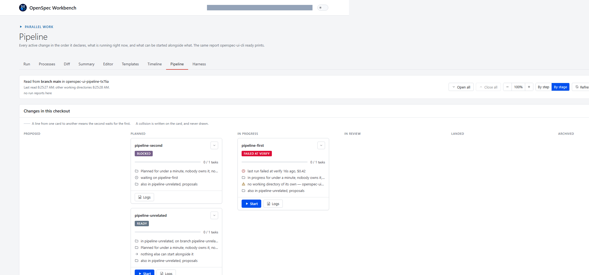

Every pitch for team features reaches for the same two things first: a
server, and a database. OpenSpec Workbench now answers three questions a
team actually asks - whose change is this, why did it go back a step, how
long did it spend in each step - and it does it with neither.



## The three questions

The repository already had a team, even if the product did not know it:
the owner, the agents that run changes, and a second agent that writes
these articles. Three questions kept coming back, and nothing answered
them. Whose change is this, and who is doing it right now. Why did it go
back a step, and who sent it back. How long did it spend in each step,
counting every time it visited.

The answer, decided on 2026-09-22 and written down as ADR 0037: team work,
with no server and no database, git and the forge as the only shared
truth.

## People are files, and joining is a pull request

Each person on a team gets one file, `openspec/people/<handle>.json`: a
handle, a display name, one public key per machine they sign on, and
optionally the git e-mail addresses that are theirs. Joining writes this
file. Nothing is committed on its own - joining is the pull request that
carries the file, the same way any other change reaches the repository.

A key is never removed, only retired with a date. What it signed before
keeps verifying for as long as the history is kept, which is for good. The
merge gate refuses a pull request that takes a person or a key out,
replaces a key, or edits a retirement already recorded - the same kind of
refusal that already guards a change's specs.

## History is signed events, one file per event

A change has an Owner, who answers for it, and an Implementer, who does
the work, by hand or through agents. An agent is never either one: it acts
for a person and signs with that person's key, and every record of what it
did names it as an agent, not as the person.

Who holds a change is played forward from its history, kept as one signed
file per event in `openspec/changes/<id>/history/`. The events are a
closed list: `owner-set`, `implementer-set`, and `sent-back`, which carries
the stage it returns to, the reason, and every task item it reopens with
why. One file per event, rather than one shared file for the whole team,
is a small engineering decision with a real payoff: two branches never
edit the same file, so a merge on this never conflicts.

The reason in a `sent-back` event is shown as plain text, never run - the
same rule the rest of this product holds for everything a repository's own
contents might say.

## Stages are derived, never declared

This is the same argument the project has made about a change's state
since its first months, applied one layer up. A change's stage - Proposed,
Planned, In progress, In review, Landed, Archived - is never set by a
person or a button. Each is proved by a dated fact: the commit that adds
`proposal.md`, the commit that adds `tasks.md`, a closed task line or a
run, a pull request opening, its merge, the archive commit. A `sent-back`
event moves a change back to a named stage, and after that only a fact
newer than the event moves it on again - so a change can visit a stage more
than once, and every visit is kept.

Getting the times right meant asking three different forges the same
question. The pull request's creation and merge times now come from
whichever one `origin` is on: GitHub, through `gh` or its own API, GitLab,
or Gitea - built on the same `Forge` interface this project described
[two articles ago](https://openspec-ui.dev/articles/one-interface-three-forges/).

## The board

The Pipeline already drew every active change as a card. It now offers a
second arrangement of the same cards: **By step**, the order changes
declare, and **By stage**, a column per stage from Proposed to Archived.
There are no lines between cards on the board - a stage says where a
change is, not what it waits for - and every card says who owns it and who
implements it, in either arrangement. Both hosts show the same board,
because both read the same core function, and the choice between them is
kept for the next visit.

## What this deliberately does not do yet

The ADR is explicit about what it leaves for later, and only if people ask
for it: a server or a database (ruled out on purpose, not postponed), board
columns of the team's own choosing, transition policies such as
work-in-progress limits or required approvals, reports beyond time in
stage, one-way sync to an outside board, a plugin API, and licensing. A
paid plugin, if one ever comes, would build on the facts this records and
change none of them.

## Try it

The code is at
[github.com/VeryComplexAndLongName/OpenSpec-UI](https://github.com/VeryComplexAndLongName/OpenSpec-UI),
where the repository and packages keep the name OpenSpec-UI.

```bash
npm run start --workspace @openspec-ui/cli -- join --handle ada --name "Ada Lovelace" --cwd .
```

## Where each claim comes from

- The decision, the three questions, and everything ruled out on purpose:
  [ADR 0037, "A Team Works Through Git"](https://github.com/VeryComplexAndLongName/OpenSpec-UI/blob/main/docs/adr/0037-a-team-works-through-git.md).
- People as files, joining as a pull request, and the merge gate's checks:
  the archived change
  [`a-team-works-through-git`](https://github.com/VeryComplexAndLongName/OpenSpec-UI/blob/main/openspec/changes/archive/2026-09-22-a-team-works-through-git/proposal.md).
- The stages, the dated facts, and the forge times: the archived change
  [`a-change-knows-its-stage`](https://github.com/VeryComplexAndLongName/OpenSpec-UI/blob/main/openspec/changes/archive/2026-09-22-a-change-knows-its-stage/proposal.md).
- The board and the per-card summary: the archived change
  [`the-board-shows-the-stages`](https://github.com/VeryComplexAndLongName/OpenSpec-UI/blob/main/openspec/changes/archive/2026-09-23-the-board-shows-the-stages/proposal.md).
- The commands (`join`, `people`, `owner`, `implementer`, `send-back`,
  `history`, `stages`) and the six-stage table:
  [README.md](https://github.com/VeryComplexAndLongName/OpenSpec-UI/blob/main/README.md),
  "join and people", "history, owner, implementer, send-back", and "The
  board, and stages".
