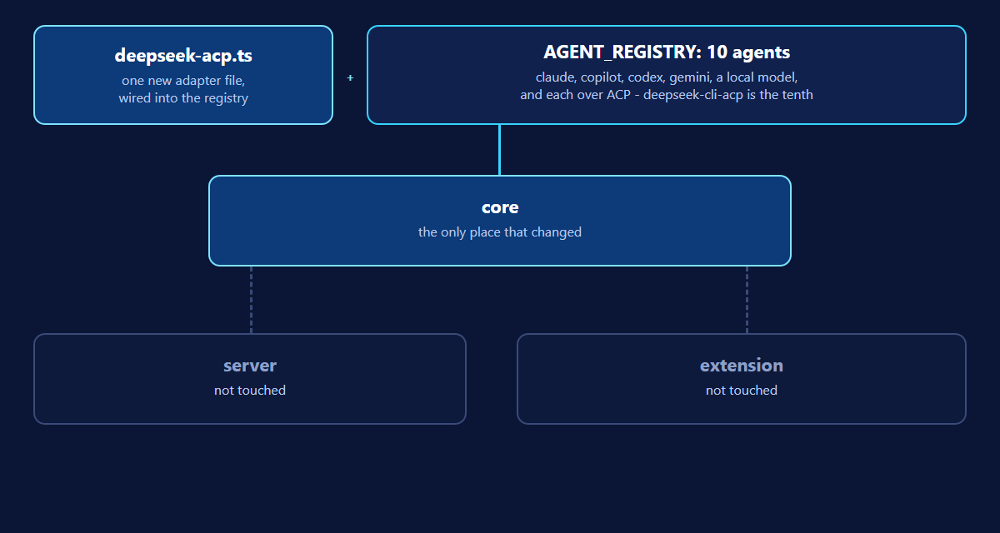

The last article argued that a shared core is what keeps a VS Code extension
and a web app from drifting apart. Two days after it went out, a new agent
arrived, and it is as good a test of that argument as any: DeepSeek, over the
Agent Client Protocol, requested by the owner and added the same day.

## What it took

One new file, `deepseek-acp.ts`, implementing the same `AgentAdapter`
interface every other agent implements. It runs `dsh --profile acp`, the
DeepSeek CLI's own Agent Client Protocol mode, through the driver the other
ACP-flavored adapters already share. It is added to the registry, allowed by
the default allowlist for exactly those arguments, and detected on `PATH` like
every other agent. Neither host's code changed. Both the standalone
application and the VS Code extension picked it up because both read the same
registry.

DeepSeek is the tenth agent, and the fifth that speaks ACP, beside Claude,
Copilot, Codex and Gemini.

## What checking it live actually found

`initialize` answers as `deepseek-harness-acp`, with no auth method to run:
the key lives in the person's own `dsh` profile, never in this project.
`session/new` offers DeepSeek-V4-Flash as the default model and
DeepSeek-V4-Pro as an option, though nothing here sends that option yet, so
V4-Flash is what runs.

Two things worth a person's attention, both found by running it rather than
by reading its documentation.

**On Node 22.11, `dsh` exits with code 0 before answering, saying nothing at
all.** This repository pins Node 22.11 with Volta for its own tooling, and
Volta puts it first on the `PATH` of anything it starts, including an agent
CLI. The same run on Node 24.18 completed. "ACP connection closed" is not a
sentence a person can act on, so a run that ends this way is now told which
Node it met and that a newer one is needed on the `PATH` a host starts agents
with.

**It reports no usage at all.** The live run sent no `usage_update` and no
usage figure on its answer, so a spending ceiling over `deepseek-cli-acp`
counts nothing and cannot fire, the same as over five of the other nine
agents. Only a time ceiling has any force over it.

## What was asked, and what was left for later

The owner has used DeepSeek enough to know it does best with instructions
taken literally, one at a time, rather than left to infer how strictly to
read what follows. So every prompt to it now opens with a short preamble:
follow the steps in order, do exactly what each one asks, name a step as it
finishes, and stop and say why rather than improvise if a step cannot be done
as written.

What it does not do yet: choose a model. DeepSeek's model is an Agent Client
Protocol session option (`session/set_config_option`), and nothing in this
project's shared driver sends session options. Whichever model `dsh` defaults
to is the one that runs. Fixing the Node a host starts agents with is also out
of reach from here: the product cannot choose what is on someone's `PATH`; it
can only say which one it met.

## Why this is the article, and not just a changelog line

Adding a tenth agent is not, by itself, news. What is worth a reader's time is
that adding it stayed inside the one package the architecture says it should:
`core`, and nowhere else. An implement run against this same change wrote its
own file and ticked its own task in 22 seconds, over the very mechanism the
article describes.

## Try it

The code is at
[github.com/VeryComplexAndLongName/OpenSpec-UI](https://github.com/VeryComplexAndLongName/OpenSpec-UI),
where the repository and packages keep the name OpenSpec-UI. The architecture
this rests on is in
[One core, two hosts](https://openspec-ui.dev/articles/one-core-two-hosts/).

## Where each claim comes from

- The adapter, the live `initialize`/`session/new` answers, the Node 22.11
  exit and its explanation, and the preamble:
  [`packages/core/src/agents/deepseek-acp.ts`](https://github.com/VeryComplexAndLongName/OpenSpec-UI/blob/main/packages/core/src/agents/deepseek-acp.ts).
- The decision, the live findings and what was left out: the archived change,
  [`deepseek-joins-as-an-acp-agent`](https://github.com/VeryComplexAndLongName/OpenSpec-UI/blob/main/openspec/changes/archive/2026-09-22-deepseek-joins-as-an-acp-agent/proposal.md).
- The agent table and the ten agents:
  [README.md, "Agent Selection"](https://github.com/VeryComplexAndLongName/OpenSpec-UI/blob/main/README.md).
- That it reports no usage, and what that means for a spending ceiling:
  [HARNESS.md](https://github.com/VeryComplexAndLongName/OpenSpec-UI/blob/main/HARNESS.md),
  the agent capability table and "needs a Node newer than 22.11".
- The 22-second implement run: `HARNESS.md`'s own row for `deepseek-cli-acp`.
