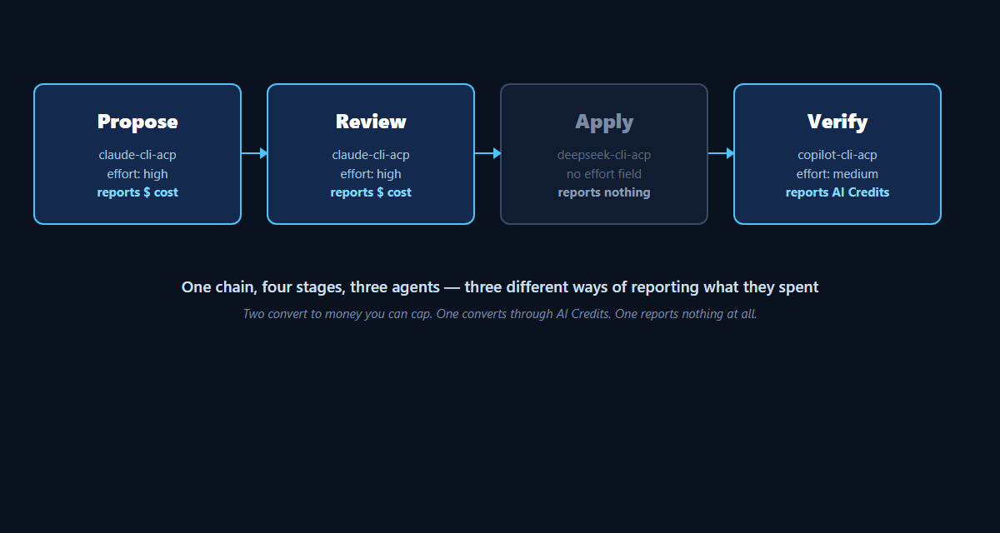

`stepAgents` has let you name a different agent for `propose`, `review`, `apply`
and `verify` since 0.42. What is new is a reason to actually do it: the four
stages do not cost the same thing to run well, and they do not need to.

Deciding what a change should do and reading whether the result is right both
call for judgement. Writing the diff that gets there is comparatively
mechanical - which is not an insult to the work, it is why a cheap, fast model
does it about as well as an expensive one. So the obvious split is: a capable
agent on `propose` and `review`, and a cheap one on `apply`. This is that
split, what it costs at today's prices, and - the part worth reading past the
headline number - exactly what this project's own telemetry can and cannot
prove about the savings.



## The four stages take different things seriously

A `harness.json` entry accepts `agent`, `model`, `effort`, `budget` and
`customAgent` - and only `propose`, `review`, `apply` and `verify` accept a
`stepAgents` entry at all; `archive` and `git` are mechanical, with nothing to
configure. A `model` is only accepted for the four adapters whose registry
entry declares a `--model` flag: `claude-cli`, `copilot-cli`, `claude-cli-acp`
and `copilot-cli-acp`. `budget` is `maxCostUsd` or `maxAiCredits`, whichever
unit the chosen agent's own capabilities accept - the other is rejected.

```json
{
  "stepAgents": {
    "propose": { "agent": "claude-cli-acp", "model": "claude-opus-5-5", "effort": "high", "budget": { "maxCostUsd": 5 } },
    "review":  { "agent": "claude-cli-acp", "model": "claude-opus-5-5", "effort": "high", "budget": { "maxCostUsd": 3 } },
    "apply":   { "agent": "deepseek-cli-acp" },
    "verify":  { "agent": "copilot-cli-acp", "effort": "medium", "budget": { "maxAiCredits": 200 } }
  },
  "timeout": { "maxStageSeconds": 2700 }
}
```

`propose` and `review` above pin `claude-opus-5-5` at `high` effort, with a
dollar ceiling each. `claude-fable-5-1` is the other reasonable choice for
either - cheaper per token, still a model built for judgement rather than
throughput; which of the two is worth its price on your own changes is
something to measure, not assume. `apply` carries no `model`, no `effort` and
no `budget` at all, and that is not an oversight: `deepseek-cli-acp` accepts
none of the three. Its model is a session option this project's driver never
sends, so DeepSeek's own default runs; nothing here can raise or lower how
hard it thinks.

## What the harness can prove, and what it flatly cannot see

This is the part a "save money" article usually skips, and it is the most
useful thing this one has to say.

Two of the three agents in this split convert cleanly to a ceiling you can
actually set. `claude-cli-acp` reports a cost figure directly - measured in
this repository on 2026-09-05, one stage: 60 input, 8,262 output and
1,693,507 cache tokens for **$1.57**, and `budget.maxCostUsd` compares
against exactly that number. `copilot-cli-acp` reports no dollar figure, but
it reports **AI Credits**, which are not a proxy this project invented - they
are the unit Copilot itself bills in, 1 credit = $0.01 - so
`budget.maxAiCredits` is a real ceiling in real money, just denominated
differently. Two agents, two currencies, both enforceable.

`deepseek-cli-acp` is the one genuine blind spot. Measured 2026-09-23, its
one usage figure is a context gauge - tokens used against the model's
window - never a cost, a credit count or even a token split. `budget` has no
mechanism to set on it, in either unit, because there is nothing to compare
a ceiling against.

So the honest description of the `harness.json` above is: three of the four
stages carry a leash denominated in real money - two in dollars, one in AI
Credits - and the cheap one does not. `timeout.maxStageSeconds` still bounds
how *long* `apply` can run, because elapsed time needs no report from the
agent - but nothing in this product will tell you, or stop you, if a
`deepseek-cli-acp` stage is burning through a prepaid balance faster than
expected. That balance lives entirely on DeepSeek's side. Watch it there.

Two more limits worth knowing before you lean on the cheap stage. Neither
`copilot --acp` nor `dsh` (DeepSeek's CLI) asks for permission before writing
a file or running a command, despite the Agent Client Protocol supporting the
mechanism - both were observed completing writes and shell commands here
without ever raising `session/request_permission`. Cheaper is not the same as
better-supervised; the review gate between `apply` and `verify` is what is
actually watching this stage, not the permission channel. And `dsh` needs
Node 22.18+ on the 22 line, or 24.2+ - below that floor it exits with code 0
before answering, silently. If your repository pins an older Node for its own
tooling the way this one pins 22.11 with Volta, that is the first place to
look when an `apply` stage using DeepSeek produces nothing.

## What this costs, at today's prices

These are vendor list prices, read 2026-09-24, not a figure this project
measured. Nothing here converts one into the other, and the harness has no
opinion about which subscription you carry - that lives entirely outside it,
in each CLI's own login.

| Setup | Monthly | Runs |
| --- | --- | --- |
| Claude Max 5x alone | $100 | every stage on `claude-cli`/`claude-cli-acp` |
| Claude Pro + Copilot Pro + DeepSeek API credit | $20 + $10 + about $5 in tokens ≈ **$35** | `propose`/`review` on Claude, `apply` on DeepSeek, `verify` on Copilot |

Claude Pro is $20/month billed monthly, $17 annually; Claude Max starts at
$100/month for the 5x tier. Copilot Pro is $10/month, including $10 of AI
Credits at 1 credit = $0.01 - which is also where `budget.maxAiCredits`'s
minimum of 30 comes from: thirty cents is the smallest ceiling the product
will accept, because Copilot itself will not meter anything finer. DeepSeek
has no subscription tier at all: `deepseek-flash` (what this project's own
measurement on 2026-09-22 recorded as `DeepSeek-V4-Flash` - names move
faster than documentation; check what `dsh` reports before you trust either)
prices output at $0.60 per million tokens off-peak, $1.20 during DeepSeek's
own weekday peak windows. Five dollars of prepaid credit is, at off-peak
rates, upward of eight million output tokens - many multiples of what one
`apply` stage moves by the only measurement available here (1.7 million
tokens, all kinds, on a `claude-cli-acp` stage). Read that as "a lot", not as
a number of stages: different models tokenize and work differently, and this
project has no `apply`-stage measurement on DeepSeek to compare it against
directly.

The arithmetic says $65 a month, and it survives the correction: GitHub's own
current price for Copilot Pro is $10, not the $20 an older plan once charged,
and the saving lands in the same place regardless, because the difference
comes out of the Claude Max to Claude Pro step either way.

## What this article is not

Not a benchmark. Nothing here measured whether `deepseek-cli-acp` produces
work as good as `claude-cli-acp` on the same `apply` stage - that is a
real, answerable question, and it is not this one. Not a recommendation for
your specific changes: an architecture decision or a security-sensitive
`apply` stage may be exactly the case where the expensive agent belongs on
every stage, ceilings included. And not a claim that Codex or Gemini would
be a worse or better third leg of this - both remain agents this project has
never run against a real binary, on any stage.

## Try it

The full field reference for `stepAgents`, `model`, `effort` and `budget` is
in [HARNESS.md](https://github.com/VeryComplexAndLongName/OpenSpec-UI/blob/main/HARNESS.md).
Which agents report what, in which unit, is in
[LIMITS.md](https://github.com/VeryComplexAndLongName/OpenSpec-UI/blob/main/LIMITS.md).
The code is at
[github.com/VeryComplexAndLongName/OpenSpec-UI](https://github.com/VeryComplexAndLongName/OpenSpec-UI),
where the repository and packages keep the name OpenSpec-UI.

## Where each claim comes from

- `stepAgents`, its four fields, which stages accept it, and which agents
  accept a `model`: [HARNESS.md](https://github.com/VeryComplexAndLongName/OpenSpec-UI/blob/main/HARNESS.md),
  "`stepAgents`".
- The agent capability table (`model`, `effort`, spending-cap unit, run
  against a real binary): HARNESS.md, "Agents, models, effort, and spending
  caps".
- Which agents report usage, in which unit, and the $1.57 and
  1,701,829-token measurements: [LIMITS.md](https://github.com/VeryComplexAndLongName/OpenSpec-UI/blob/main/LIMITS.md),
  "Which agents report usage".
- `deepseek-cli-acp`'s context gauge, its measurement date, and that it
  reports no cost, no credits and no token split: LIMITS.md, the same
  section, and the archived change
  [`a-run-can-outgrow-its-context`](https://github.com/VeryComplexAndLongName/OpenSpec-UI/blob/main/openspec/changes/archive/2026-09-23-a-run-can-outgrow-its-context/proposal.md).
- Neither `copilot --acp` nor `dsh` asking for permission, and the Node
  22.18+/24.2+ floor: HARNESS.md, "ACP effort and budget capabilities", and
  the article
  [A new agent, and nothing else moved](https://openspec-ui.dev/articles/a-new-agent-and-nothing-else-moved/).
- Claude Pro and Max prices: [claude.com/pricing](https://claude.com/pricing),
  read 2026-09-24.
- Copilot Pro's price and its AI Credits: [GitHub's own announcement](https://github.blog/news-insights/company-news/github-copilot-is-moving-to-usage-based-billing/),
  read 2026-09-24.
- DeepSeek's per-token prices and peak windows:
  [DeepSeek's own pricing page](https://api-docs.deepseek.com/quick_start/pricing),
  read 2026-09-24.
