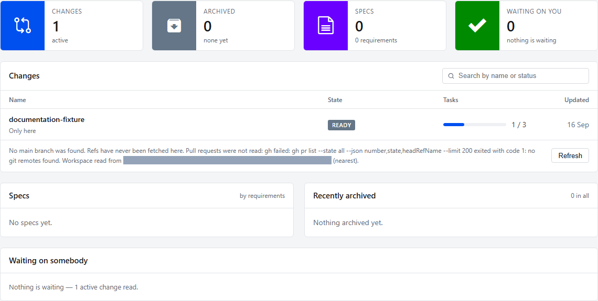
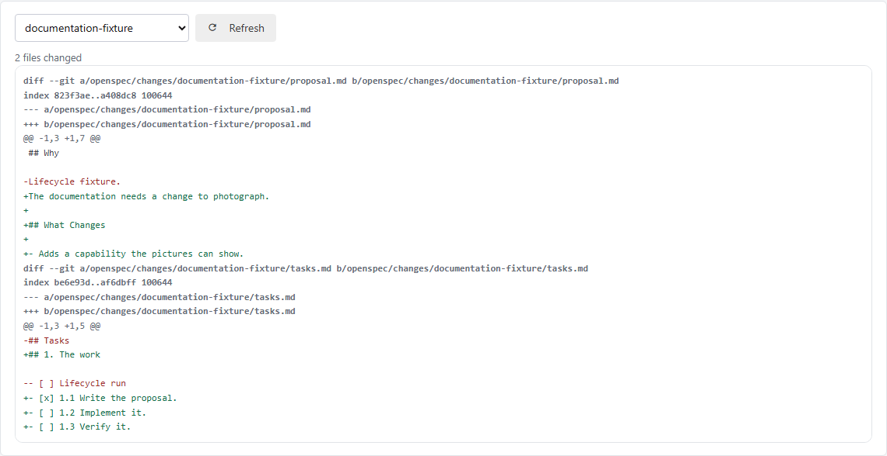
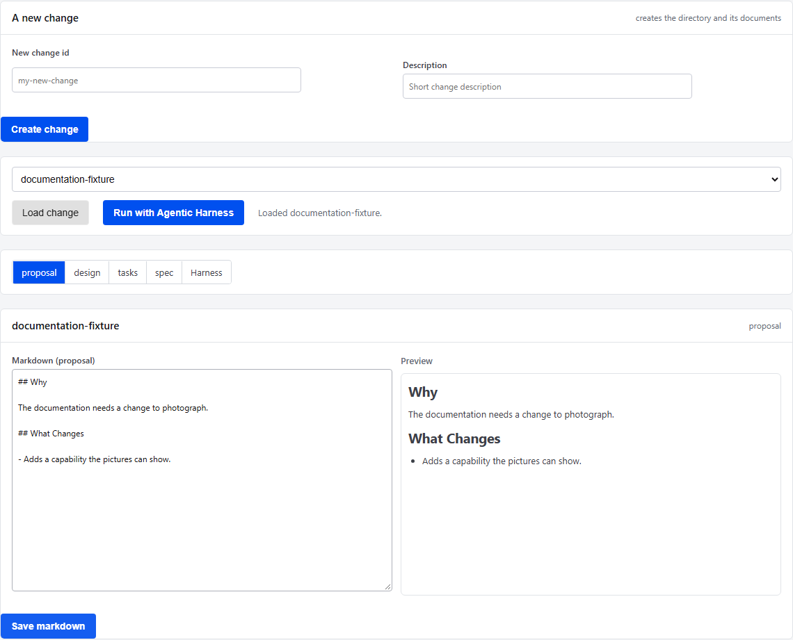
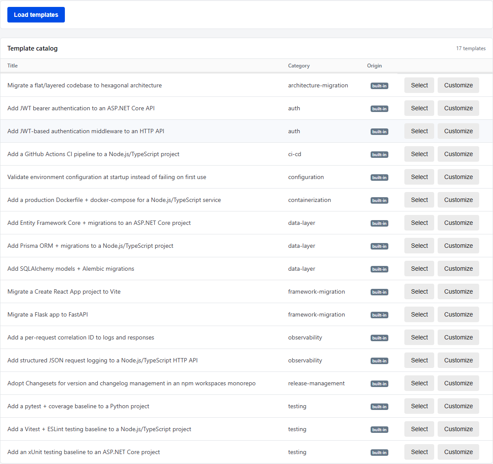
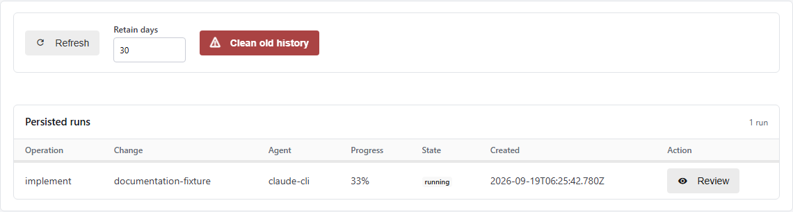
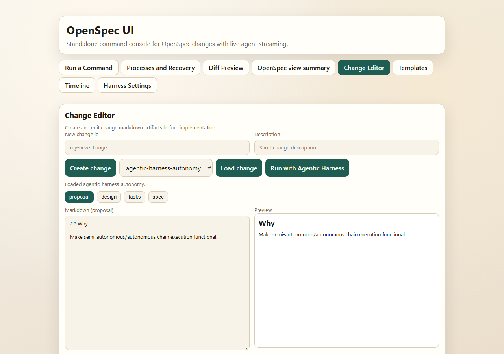

# @openspec-ui/server

A thin authenticated REST/WebSocket adapter over `@openspec-ui/core`. It serves
the standalone `@openspec-ui/webui` shell and binds to `127.0.0.1` by default.
Business logic, execution security, recovery, and change state remain in core.

The standalone capability is governed under `openspec/changes/standalone-app/`.
The VS Code extension may also launch this server as an optional transport mode.

## Screenshots

### Run OpenSpec commands

Select a change, command, and CLI agent, then inspect structured results and
streamed output in the same view.


### Inspect repository state

#### OpenSpec view summary



#### Diff preview



### Edit changes and templates

#### Change Editor



#### Template catalog



### Review persisted processes



### Configure and run with Agentic Harness

Recommend a CLI agent per OpenSpec-change stage, then start a run — a
single-stage picker or a supervised/unsupervised chain, depending on the
resolved autonomy level — without leaving the Change Editor. See
`openspec/README.md`'s "Agentic Harness — how to work with it".




## Transport

- `POST /api/status`: synchronous `{ events: Event[] }` response for status.
- `POST /api/command-json`: direct structured OpenSpec commands.
- `GET /api/ws`: bidirectional command/event streaming.
- `POST /api/change-editor/*`: conflict-aware Change Editor operations.
- `POST /api/processes/*`: persistent process review, rollback, and cleanup.
- `GET /` and `GET /app.js`: built standalone browser shell.

Every API request requires the ephemeral startup token. REST clients send
`X-OpenSpec-UI-Token`; WebSocket clients use the
`openspec-ui-token.<token>` subprotocol.

## Run

```bash
npm run build
npm run start -- <workspaceRoot> <port>
```

The default port is `4317`. To intentionally permit API requests outside the
startup workspace, use the explicit opt-in flag:

```bash
npm run start -- <workspaceRoot> <port> --allow-external-cwd
```

Open the tokenized URL printed by the server after startup.

## Agents

`npm run start` (via `src/cli.ts`) populates `createServer`'s `runners`
option with `buildDefaultAgentRunners({ workspaceRoot, allowExternalCwd })`
from `@openspec-ui/core` — `plan`/`implement`/`review` resolve to a real
CLI-agent runner by default, not an empty map. See the root `README.md`'s
"Agent Selection" section for the full picture (available agents, how
each one authenticates, and how this differs from VS Code's native
Chat/Agent handoff).
