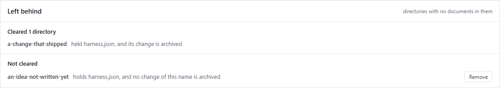
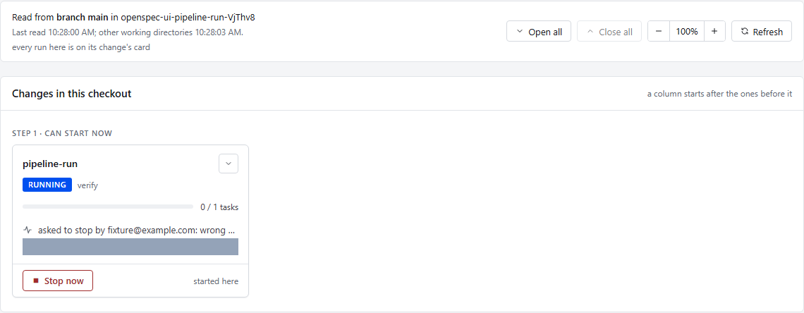

# @openspec-ui/server

A thin authenticated REST/WebSocket adapter over `@openspec-ui/core`. It serves
the standalone `@openspec-ui/webui` shell and binds to `127.0.0.1` by default.
Business logic, execution security, recovery, and change state remain in core.

Project site: [https://openspec-ui.dev](https://openspec-ui.dev).

The standalone capability is governed under `openspec/changes/standalone-app/`.
The VS Code extension may also launch this server as an optional transport mode.

## Screenshots

### Run OpenSpec commands

Select a change, command, and CLI agent, then inspect structured results and
streamed output in the same view.


### Inspect repository state

#### OpenSpec view summary


#### What the archive left behind

The summary says what the product cleared of its own leavings, what it
will not clear and why, and which working directories have nothing left to
do. A directory is cleared only where its change is archived and every
file in it is one this product wrote; anything else is shown with a
Remove beside it.



#### Diff preview


### Edit changes and templates

#### Change Editor


#### Template catalog


### Review persisted processes


### See the order of the work, and what each change is doing

The **Pipeline** tab draws every active change as a card, in the order the
changes declare. A solid line means the second change waits for the
first. Each card says, in one word, where its change stands (Running,
Waiting for you, Failed at a stage, Blocked, Ready, Done, and so on). It
also says how many tasks are done, and what a live run last said.
**Show tasks** opens a card to its task list. Every other working
directory of the repository is drawn beneath, read and never acted on.


**Start** on a card opens the run dialog for that change. A run this
server holds can be answered on its card, with **Continue** at a
checkpoint and **Allow** or **Deny** on a permission. It can also be asked
to stop: **Stop** asks for a reason, and the run stops where its work is
sound. **Stop now** cancels at once, once a stop has been asked. A run held
in another working directory offers Stop only when its record is signed by
the same enrolled person as this machine's key.




See [`docs/how-to/stop-a-run.md`](../../docs/how-to/stop-a-run.md).

### Configure and run with Agentic Harness

Recommend a CLI agent per OpenSpec-change stage, then start a run — a
single-stage picker or a supervised/unsupervised chain, depending on the
resolved autonomy level — without leaving the Change Editor. See
`openspec/README.md`'s "Agentic Harness — how to work with it", and the
root repository's [`HARNESS.md`](../../HARNESS.md) /
[`LIMITS.md`](../../LIMITS.md) for the full settings and spending-limit
reference.


## Transport

- `POST /api/status`: synchronous `{ events: Event[] }` response for status.
- `POST /api/command-json`: direct structured OpenSpec commands.
- `GET /api/ws`: bidirectional command/event streaming.
- `POST /api/change-editor/*`: conflict-aware Change Editor operations.
- `POST /api/processes/*`: persistent process review, rollback, and cleanup.
- `GET /` and `GET /app.js`: built standalone browser shell.

Every API request requires the ephemeral startup token. REST clients send
`X-OpenSpec-UI-Token`; WebSocket clients use the
`openspec-ui-token.<token>` subprotocol.

## Run

```bash
npm run build
npm run start -- <workspaceRoot> <port>
```

The default port is `4317`. To intentionally permit API requests outside the
startup workspace, use the explicit opt-in flag:

```bash
npm run start -- <workspaceRoot> <port> --allow-external-cwd
```

Open the tokenized URL printed by the server after startup.

## Agents

`npm run start` (via `src/cli.ts`) populates `createServer`'s `runners`
option with `buildDefaultAgentRunners({ workspaceRoot, allowExternalCwd })`
from `@openspec-ui/core` — `plan`/`implement`/`review` resolve to a real
CLI-agent runner by default, not an empty map. See the root `README.md`'s
"Agent Selection" section for the full picture (available agents, how
each one authenticates, and how this differs from VS Code's native
Chat/Agent handoff).
